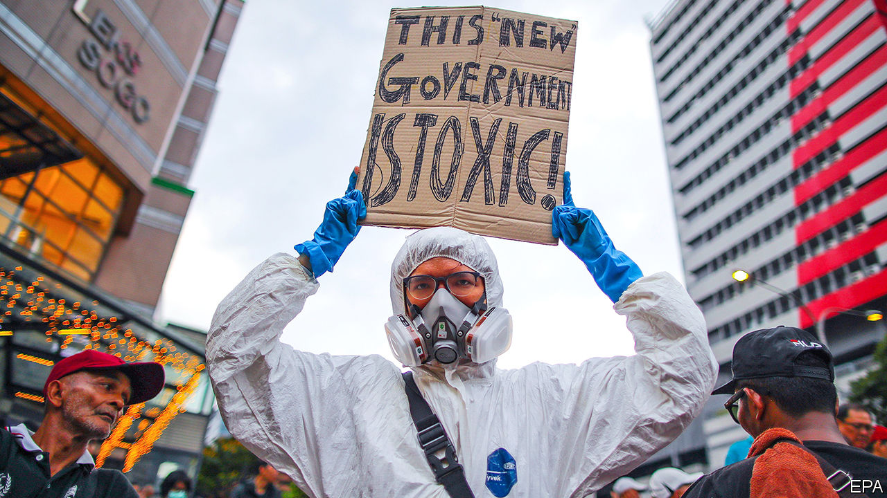

## Beset at its birth

# Malaysia’s new government may be even more unstable than old one

> It does not seem to have a policy agenda, even though problems are piling up

> Mar 5th 2020KUALA LUMPUR

“I AM A brother to the Malays, the Chinese, the Indians, the Sikhs, the Ibans, the Kadazans, the Dusun, the Murut and those of various ethnicities,” declared Malaysia’s new prime minister in his first televised address on March 2nd. Muhyiddin Yassin’s conciliatory words played well in a country riven by turbulence among its largely race-based parties. The previous government, a coalition called Pakatan Harapan, collapsed on February 24th after one of its components split in two and another, Bersatu, broke away altogether. After a week of confusion, a new ruling coalition emerged: Perikatan Nasional, (“national alliance”), led by Mr Muhyiddin. He was sworn in on March 1st.

Perikatan Nasional contains some very familiar faces. Its biggest component is the United Malays National Organisation (UMNO), which ran Malaysia for 61 years, but took a 21-month sabbatical after Pakatan Harapan booted it from office in 2018. Other members include PAS, an Islamic outfit, and almost all of Bersatu. It is on friendly terms with parties from the state of Sarawak, in the Malaysian part of Borneo, whose support is needed to give Perikatan Nasional a majority in the lower house of parliament.

While each party has its own platform, advancing Malay interests is a common goal. Bumiputras—Malays and other indigenous groups, who make up 69% of the country’s population of 32m—have special privileges enshrined in the constitution. Pakatan Harapan talked about the need for a more meritocratic system, although it did little to introduce one. That endeared it to the 24% of Malaysians who are ethnically Chinese and the 7% with Indian roots, as well as to liberal Malays, but most bumiputras were alarmed.

Mr Muhyiddin presents himself as a unifier. He will have to start with parliament. He got the nod from the king to form a government only on the basis that he was “likely” to be able to command a majority. His decision on March 4th to delay parliament’s next sitting until May will buy him time to woo wavering or biddable parties and MPs. Although he has many grand jobs at his disposal, starting with seats in cabinet, he also has many jockeying factions to mollify. An attempt at racial diversity would bolster minorities’ confidence in the government.

Holding Perikatan Nasional together will be a challenge for Mr Muhyiddin. UMNO brings lots of baggage. Its president, Ahmad Zahid Hamidi, is among the candidates for deputy prime minister. But he is on trial for allegedly misappropriating funds meant for a charity. Support within UMNO for Najib Razak, the prime minister from 2009 to 2018, remains strong. But Mr Najib faces several trials on charges related to 1MDB, a state investment company from which some $4.5bn disappeared on his watch. Mr Najib denies all wrongdoing, and recently said that under the new government he “would expect that the atmosphere would be more conducive towards a fair trial”. Yet any indication that prosecutors are going soft on Mr Najib, who remains an UMNO MP, would presumably go down as badly with voters as the 1MDB scandal did in the first place.

That is just one item in the daunting in-tray that awaits new ministers, whenever they are named. There is also covid-19, cases of which are creeping up in Malaysia. The epidemic, in turn, is likely to harm the economy. In the last quarter of 2019 it grew at its slowest pace in a decade; the current quarter is expected to be even worse. The prime minister’s advisers urge action to help the poorest 40% of citizens, the vast majority of whom are bumiputras. Bringing down the cost of living “is essential”, believes Rais Hussin, Bersatu’s chief strategist. The recent political drama has made matters worse, he notes, since it has caused the ringgit to weaken, which will boost the cost of meat, dairy and other imported foods. Joblessness among young people is another concern. The overall unemployment rate is around 3%, but among those aged 15-24 it is over 10%. Many of those who do have jobs are overqualified for the positions they occupy.

Perikatan Nasional has existed for less than two weeks. It has no manifesto. If its constituent parties have agreed on any policies to tackle the country’s problems, they have not made them public. Then there is the question of how to handle the pet projects of each party in the government. For years PAS, for instance, has pushed for the adoption of an Islamic criminal code, including harsh punishments such as amputations and stoning. Under Mr Najib, UMNO toyed with such ideas, too. The parties from Sarawak, meanwhile, are likely to demand lavish spending in their state, even as the ailing economy crimps revenue. “It’s not going to be a bed of roses,” admits an adviser to the government. ■