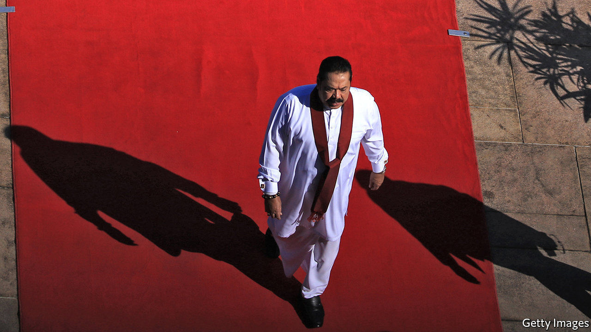

## Brotherly shove

# Sri Lanka’s ruling party calls an election, hoping for a landslide

> But civil libertarians and economists quake at the prospect

> Mar 5th 2020COLOMBO

JUST FIVE years ago the Rajapaksa family seemed to have lost everything. Mahinda Rajapaksa was beaten in Sri Lanka’s presidential race in 2015, ending his ten-year tenure. His younger brother, Gotabaya, was no longer number two (to Mahinda) in the ministry of defence. Basil, the baby of the brood, had lost his job as minister of economic development, and their eldest sibling, Chamal, would soon be ousted as speaker of parliament. Worse, the incoming government was threatening to prosecute varied Rajapaksas and their allies for everything from corruption to human-rights abuses.

But five years is an age in politics. Sahodara Samagama or Brothers Inc, as Sri Lankans jokingly call the resilient political clan that first entered parliament three generations ago, in 1936, is very much back in business. In November Gota, as he is widely known, captured the presidency in a landslide. He picked Mahinda, the former president, to be his prime minister. Chamal is still an MP and Basil, though out of government, runs the family’s political party, the Sri Lanka People’s Front (known by its Sinhala initials SLPP). Few Sri Lankans doubt that when polls open for a new parliament on April 25th, the nine-party coalition he has stitched will romp home.

Yet for the Rajapaksas, capture of the presidency, the cabinet and, in all probability, the legislature (in addition to considerable influence in the army, the police, the courts and much of the media) may not be enough. What they would really like is not merely a parliamentary majority but a two-thirds majority. That way they could roll back constitutional changes brought in by the previous government that trimmed the president’s powers. They could also, fear some among the 30% of the island’s 22m people who are not part of the Sinhalese Buddhist majority, scrap efforts to reconcile the country’s different ethnicities and religions after the murderous civil war of 1983-2009. Rival politicians and liberal types, meanwhile, worry that they will redouble the assault on civil liberties that took place when Mahinda was president.

Signs of such intentions are already showing. After Gota became president in November he placed the civilian police and the registration of NGOs under the control of the defence ministry. The ministry itself is run by a fierce general, with another hardliner in command of the army; both have been accused of war crimes. Human-rights activists and journalists say that while there have been no disappearances, as in the bad old days, forms of intimidation such as surveillance and repeated interrogations are becoming common again. Among signs that have worried Tamils, a minority concentrated in the north and east and in Colombo, the capital, whose armed uprising sparked the war, was a ministerial order in January that the national anthem may now only be sung in Sinhalese and no longer also in Tamil. Ominously, too, the government in February officially annulled its predecessor’s co-sponsorship of a resolution by the UN Human Rights Council, which had prescribed institutional steps for reconciliation between Tamils and Sinhalese.

Grisly terror attacks on churches and hotels last year by members of a local jihadist cult, which left 259 dead, drew attention to poor policing and intelligence and allowed the Rajapaksas to portray themselves as more reliably tough on security issues. “But in the guise of stability they want to arrogate all power to themselves and restrict public space,” warns Rauff Hakeem, an MP and former minister who happens to be Muslim. “It’s as if they are preparing for a police state.”

Few analysts believe the SLPP will gain its desired two-thirds. But this has more to do with an electoral system of proportional representation, which tends to reflect Sri Lanka’s demographic mix, than to the appeal or dynamism of the main opposition group, the United National Party (UNP). It is in disarray, split between a faction that backs Ranil Wickremesinghe, a seasoned but charmless politician, and one led by the more popular but less savvy Sajith Premadasa, the son of a former president. Mr Premadasa has forged an alliance of 12 groups to fight the SLPP. Mr Wickremesinghe is not only refusing to join, but also to allow Mr Premadasa to use the UNP’s symbol, an elephant. “What people are saying is, ‘How can they run a country if they can’t even run a party?’” says Malinda Seneviratne, a columnist and poet.

Given the opposition’s dysfunction, the Rajapaksas may be able poach some of its MPs even if they do not win the coveted two-thirds of seats outright. It is not just civil liberties that may suffer under a period of unchecked single-party rule. The economy, too, is at a worrying juncture.

The central government’s debt currently stands at around 82% of GDP. Interest payments eat up 42% of government revenue. For the next five years the International Monetary Fund expects that the government will have to borrow a further 2.7-5.2% of GDP annually. The already battered tourism industry is taking another hit from the coronavirus scare. So far the Rajapaksas’ answer has been a big tax cut, which in turn has generated scepticism about the government’s fiscal probity. Even a whopping parliamentary majority may struggle to sort out the government’s alarming finances. ■