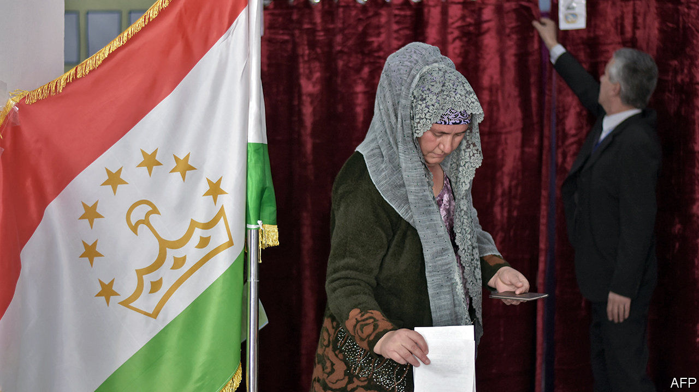

## United in unity

# Tajikistan’s long-serving ruler dispenses with all political opposition

> Emomali Rahmon has been in power since 1992

> Mar 5th 2020DUSHANBE

MAMMOTH PHOTOS of Emomali Rahmon, Tajikistan’s bushy-eyebrowed president, are everywhere in Dushanbe, the capital: striding in a suit, posing in a poppy field, waving regally. But as voters went to the polls to elect a new parliament on March 1st, advertising for political parties was all but invisible. The subliminal message was clear: however voters vote, the president—officially, the Founder of Peace and National Unity, Leader of the Nation—will still run the show.

Mr Rahmon’s People’s Democratic Party of Tajikistan scooped 75% of seats in parliament. Five other parties won seats, offering different manifestos but uniform devotion to the great man. Their role is to provide a semblance of opposition. The only outfit that was critical of Mr Rahmon, the Social Democratic Party of Tajikistan (SDPT), won 0.3% of the vote and no seats.

Rahmatullo Zoirov, the loquacious lawyer who leads the SDPT, says the president is an illegitimate leader who has rigged the political system to cling to power, most recently through a referendum allowing him to remain president for life. Mr Zoirov was under no illusions about his party’s chances, expressing doubt about “the fairness, freedom and transparency of this election” as he cast his ballot. He refused to accept the results after they were released. The Organisation for Security and Co-operation in Europe, which usually monitors elections in the region, deemed this one too far below its standards to be worth a full mission, citing limited political choices and a deterioration in respect for basic freedoms. In some polling stations, at least, one member was allowed to vote for an entire family. The election commission, however, says the vote was clean and fair.

Mr Rahmon and his lackeys are not without support. Many voters leaving polling stations had endorsed the ruling party out of a desire to preserve stability, a powerful motivator in a country that fought a brutal civil war after independence from the Soviet Union in 1991. They are getting what they wish for: Mr Rahmon came to power in 1992, and is now the longest-serving leader in the former Soviet Union.

Many others switched off. “To be honest, I’m more interested in Brexit than local politics,” said one man, complaining that no one had canvassed for his vote during the campaign, which featured no television debates or rallies. One woman, asked what she hoped for from the new parliament as she left a polling station, raised her eyebrows and replied: “Nothing.”

Tajikistan, the poorest country in the former Soviet Union, has plenty of problems: low wages, high prices and a shortage of work for the young, fast-growing population of 9.5m. Tajiks flock abroad to work, mostly to Russia: officially, the number of émigrés stands at 500,000, but some estimates put it as high as 2m. Mr Rahmon’s critics say his friends and relatives are doing well, but ordinary people are not. More than a quarter live in poverty, by the government’s own count. Tajikistan is deeply in hock to China, to which it has been granting land and mining concessions to pay off loans. It also depends on its former colonial master, Russia, which has a military base in Tajikistan.

The election was the first since a moderate Islamic party that was for years the main opposition to Mr Rahmon was banned, in 2015. The government labelled the Islamic Renaissance Party of Tajikistan a terrorist group, sending its leader, the mild-mannered Muhiddin Kabiri, fleeing abroad. Other senior members were jailed. From exile in Berlin, Mr Kabiri dismissed the talk of terrorism as a “trumped-up pretext” to ban the only party capable of posing a challenge to Mr Rahmon, who had already eliminated most secular opposition. A reformist movement called Group 24 was outlawed in 2014. Its leader, Umarali Quvvatov, was later shot in Istanbul.

Mr Rahmon will probably stand for re-election in November. But there is speculation that he may step aside and anoint as his successor his son, Rustam Emomali, the 32-year-old mayor of Dushanbe. That would make the Founder of Peace and National Unity the founder of Central Asia’s first modern-day dynasty, too. ■

## URL

https://www.economist.com/asia/2020/03/05/tajikistans-long-serving-ruler-dispenses-with-all-political-opposition
