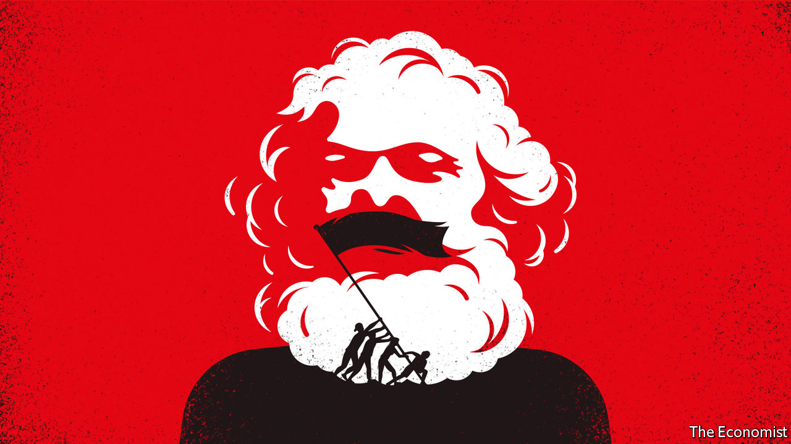
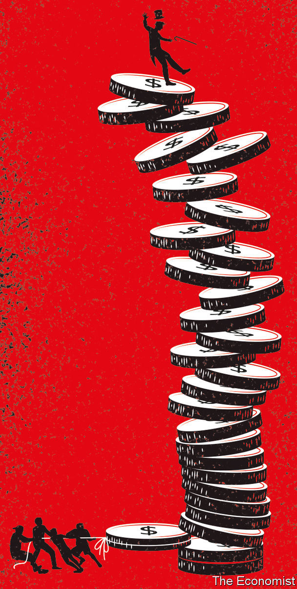

## A modern Marx

# A bestselling economist sets out the case for socialism

> Thomas Piketty’s new book may prove as famous—and controversial—as its predecessor

> Mar 5th 2020

Capital and Ideology. By Thomas Piketty. Translated by Arthur Goldhammer. Belknap Press; 1,104 pages; $39.95 and £31.95.

THOMAS PIKETTY’S “Capital in the Twenty-First Century”, first published in 2013, made the French economist a household name. Combining heavy economic theory with data wizardry and commentary on the novels of Jane Austen and Honoré de Balzac, Mr Piketty argued that capitalism almost inevitably generates high and rising inequality. Many of his claims—that the stock of wealth in an economy grows faster than income, for instance, or that inequality in the West is approaching levels last seen during the Belle Époque—are now both familiar and fiercely debated.

Mr Piketty’s new book is over 1,000 pages long and looks far beyond the West. Austen and Balzac turn up again—joined by “Black Panther”, a recent blockbuster film, and Chimamanda Ngozi Adichie’s novel “Americanah”. Mr Piketty says the tome is “in large part a sequel” to its predecessor, yet in an important way it is a clear change of direction. In “Capital” Mr Piketty shared Karl Marx’s goal in the work of the same name that he published in 1867: to reveal the economic logic of the capitalist mode of production. “Capital and Ideology”, by contrast, is closer to the sociological writings of Marx and his followers, especially “The German Ideology” (1845-46), which sought to explain the social and political means by which capitalists maintained power over the working classes.

The scope of Mr Piketty’s analysis is wider than Marx’s, however. “Every human society must justify its inequalities,” he begins. The book surveys not only capitalist societies but colonial, slave-owning and feudal ones, too. In almost all, income and wealth have been distributed highly unequally. To retain their dominant position, Mr Piketty says, elites have used “ideologies”, which he describes as “a set of a priori plausible ideas and discourses describing how society should be structured”. “Plausible” they may be, but for Mr Piketty all such ideologies are in a crucial sense illegitimate or unjust. His deconstruction of these rackets leads him to advocate a transition to a hardline version of socialism.

Mr Piketty spends much of the book explaining how ideological techniques have varied. In the Middle Ages church authorities said the natural order required small numbers of clergy and nobility and a mass of labourers; the lower ranks were meant to meekly accept their lot. In India the “Manusmriti”, a compendium of laws compiled in the second century BC, proposed “a social structure and rules intended to…restore order to the Hindu social and political system”. In the 18th century Western elites declared that slavery was justified because the enslaved needed moral guidance; similar arguments were thereafter used in favour of colonialism. And so on.

None of this analysis of elite skulduggery is very novel. For example, Theodor Adorno and other members of the Frankfurt School argued that the media turned people into capitalist drones. Michel Foucault examined how prisons, hospitals and schools shaped good capitalist subjects.

And Mr Piketty’s account of ideology is less well developed than some such predecessors’. In part this is because he flits between case studies (with strange digressions, such as an explanation of the role of vegetarianism in Hinduism). It is not clear who exactly is promulgating the ideologies he sketches, or how. Moreover, in his overly pessimistic view of history, elites are only ever self-serving. Take the repeal of the Corn Laws in Britain in the mid-1840s, an episode which Mr Piketty barely mentions. Some bigwigs wanted to preserve the privileges of the landed gentry by maintaining high tariffs on imported grain, but others genuinely wanted to reduce the cost of food for the working classes.

Nevertheless, his book has virtues that many post-Marxist critiques lack. For one thing, it is more readable. The prose is pithy and light on theory. Mr Piketty draws on an impressive range of historical statistics. In the early 1980s, he relates, income inequality in Soviet Russia was only marginally lower than it was in Europe. His numbers show how the definition of “elite” has changed over time. Just before the revolution of 1789 the French church owned almost a quarter of the country’s property; today all non-profit organisations in France own just 1%. Above all, Mr Piketty’s sweeping scholarship enhances, rather than obscures, his central argument.

It is a familiar one. In 1867 Marx said the “essential difference between…a society based on slave-labour, and one based on wage-labour, lies only in the mode in which this surplus-labour is in each case extracted”. Capitalism, in other words, was just as exploitative and immoral as slavery or feudalism—it just did a better job of covering it up. As Mr Piketty casts his eye over a millennium of global history, he reaches a strikingly similar conclusion.

From today’s perspective, many past societies appear obviously unjust. It now seems self-evident that colonialism was immoral, for instance, and that feudalism deprived people of agency. Many of the arguments once deployed against liberal reforms now seem blatantly self-interested. Thomas Jefferson’s views on the emancipation of slaves are a stark example: “We have the wolf by the ear, and we can neither hold him, nor safely let him go. Justice is in one scale, and self-preservation in the other.”

Mr Piketty believes that “the justifications [for inequality] given in the past turn out, if studied carefully, to be no more incoherent than those of the present.” He calls the current inequality regime “neo-proprietarian”, an ideology characterised by absolute respect for property rights and the distribution of income and wealth that results. It is a thin creed, in his view. The notion that people have “an inviolable natural right [to] strictly private property” cannot withstand analysis, since the “accumulation of wealth is always the fruit of a social process, which depends, among other things, on public infrastructures…the social division of labour, and the knowledge accumulated by humanity over centuries.” At the same time, access to fundamental goods, such as education, is so unequal that the resulting distribution of income and wealth must be illegitimate.

This is too gloomy—as some of Mr Piketty’s own data show. Inequality has risen in most countries in recent decades, but it remains much lower than it was a century ago. The world is healthier and wealthier than ever; the author accepts the rise in life expectancy, though he begrudgingly points to “the limitations of available demographic sources”. The development of capitalism from the 18th century onwards greatly lifted average living standards. Meanwhile, considerable (if incomplete) progress has been made on racial and gender equality. But for Mr Piketty, history lurches from one inequitable regime to the next, each scarcely better than the last.

The last part of his book focuses on his alternative to “neo-proprietarianism”. He is no fan of Soviet communism, in part because he accepts that society “sometimes requires small businesses funded with private capital and employing a handful of workers”. And though he is encouraged by the willingness of politicians in the mid-20th century to confront elites, for instance by steeply raising income and inheritance taxes, he cannot bring himself to endorse 20th-century social democracy. It fell short, he thinks, not least because “progressive taxation…power-sharing in firms…democratic budgeting and public ownership were never explored as fully or systematically as they might have been.” Instead he proposes a new form of socialism.

This system bears many of the hallmarks of a movement The Economist has called “millennial socialism”, which is on the rise on both sides of the Atlantic. The core idea is to “democratise” the economy, transferring control from capitalist and government elites to ordinary folk. Employees would have a decisive say in the management of their firm: think of Bernie Sanders’s plan to put workers on boards. Public services, especially education, would be vastly enhanced. Every youngster would get a cash lump sum. Mr Piketty envisages radically higher taxes on the rich, not just to raise revenue but to drastically reduce their clout. He imagines a wealth tax of up to 90% on the largest fortunes.

Such measures would unquestionably reduce income and wealth inequality, perhaps to all-time lows. But would they create better societies? After all, socialism carries its own risks and distortions. Reductions in material inequality might be offset by increases in other sorts—in access to public services, say, or in free expression and political power. Businesses run by “the workers” might be captured by trade unions. A more powerful state might become more self-serving. Would such societies be truly just and their inhabitants truly free? In the end, Marx came to worry about this complication. Not Mr Piketty.

Then there is the economy itself. Many thinkers on both left and right agree with him that inequality is too high, and that, even in mature democracies, income and wealth are often accumulated unfairly. Unlike him, most resist the idea of a socialist overhaul, in part because they fear it would leave everyone, including the poorest, worse off. You don’t have to be a plutocrat to fret that sky-high wealth taxes would play havoc with incentives, reducing investment and entrepreneurship.

Mr Piketty waves away such concerns in a few paragraphs, an oddly brief discussion given the book’s length, not to mention his profession. He provides some graphs which purport to show that high tax rates are actually good for economic growth. “Bill, Jeff and Mark”, he reckons, “would no doubt have lived their lives in exactly the same way” in the face of confiscatory taxes (never mind that they would lose control of Microsoft, Amazon and Facebook). He evinces a breezy disregard for orthodox economics, asserting, for example, that “there is no obvious reason why wealth redistribution should be limited to property in land”. That ignores the widespread opinion that, since its supply is fixed, land may be treated differently to other assets.

This book may well become as famous as “Capital”. But it is hard not to conclude that, deep down, Mr Piketty believes the worth of a society is measured by its Gini coefficient alone. For all his flair and learning, that is a mistaken ideology. ■

Listen to our interview with Thomas Piketty on “The Economist Asks” at [economist.com/thomaspiketty](https://www.economist.com//thomaspiketty)

## URL

https://www.economist.com/books-and-arts/2020/03/05/a-bestselling-economist-sets-out-the-case-for-socialism
