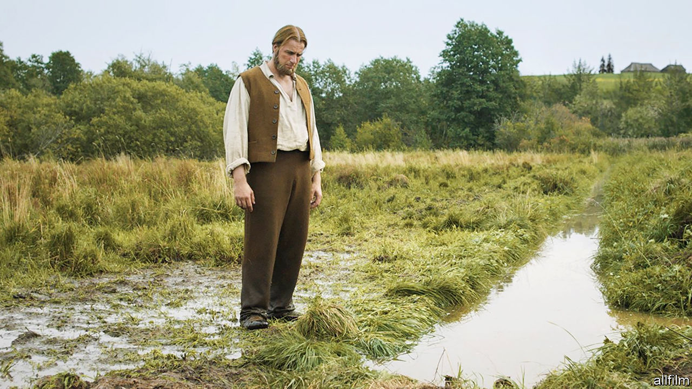

## The farmer’s tale

# A landmark Estonian novel is adapted into a film

> “Truth and Justice” tells the national story—but its meaning has changed with the times

> Mar 5th 2020TALLINN

BY 1927 PEOPLE began to descend on North-Tammsaare, a farm deep in the Estonian countryside. They asked the farmer, August Hansen, to show them the spot where Juss hanged himself, or where Kroot had given birth. Hansen was surprised, and sometimes annoyed: Juss and Kroot did not exist. They were characters from the fictional farm of Vargamae who appeared in the first volume of a five-part novel, “Truth and Justice”, published the previous year by Hansen’s younger brother, Anton. (The author adopted the name of the real farm as his pseudonym, becoming A.H. Tammsaare.)

At first, locals pointed out that the people and places sought by the visitors were invented. As more kept coming, though, they began recounting the stories as if they were true. “The reality got mixed up so perfectly with the fiction that we are not able to say any more what was made up and what was actually there,” says Maarja Vaino, who runs a museum devoted to the author in Tallinn. “It [became] kind of a sacred cultural place for Estonians.” The farm has remained so ever since—even if its meaning has changed with the times. Now a blockbuster film is spreading the legend to an even wider audience.

Together, the story’s five volumes chart Estonia’s progress from province of the Russian empire to statehood. The first volume is by far the best known; most Estonians are familiar with the characters, even if they have never read the book. Some secondary-school pupils take other classes to avoid studying it—and it is easy to see why. The series is a daunting read, full of metaphysical asides and tangential subplots, centring on the grinding life of peasants.

It opens in the 1870s during the “national awakening”, when a unique Estonian national identity began to emerge. An idealistic young man named Andres buys a poor farm—the best he can afford—determined to improve it for his children. He repeatedly scraps with his idle, drunken neighbour, Pearu. As their antagonism grows, so does Andres’s obsession with making his plot prosperous. He fights trivial legal battles with Pearu, all the while slaving over the farm along with his put-upon family.

Early Estonian readers saw themselves and their ancestors in Andres’s struggles. Serfdom was abolished in the Baltic region in 1816-19, more than 40 years before most of Russia’s empire. Much of the land still belonged to Baltic-German aristocracy, but people could now lease or buy their own patch. Conditions were harsh, but literacy spread rapidly, enabling peasants to fight for their rights in court, against both squires and each other. (The literal translation of the novel’s Estonian title, “Tode ja oigus”, is “Truth and Jurisprudence”.) Reading the Bible helped them form their own religious views; Tammsaare’s characters frequently question divine authority.

Later volumes deal with the events—including revolution and the first world war—that led to Estonia becoming an independent republic in 1918. In his compatriots’ imagination, Tammsaare and his creations were bound up with the historical tumult. Even in his lifetime he was a literary hero. His death in 1940, just before the Soviet invasion, was seen as a harbinger of the republic’s demise.

In the Soviet era, interpretations of “Truth and Justice” were updated. Tammsaare’s criticism of revolution originally landed his work on a list of suspicious books, but by 1950 Soviet authorities had come up with a way to exploit the story. New forewords praised its depiction of unceasing labour in pursuit of a better future—“work hard, and love will come later” remains one of the most famous lines—while blaming the misery of Andres’s family on his urge to accumulate wealth and property. For most Estonians, meanwhile, the book was a reminder of a past and an identity that their occupiers wanted to erase.

The new film—the first ever cinema adaptation—is yet another twist in the cultural odyssey of “Truth and Justice”. Within a month of its premiere last year, it was the most watched movie in the country since it emerged from the Soviet Union in 1991. Though paltry by Hollywood’s standards, the budget of €2.5m ($2.8m), mostly state-funded, was among the biggest ever for an Estonian film. It won recognition abroad, just missing a nomination for Best International Feature Film at the Academy Awards.

The adaptation was a saga in itself. Tanel Toom, the director, was among those who avoided reading “Truth and Justice” as a child. He jokes that, after graduating, he lugged the book around for a decade before opening it. The film took seven years to make, in part spent honing the sprawling story into a coherent script. In this selective rendering, stoicism and striving are more destructive than virtuous. Desperate for a son, Andres repeatedly impregnates his first wife until she dies in childbirth; he beats his second rather than acknowledge his guilt over marrying her. He reads his Bible obsessively, shuns society and cannot see why his children want to leave the land he moulded for them. These lives play out in a sweeping, inhospitable landscape, against which they seem insignificant.

“I understood that I’m a bit like [Andres],” Mr Toom says of the project. To him, it is a reminder to “see the rest of the world, to not forget about your loved ones”. Evidently his interpretation struck a chord: he was named “person of the year” for 2019 by Postimees, Estonia’s biggest newspaper. Almost a century after they first appeared, the denizens of Vargamae farm live on. ■