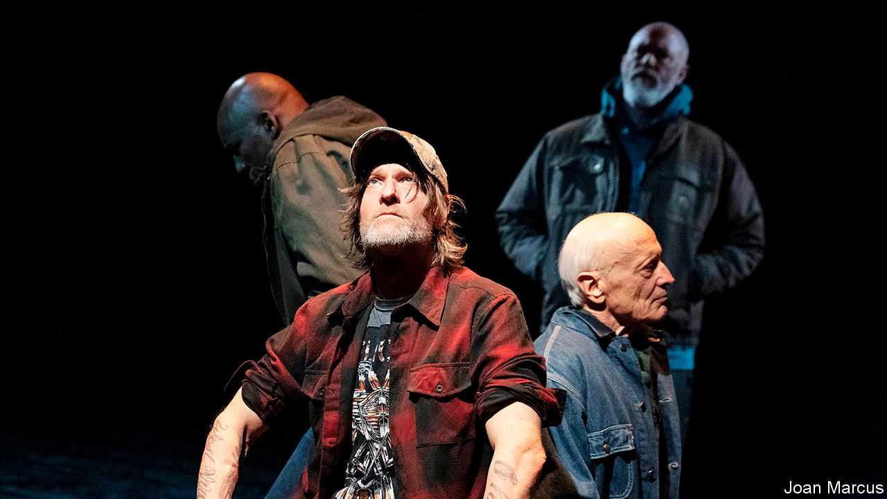

## Notes from the underground

# A West Virginian tragedy in Manhattan

> “Coal Country” tells the story of a fatal mining accident in 2010

> Mar 7th 2020NEW YORK

THE BLAST that killed 29 men at the Upper Big Branch mine in West Virginia in 2010 was the deadliest coalmining explosion in America in decades. Afterwards investigators found dangerous levels of methane, poor ventilation, faulty machines, broken water-sprinklers and thick, sight-obscuring clouds of coal dust. The mine’s owner, Massey Energy Company, was subsequently bought by a rival; its boss at the time, Don Blankenship, was convicted of a misdemeanour in 2015 and served a year in prison. He claims he is innocent and is now running for president as a third-party candidate. Yet the miners who lost their lives, and the families who mourn them, were largely forgotten.

Now their stories can be heard at the Public Theatre in Manhattan, where “Coal Country”, a “documentary play” by Jessica Blank and Erik Jensen, opened on March 3rd. The accounts, delivered by actors but collected from survivors—and accompanied by Steve Earle’s Appalachian banjo and guitar—are riveting. They tell a tale of corporate greed and silenced dissent. These are men who followed their fathers and grandfathers into the pits, firm in the belief that the work was honest and safe. When Gary Quarles (played by Thomas Kopache), whose son died in the disaster, began mining in 1976, the union saw to it that shifts lasted eight hours, lunches could be eaten sitting down and “you didn’t worry ’bout gettin’ fired by speakin’ up.”

When Massey bought the lucrative mine in 1994, the union was sidelined. “Safety started goin’ out the window,” recalls Stanley Stewart (Michael Gaston), a miner better known as Goose. Months before the explosion, he sensed the facility was a “ticking time-bomb”. He left a record of the firm’s hazardous practices for his wife, so she could sue if anything happened to him. He suspected his days were numbered, but options were scarce in rural West Virginia, and this was the only job he ever knew.

Verbatim theatre—in which the drama is adapted from real-life documents and transcripts—has been used to explore topical issues and historic events in Britain and Russia. Ms Blank and Mr Jensen, who are married and regular collaborators, are among its most accomplished exponents in America. “The Exonerated”, their play based on interviews with more than 40 exonerated death-row inmates, has been produced around the world. In 2003 (three years after it opened) it reportedly influenced the decision by George Ryan, then governor of Illinois, to commute all the state’s death sentences. “Aftermath” (2009) relied on interviews with refugees in Jordan to convey the chaos left in the wake of America’s invasion of Iraq. Enlisting first-hand accounts in this way helps overcome the audience’s politics and prejudices.

The mining tragedy “gets at the heart of what we need to be grappling with as a country,” reckons Ms Blank. Since the playwrights began work on the project in 2014, its themes have become only more pressing: anxiety over corporate power; declining unions; the erosion of opportunities for poorly educated American men; an over-reliance on fossil fuels. Still, persuading the miners and their families to talk was difficult, not least because “this is a community that has long been exploited by outsiders,” says Ms Blank. Once they gained their subjects’ trust, however, they discovered that West Virginians were natural raconteurs. “Every person we spoke to was a beautiful storyteller,” says Mr Jensen.

The duo hope “Coal Country” will soften metropolitan views of rural America. “A bias against the rural working class is one of the last socially acceptable prejudices to hold publicly among coastal progressives,” observes Ms Blank. She confesses to being surprised by the nuances of politics in Appalachia, where families display their guns proudly but hold left-wing convictions about workers’ rights. By letting these Americans speak for themselves, the playwrights hope audiences will empathise with their stories—and grasp the pain behind their nostalgia for a simpler time. ■