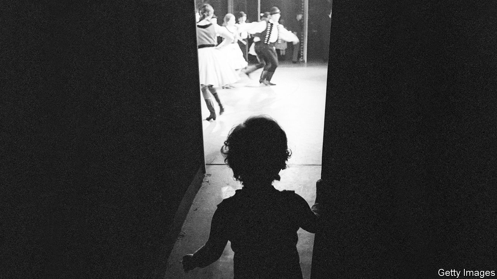

## A life in parts

# In “Actress”, a daughter strives to understand her mother

> Anne Enright’s new novel is a meditation on families and fame

> Mar 5th 2020

Actress. By Anne Enright. W.W. Norton; 272 pages; $26.95. Jonathan Cape; £16.99.

VERY LITTLE about Katherine O’Dell was genuine. Born in south London in 1928, she would come to be celebrated as “the most Irish actress in the world” (her “standard south Dublin” lilt was charming but affected). Her hair’s flaming auburn hue came out of a bottle. Her first and only marriage was a sham: a union between a gay man and his young co-star, conceived by the Hollywood studio that had matched them on-screen. Even the name O’Dell was a kind of deception—her mother’s maiden name, but “Irished”.

Katherine is the strange and captivating figure at the centre of “Actress”, Anne Enright’s seventh novel. Many years after the character’s death, Norah, her daughter, begins a search for the woman beneath the famous roles, stage make-up and costumes. She is a slippery subject, who concealed and exaggerated much more than she revealed. Norah can never quite grasp Katherine’s nature. How many lovers did she take? Was she involved in the IRA, or did the paramilitaries just use her for publicity?

Norah hopes to better understand their relationship, as well as to answer more difficult questions: who her father was, why Katherine always refused to name him and why she eventually lost her grip on reality. Katherine’s mental decline culminated in a seemingly random attack on a film producer, followed by a spell in an asylum. (She dressed in an expensive suit for the assault, ready “for the six o’clock news”.)

“Actress” is a poignant tale of the vicissitudes of fame and its effects on the loved ones of the famous. In good times Katherine revelled in adoration, raucous parties and shopping trips to Fifth Avenue; when they were bad, she suffered bouts of depression. Money ebbed and flowed. As she aged she became unable to find decent roles. She thrived on public attention but Norah was her most constant companion. “No one liked her for herself, she said, which was a little bit paranoid and a little bit true.”

Ms Enright’s story of the abuses reserved for young female stars is timely; her observations on the strains of mother-daughter relationships are shrewd. But it is in rendering the less glamorous sides of show business that her writing is at its most memorable. Norah recalls watching her mother perform from the wings, aged only four or five. What seems magical is, up close, cheap and horrid. “The sparkles on her gown were, in fact, plastic bits stuck on flesh-coloured net that creased, as she bent over me, like a second, loose skin.”

## URL

https://www.economist.com/books-and-arts/2020/03/05/in-actress-a-daughter-strives-to-understand-her-mother
