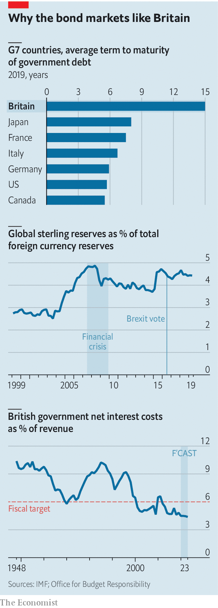

## Fiscal policy

# Britain’s budget and the bond markets

> If the government wants to increase borrowing in next week’s budget, that’s fine by the bond markets

> Mar 5th 2020

THERE WAS a time when so-called “bond-market vigilantes” could intimidate governments. “Over the course of my career we’ve gone from being rottweilers to poodles”, laments a 35-year market veteran. “You’d go and meet with the Treasury and say the market won’t wear this. Now you’re just thankful to buy something that has a positive yield rather than negative one.”

Since the financial crisis of 2007-2009 Britain has lost its AAA credit rating, seen its debt-to-GDP ratio rise from 40% to more than 80% and voted for Brexit. And yet over the same period the yield on gilts, the benchmark ten-year government bond, has fallen from around 4.5% to under 0.5%. In this, Britain is not alone; interest rates have fallen across the advanced economies. This week the yield on gilts hit a historic low below 0.4%, and the equivalent yields on American and German government debt fell below 1% and -0.6% respectively. The vigilantes do not appear to be very vigilant.

That record-low borrowing cost was hit ahead of a budget, due on March 11th, which most investors expect to be marked by an increase in borrowing. The new chancellor of the exchequer, Rishi Sunak, is widely expected to revise the fiscal rules he inherited from his predecessor, either in this budget or later in the year. Britain now looks set to get its sixth fiscal framework in a decade. Bond-market types have reacted with a shrug rather than a gasp.

Fiscal rules are supposed to guard against politicians’ propensity to run up debt by setting rules on how much borrowing is appropriate. Such rules are, in theory, aimed at reassuring investors in British government debt that they are lending to a credible counterparty. But investors pay less heed to them than politicians might imagine. According to Chris Jeffery of Legal & General Investment Management, an asset manager, “fiscal rules are a political figleaf: they help preserve the government’s modesty, tend to irritate the most delicate areas of the government and don’t last very long before needing replacement.”

The delicate area being irritated in this case is departmental spending. The current rules allow plenty of space for new capital projects but they pledge to balance the current budget within three years. Promises to increase spending on the National Health Service, hire 20,000 new police officers and protect schools funding while also cutting payroll taxes means a squeeze on other departments and local government. The need for a policy response to covid-19 puts further pressure on the existing fiscal framework. After falling from around 10% of GDP in 2009 to less than 2% today, the government’s deficit will probably start climbing again. That is less of a problem than many assume.

Britain’s existing stock of government debt may be high but the cost of servicing it is extremely low. In 2018-19 the net interest bill amounted to just 1.7% of GDP, the joint lowest of any year since the second world war. Borrowing costs amount to only 4.5% of tax revenues—well below the government’s rule of holding them below 6% (see chart). Demand for gilts has been high for two decades, which has pushed down yields.

The role of the Bank of England, which bought more than £400bn ($512bn) of government debt as part of its quantitative-easing programme between 2009 and 2016 and now owns around a quarter of the outstanding debt, has got a lot of attention. But over the longer term, demand from foreign reserve managers and domestic pension funds has been more important.

Gilts were a beneficiary of a large increase in global foreign-exchange reserves in the 2000s. As East Asian and Middle Eastern governments increased their reserves, gilts appeared attractively priced relative to other safe forms of debt. Sterling’s share of global reserves has risen from under 3% in 1999 to around 4.5% now. That money has proved to be sticky, and an increase in British borrowing is unlikely to make managers panic. “The obvious stress test was 2008,” when government borrowing leapt during the banking crisis, argues Moyeen Islam, a gilt strategist at Barclays. If foreign holders did not get rid of their gilts then or after the Brexit referendum, they are unlikely to do so in the face of a modest loosening of the purse strings now. “Where else are they going to go? Italy?”, asks a global fund manager. Choosing bonds is sometimes like picking the least dirty shirt out of the laundry basket and, compared with some peers, Britain does not look too crumpled.

Domestic pension funds and insurance companies hold around a third of the stock. Defined-benefit pension funds, in particular, have been keen to seek long-dated, safe sources of fixed income to match their liabilities. Although most such schemes are closed to new members, they still control over £1.5trn of assets. Their demand for gilts over the past 15 years has been “almost insatiable”, says a broker. Bonds made up 28% of their assets in 2006 but 63% by 2019.

In a low-interest-rate environment with gilt demand still high, Mr Sunak will have no problem funding his additional borrowing. Indeed, some bond managers argue the government has been ignoring market pressure to borrow more. Just as high rates in the past were taken as sign that fiscal policy was too loose and should be tightened, low rates today might point to fiscal policy being too tight. “If anything, markets have been calling for easier policy for years in Britain,” says Toby Nangle of Columbia Threadneedle Investments, an asset manager.

Things could, of course, change. The higher its debt, the more vulnerable a country is to shifts in market sentiment. But the average maturity of British government debt, at 15 years, is the longest of any advanced economy. Strong demand from pension funds for long-term paper has allowed Britain’s debt managers to gradually lengthen their borrowing. That maturity profile means not much of it needs to be refinanced each year and provides insulation against any sudden move in global interest rates. If Mr Sunak wants to splash the cash at the budget the bond market will be happy to oblige. ■

## URL

https://www.economist.com/britain/2020/03/05/britains-budget-and-the-bond-markets
