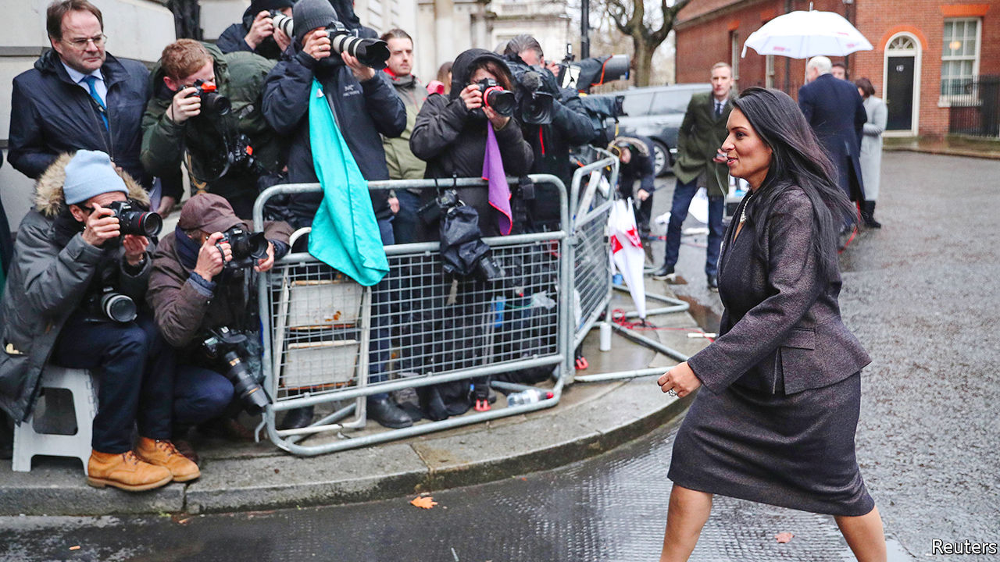

## Politicians and civil servants

# Priti Patel’s bust-up at the Home Office

> A bullying row reveals a lot about Boris Johnson’s government

> Mar 5th 2020

“THE HOME SECRETARY is doing an outstanding job,” according to Boris Johnson, defending Priti Patel during prime minister’s questions in the House of Commons on March 4th, as she sat beside him. Sir Philip Rutnam, who on February 29th resigned as permanent secretary to the Home Office after a 33-year career, begs to differ. He claims Ms Patel bullies her staff and was involved in a vicious briefing campaign against him. He is suing the department for constructive dismissal. Mr Johnson has asked the Cabinet Office to conduct an investigation, which may become a running sore for the government.

Several combustible factors have come together to create this bust-up. The first is Ms Patel’s personality. A hardliner on Europe and crime, she has a chequered history in government. Theresa May sacked her from a job as a foreign office minister because she had unauthorised meetings with Israeli government officials that she had failed to reveal.

The Home Office is not the only department in which colleagues have had problems with her. Complaints of rough treatment were made at her former ministries of welfare and international development. “Anybody who has gone into a department as a minister where Priti has been is greeted with open arms, because she is a such a high-tempered person,” says an ex-colleague. An acquaintance from her days as a lobbyist says she refused to take no for an answer and often left underlings in tears. “She would appear to enjoy that.”

Ms Patel denies any wrongdoing. Her allies say “dark forces” are at work, and that she’s an iron lady, guilty of nothing more than delivering the people’s will.

That points to the second factor—ideology. New cabinet ministers and their permanent secretaries often start out on a frosty footing, but the current level of mistrust is unusual. Many of Mr Johnson’s ministers regard the civil service as idle, know-it-all and hostile to Brexit. Dominic Cummings, the prime minister’s top aide, thinks bureaucrats use legal advice to bamboozle ministers, and argues that the likes of Sir Philip should be replaced by political appointees. Top officials at the Foreign Office and Treasury are on a Downing Street “shit list” and face being culled, according to reports.

The third factor at work is the peculiarity of the Home Office, where danger lurks around every corner for ministers. Unlike those in areas such as health and education, where operational decisions are devolved to arms-length bodies, Home Office ministers find themselves on the hook for individual immigration cases or terrorist probes. Ministers get ambushed by things that have gone on in the machinery way out of their line of sight. The heavy pressure to drive down immigration in recent years has increased the likelihood of foul-ups. “The Home Office exists in an atmosphere of permanent, heightened tension,” says a former minister. Survival, says Will Tanner, an aide to Theresa May when she was home secretary, “requires absolute attention to detail, cast-iron self-belief and a team of people to watch your shadow.”

Ms Patel is said to have been particularly incensed by a judge’s decision on February 10th to halt the deportation of criminals to Jamaica, on the grounds that their legal rights had been denied. Laws that bind ministers’ hands on security and immigration make the department particularly unsuited to an assault on the liberal “blob”. “It’s a conflict between a saloon bar fantasist in the form of Priti Patel, versus a hard-core realist” in the form of Sir Philip, according to Charles Clarke, a Labour former home secretary.

Brexit adds to the pressure. Mr Johnson has ordered the Home Office to recruit an additional 20,000 police officers to reverse a trend of rising crime. The department is trying to get several complex new computer systems up and running. Coronavirus may stretch the cops further.

In addition, a new immigration system needs to be ready at the end of the year, when Britain’s departure from the EU is complete. The department must also complete the registration of 3.6m EU citizens already living in Britain, and work out how to mitigate the loss of EU information-sharing systems used by police and border guards. All these elements are crucial to a smooth Brexit; getting them working in the tight timetable that the government has set would tax the patience of even the easiest of ministers. ■

## URL

https://www.economist.com/britain/2020/03/05/priti-patels-bust-up-at-the-home-office
