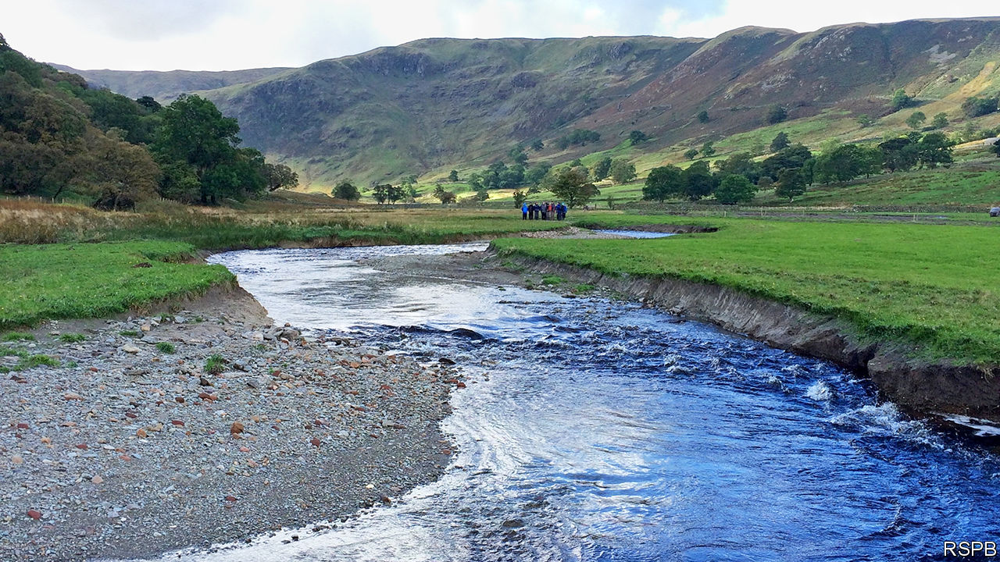

## Hydrology

# Re-engineering Britain’s rivers

> Why the wiggles are being put back into watercourses

> Mar 7th 2020PENRITH

BENEATH THE junction where Hobgrumble Gill meets Swindale Beck in the Lake District of Cumbria is a suspended valley that has been farmed, against all the odds, for centuries. Today just one active farm remains. Crumbling buildings and 47km of stone walls that climb right up to the highest hill passes bear witness to a time when ten or more families would have eked a living from this inhospitable land.

The wet valley floor is mown in the summer to provide hay for sheep in the winter months, when steep and rocky flanks of the valley are too cold and snowy for grazing. At some point, 200 years ago or perhaps more, the river was straightened in an effort to speed up the movement of water through the valley and to dry out the hay meadows.

This kind of battle to control water was repeated across Britain, as farming expanded and landowners consistently sought to keep rivers on the straight and narrow, inside their riverbeds where they belonged, and thus maximise the land area available for cultivation. But rivers, particularly ones that travel through flat valleys like this one, do not want to run straight. Their natural inclination is to wander back and forth in oxbow bends that shift across the land over time.

Meandering waterways have many virtues. They are slower; they have a greater diversity of wildlife habitats from ponds to gravel beds and rapids which draw more oxygen into the water; they boost water quality, by creating elbows and pools where sediment flowing down the river gets trapped rather than washing off the land; they are prettier. And—a matter of increasing salience—their water spends more time upstream, reducing the risk of floods downstream.

Now that farming has receded, and squeezing the last unit of production out of this land is no longer an imperative, these other considerations are gaining weight among those who manage rivers. As a result, a new trend is taking hold, in Swindale and elsewhere: Britain is putting the kinks and wiggles back into its rivers. Across the country, thousands of waterways are being encouraged to take a wander.

The simplest but least predictable approach to re-wiggling a river is to block the upper end of its straightened bed and let the water find its own way. This was done at Ennerdale, also in Cumbria, with great success. In Swindale, there was farmland to consider so geomorphologists estimated the river’s most likely natural path, which diggers then scraped out helping the water find its way to the valley’s lowest point—conveniently off to the side of the haymeadows. The project is a collaboration between the Royal Society for the Protection of Birds, which runs the Swindale farm as an experiment to demonstrate how farming can be done hand-in-hand with ecological conservation, United Utilities, which owns the land, Natural England, a government body, and the UK Environment Agency.

The result of all this is a longer and healthier riverbed, ecologically speaking. Within months of the diggers moving out of Swindale, new gravel beds had formed organically and salmon were using them to spawn. A vast tree-planting programme on the banks of the beck and up the sides of the valley should also stabilise the land, further hold back sediment and increase the amount of carbon stored, which both enriches the soil and sucks some of the carbon dioxide out of the atmosphere, helping combat climate change.

It is not all plain sailing. The Lake District is a World Heritage site, which puts an onus on preserving the cultural identity of the landscape as a farmed one. Farmers who follow ancient farming practices do not always appreciate being told that the rivers their forefathers created are the wrong shape and don’t do the jobs they need to do.

Nonetheless, projects like the one under way in Swindale may help inspire farmers to think differently about their land. This is a time of change for them. After Brexit, the EU’s comfortable Common Agricultural Policy looks like being replaced with a new, less generous subsidy regime, in which payments will be tied to, among other practices, the provision of environmental services. “Most farmers in these areas will admit that it’s hard to make money in these marginal upland areas,” says Jim Bliss, who helps farm the 3,500-acre Lowther estate some 10km north of Swindale. “Diversification is the way forward. But this is a live debate: are we farming for goods or nature?”

Lowther estate is in the process of shifting to the nature side. Like many others, it is transected by a straight river channel. But for some months now, Mr Bliss and his team have been nudging the water this way and that, encouraging it to go back to its natural winding course, whose trace can still be seen on the landscape. The goal is to have a much smaller, pedigree herd of 120 longhorn cattle that cost less to maintain and benefit from a richer, healthier “wildland farm”. And a wiggly river running through it all.■