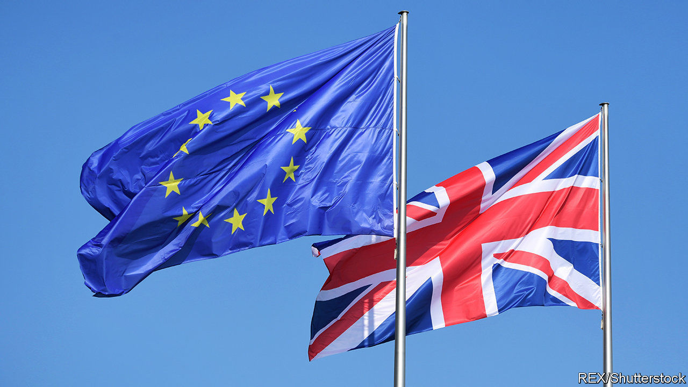

## Brexit negotiations

# The gaps between the EU and Britain are wide—and time is short

> Seconds away, round two

> Mar 5th 2020

TALKS ABOUT future EU-UK relations formally opened in Brussels this week. Although the two sides share the goal of a zero-tariff, zero-quota free-trade deal similar to Canada’s, there are big differences over how to reach it. The most contentious, which will be thrashed over in negotiating rounds alternating between Brussels and London, are demands for a level playing-field on regulation, access to British fisheries, financial-services regulation, data protection and dispute settlement.

The EU says it cannot give Britain a deal like Canada’s without regulatory alignment. Its negotiating mandate cites EU labour, environmental and other standards merely as “reference points”. But it wants British commitments to be legally binding; and, for state subsidies to industry, it demands full adherence to its rules. Britain is ready to promise not to undercut the EU unfairly, but it rejects sticking to the bloc’s laws on the grounds that regulatory divergence is a key purpose of Brexit.

The political declaration attached to October’s withdrawal treaty suggested agreeing on fisheries, financial services and data protection by the end of June. This deadline is unlikely to be met. The EU wants to keep today’s access to British waters, but Britain suggests annual haggles instead. The British want their financial-services regulation and data protection deemed to be equivalent to the EU’s, but Brussels says these are non-negotiable, unilateral decisions it can withdraw at any time.

Dispute settlement is problematic. The EU wants an overarching agreement allowing it to choose unspecified punishment for any breaches. Britain prefers individual deals that avoid the risk that a dispute in one place leads to retaliation in an unrelated area. It also rejects any role for the European Court of Justice, whereas Brussels insists that the court must always be the sole interpreter of EU law.

Both sides believe a hard line bolsters their bargaining position. As the smaller side, the British are adding two other tricks. One is to threaten to walk out if not enough progress is made by June. The idea is to signal that London is not worried about having no trade deal when the current transition period ends in December. This is unlikely to work, as the EU thinks Britain has a lot more to lose.

The second is to tout trade talks with America as an alternative. Liz Truss, the trade secretary, published her negotiating terms this week. She says Washington is eager, though her insistence on retaining high food standards and excluding National Health Service procurement may dampen its enthusiasm, since opening these areas up is among America’s priorities. True to the new tactic in Brussels, Ms Truss already threatens to walk out if the Americans do not offer the right deal.

What was most notable about her plan was its economic analysis. She talked airily of boosting bilateral trade by some £15bn ($19bn). But her own modelling puts the boost to GDP from a US-UK trade deal after 15 years at only between 0.07% and 0.16%, depending how far trade barriers were reduced. Gains from free-trade deals with other countries would be smaller.

Such numbers are tiny compared with the likely losses from new barriers to trade with the EU. Treasury analysis in November 2018 found that, over ten years, a Canada-style deal would reduce GDP by some 4.9% compared with staying in the EU. Leaving with no trade deal would cut it by as much as 7.7%.

The government refuses to update this analysis. David Frost, its Brexit negotiator, has said the impact of tariffs and customs barriers is exaggerated, but offered no economic argument to support this claim. In its trade mandate, the government promises only to “invite contributions about the economic implications of the future relationship”. As for the November 2018 study, Downing Street says primly it was done by “another government”. What accounts for this coyness? Maybe the fact that most economic models show losses from leaving the EU being vastly bigger than gains from trade deals with other countries.■