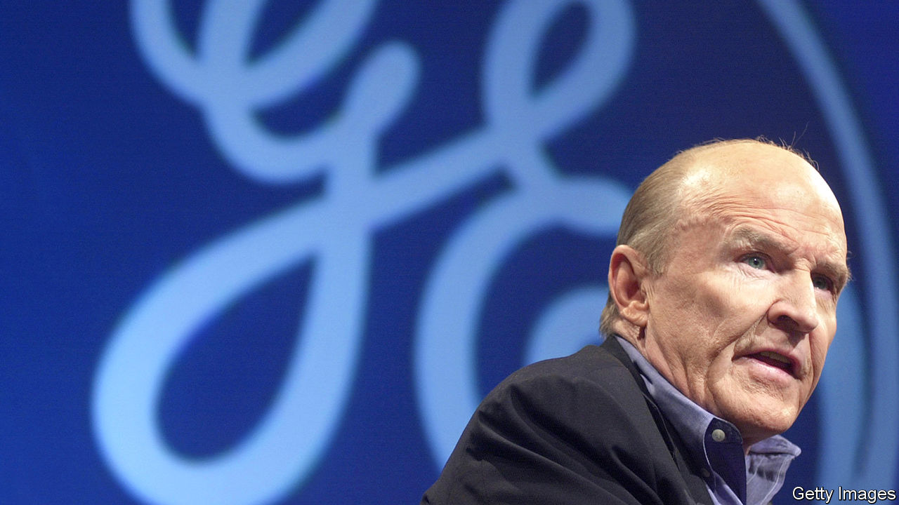
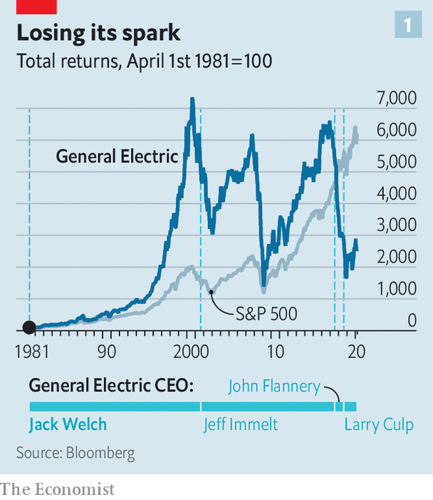
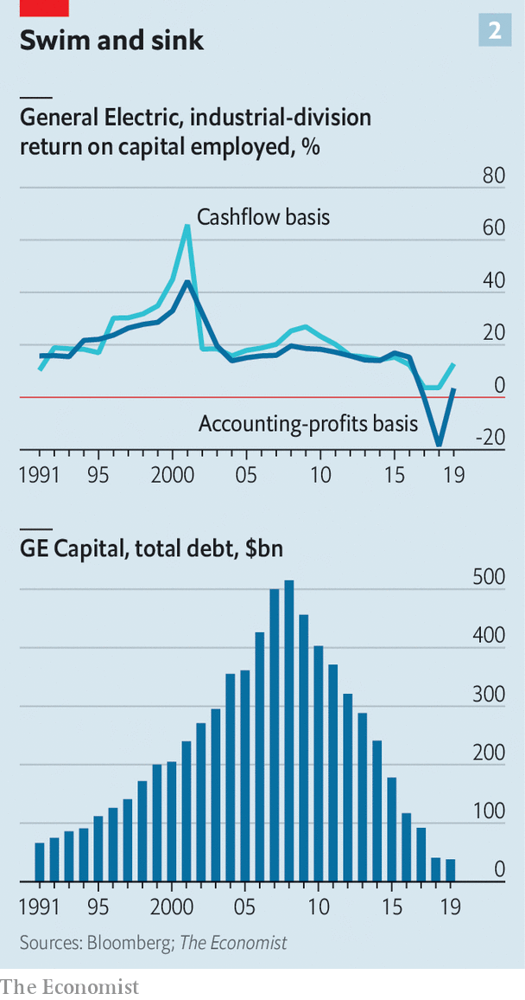

## Captain of industry

# Jack Welch transformed American capitalism as boss of GE

> In good ways and bad

> Mar 5th 2020NEW YORK

IN HIS AUTOBIOGRAPHY, published soon after retiring from GE in 2001, Jack Welch explained the challenge he had faced when taking over as chairman and chief executive of the iconic American company 20 years earlier. The firm had grown top-heavy and sclerotic. Some divisions had not posted profits in over a decade. In his farewell speech, Reginald Jones, his patrician predecessor, likened the industrial conglomerate poetically to the Queen Mary, a majestic ocean liner, caught in a storm.

In his inaugural address Mr Welch maintained the nautical metaphor—with less decorum and a greater sense of urgency. He told his charges that he wanted GE to be like a speedboat in the harbour “trying to move like hell”. The threat from sophisticated competitors from Japan was growing. He did not want GE to go the way of Detroit’s carmakers or IBM, which failed to adapt. As corporate America mourns his death on March 1st, aged 84, the company he reinvented is itself struggling to keep up with the times.

Mr Welch certainly revved up GE’s propellers. Under Jones, who led the firm from 1973 to 1980, it doubled revenues to $25bn and saw its share price sink by about a fifth. Under Mr Welch revenues quintupled from $27bn in 1981 to $130bn in 2000. Total shareholder returns, including dividends, rose 70-fold, more than three times as fast as those for the S&P 500 index of big corporations (see chart 1).

This made him the talk of corporate America. In 1999 Fortune magazine anointed him “manager of the century” (never mind Henry Ford, who pioneered mass production, and Alfred Sloan, who more or less invented modern management at General Motors). The plain-spoken Mr Welch had admirers outside business circles, too. Beth Comstock, a former GE vice-chairwoman, recalls attending overflowing shareholder meetings with him where “little old ladies were shaking like they were meeting a rock star.”

The Welch revolution rested on four pillars: people, process, purpose and profit. Start with people. Ex-lieutenants praise him for nurturing talent. He encouraged employees to take risks and speak their minds, remembers Jeff Sonnenfeld of the Yale School of Management, who taught at the company university in Crotonville.

He also promoted an obsessive, ruthless meritocracy. To tame GE’s bloated bureaucracy, he introduced the policy of “rank and yank”, sacking the bottom 10% of managers, measured by financial and other metrics, each year. “Public hangings are…worth a thousand CEO speeches,” Mr Welch once quipped. He lavished praise when managers excelled, but upbraided them publicly if they did not. “You were either a pig or a prince,” recalls a senior aide.

Mr Welch was also obsessed with processes. Some were radical in his day but have since become commonplace. To prevent turf wars from killing new ideas, for instance, he insisted that town-hall meetings (dubbed “work-outs”) be held so that all relevant parties could raise objections. He championed Six Sigma, a series of techniques that aimed to keep manufacturing defects below 3.4 per million parts.

GE’s purpose also changed on his watch. Since its founding by Thomas Edison in 1892 it had focused on engineering, from refrigerators to turbines. Mr Welch extended it to product-related services, like selling airlines flight time rather than merely jet engines. More controversially, he also grew GE’s financial-services arm.

Everything, always, in the service of profits. To boost them further, Mr Welch slashed costs and sold flagging units, insisting that every GE division be first or second in its industry. Net income duly soared from $1.7bn in 1981 to $12.7bn in 2000.

Mr Welch always had critics. His insistence on downsizing while GE was still profitable—headcount fell from above 400,000 in 1980 to below 300,000 five years later—earned him the epithet “Neutron Jack”, in reference to the neutron bomb, which kills people but leaves buildings intact. Tom Peters, co-author of “In Search of Excellence”, a hallowed management tome, accepts that GE needed discipline as its woes were “obvious to a fourth grader”. But he likens Mr Welch’s methods to “dumping loads of bodies off the side of the cruise ship”.

More important, GE began to unravel almost as soon as he left. His hand-picked successor, Jeffrey Immelt, was finally ousted in 2017 after failing to reverse a sharp decline. John Flannery, who replaced him, lasted barely a year. GE’s market capitalisation fell from a peak of $600bn in 2000 to $95bn today.

Was Mr Welch to blame? Some strategies that fuelled heady returns during his tenure no doubt played a role. “The dark side of worshipping at the altar of Six Sigma is that breakthrough innovations get cut,” says Vijay Govindarajan of the Tuck School of Business. The checklist culture and underinvestment in research left GE’s innovation engine sputtering.

Mr Welch also missed the digital revolution. He admitted in his autobiography that he was “slow to understand the impact of the internet”. Mr Govindarajan points to his aggressive outsourcing of information technology to Indian firms, a move that saved money in the short run at the expense of surrendering the future. “If Jack had been visionary, we could have done what Google or AWS [Amazon’s cloud-computing arm] did,” grumbles a former senior GE man. Instead, Mr Welch bought trophy assets like NBC, a television network and Kidder Peabody, an investment bank.

Mr Welch’s most consequential mistake was to grow the financial arm, GE Capital, into a monster. The division’s easy profits during the long economic expansion of the 1990s masked plenty of sins, including mounting troubles at GE’s core industrial units. As Mr Peters puts it, mincing no words, Mr Welch handed his successor “a real pile of shit” in the form of GE Capital.

The division grew quickly from the early 1990s, bolstering profits, free cashflow and returns on capital. Its loaded up on debt and relied on fickle short-term funding. By 2000 it generated 51% of GE’s revenues; GE’s industrial and power divisions eked out barely a tenth each.

Industrial performance peaked as Mr Welch left, and collapsed between 2001 to 2003, with Mr Immelt in charge. Part of this was down to a recession in 2001. However, after 2003 GE’s industrial businesses continued to deteriorate; their returns on capital collapsed and cashflow dried up. Mr Immelt pursued pricey acquisitions (most notably of France’s Alstom, which makes power equipment, and Baker Hughes, an energy firm) and ill-timed asset sales. For years he continued to expand GE Capital. Though less dependent on short-term funding, it remained highly leveraged. It was pushed to the brink by the global financial crisis of 2007-09, saved only by a federal bail-out. Only then was Mr Immelt forced to shrink the division, a move his successors have since intensified.

There is no denying that Mr Welch was a towering figure who helped jolt America Inc out of the complacent 1970s. At times, he may have shaken too hard. On March 4th the current boss, Larry Culp, observed that Mr Welch had “changed the business landscape as we know it”. He did not say whether it was for better or worse. ■