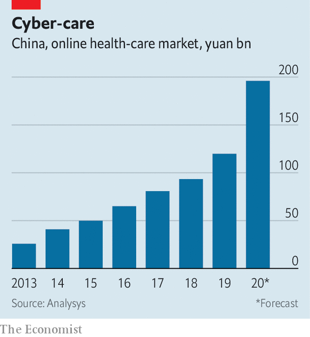

## The smartphone will see you now

# Millions of Chinese, cooped up and anxious, turn to online doctors

> Even after the covid-19 epidemic, many will continue to favour internet hospitals

> Mar 5th 2020SHANGHAI

WHEN SARS, a coronavirus, hit China in 2003 citizens hunkered down at home. This proved a blessing for some businesses. Chinese social media took off. So did e-commerce. Richard Liu, who ran a chain of consumer-electronics shops, shut all his brick-and-mortar stores and set up JD.com. The firm is now valued at $64bn.

A novel coronavirus that has brought China to a halt this year is boosting another fledgling industry: telemedicine. As hospitals turn away patients with other ailments and many Chinese are confined to their homes or steer clear of clinics for fear of infection, millions are seeking treatment and advice on the internet. The government is egging them on.

Xin Lijun, boss of JD Health, says that his platform’s monthly consultations have grown tenfold since the outbreak, to 2m. Some 1.6m tuned in to a talk by a top cardiologist that the JD.com subsidiary live-streamed. Without the outbreak, the shift in consumer behaviour would have taken perhaps five years, reckons Mr Xin. Chen Qiaoshan of Analysys, a consultancy in Beijing, thinks that China’s online health-care market may near 200bn yuan ($29bn) this year, up from her pre-outbreak estimate of 158bn yuan.

China’s telemedicine market—including consultations and drug sales—had been predicted to grow vigorously even before the latest epidemic. Ping An Good Doctor, a medical-services app run by a big insurer, claimed in September that over 300m had registered on it, equivalent to one in three internet users in China. Tianyancha, a data firm, counts over 1,000 home-grown telemedicine companies. 

Until now, however, most of these firms have stuck to delivering drugs or, in Ping An’s case, booking appointments with specialists, whom Chinese patients favour over general practitioners, even if it means queuing for hours at a hospital. Prestigious “AAA” hospitals account for one in ten public institutions but receive half of all outpatients. And the many Chinese who believe in traditional medicine, with its injunction that a reliable diagnosis cannot be made without feeling the pulse, would not dream of accepting health advice by video link. 

Authorities, too, have been cautious. In many countries, including America, the world’s biggest telemedicine market, most insurers do not reimburse patients’ online expenses. Nor, in all but a few regions, does China’s national health-insurance scheme. Most Chinese online doctors are permitted only to handle repeat prescriptions and follow-up consultations, not make an initial diagnosis. A draft government policy from 2017 took “a negative tone” on internet hospitals and recommended they be shut down, recalls Li Tiantian, founder of Dingxiang Doctor, which runs a medical myth-busting-and-advice forum.

Last year the government began to lift some restrictions, such as a ban on the sale of prescription drugs. But covid-19, as the new disease is known, has accelerated the shift. At the peak of the epidemic in early February a health-ministry directive mandated that internet-based medical services be given “full play” to diagnose and treat patients. Another encouraged hospitals to give online consultations. Jiangsu province, China’s industrial powerhouse, authorised reimbursements for online medical care. So have cities including Shanghai and Wuhan, capital of Hubei province, where covid-19 first emerged. 

Telemedicine firms are trying to win over the government and consumers by behaving like good corporate citizens. Many, including JD Health, are offering patients consultations free of charge while the epidemic lasts. Ali Health, an arm of Alibaba, China’s e-commerce titan, launched a free “online clinic” for residents of Hubei, which has been under lockdown; in five days 100,000 patients got a remote consultation. WeDoctor, an app backed by Tencent, a tech giant, mobilised 20,000 physicians to work online for no pay. Ping An set up an “antivirus command centre” to dispatch free face masks around the country. Dingxiang Doctor got epilepsy medication to 300 children in Hubei amid an acute shortage of suppliers and delivery firms. Its real-time heat map tracking covid-19 infections has been viewed 2.5bn times.

All this is costing the companies money. But, says Mr Xin of JD Health, it makes “little sense” to focus on profit at the moment. What matters, he adds, is how covid-19 has made people think twice about rushing to hospital and helped foster trust in general practitioners, who provide the bulk of online advice. It has also broadened the appeal of firms like his, beyond middle-aged patients with chronic conditions to web-savvy youngsters seeking advice for parents and grandparents and healthy types simply seeking reassurance. Of the 10m people who have turned to the internet for health services in the past month, perhaps half were first-time online patients, says Ms Chen. At least a third are likely to keep using such apps, she estimates. 

It is not just patients and politicians who are embracing telemedicine. JD Health has lured more pharmacies to its platform (in part by waiving the fee it earns on drug orders in Hubei). China’s underpaid, overworked doctors are also keen. Xiao Xingxing left a AAA hospital in Beijing to consult full-time for JD Health; many old colleagues and classmates are doing the same, she reports. And against the backdrop of a global, virus-induced stockmarket rout, Chinese online health firms offer a tonic to ailing investors. This year the share prices in Ping An Healthcare and Ali Health are up by 33% and 74%, respectively. ■

## URL

https://www.economist.com/business/2020/03/05/millions-of-chinese-cooped-up-and-anxious-turn-to-online-doctors
