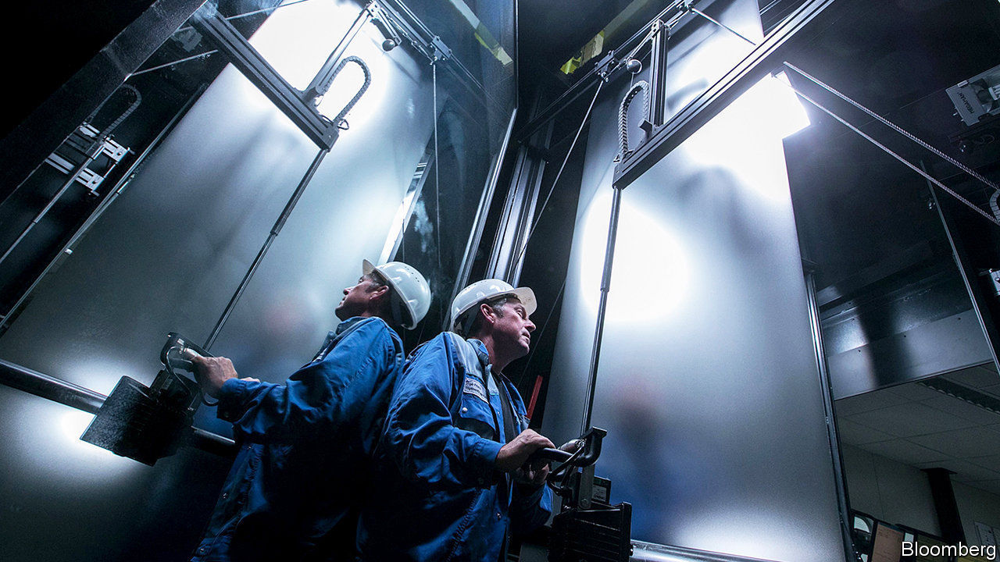
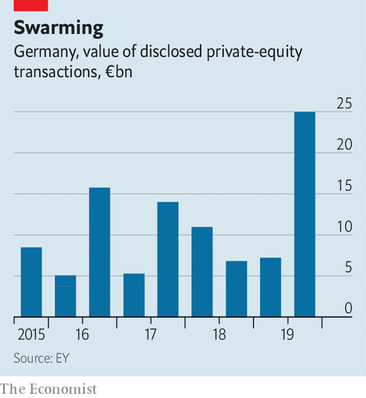

## Locusts of attention

# Two buy-out firms pay €17bn for Thyssenkrupp’s lifts business

> It is the latest example of Germany’s buzzing private-equity scene

> Mar 5th 2020BERLIN

THE BID was months in the making. On February 27th the supervisory board of Thyssenkrupp announced that a consortium led by two Anglo-Saxon private-equity firms, Advent International and Cinven, had beaten one led by two others, Blackstone and Carlyle, in the bidding war for Thyssenkrupp Elevator (TKE), a division of the troubled conglomerate. They paid €17.2bn ($19bn), a rich price for the world’s fourth-largest liftmaker. It is the biggest private-equity deal ever in Germany, and one of largest anywhere in Europe.

It is not the only recent one. Germany has become the most popular European market for private-equity investors, according to consultants at PwC. Last year the value of disclosed deals reached an all-time high of €32bn (see chart). Many of them involved foreign buy-out firms, whose advances seem increasingly welcome in Germany. Martina Merz, chief executive of the cash-strapped Thyssenkrupp, preferred the bids of the two consortiums to a higher one from Kone, a rival Finnish liftmaker. She worried that antitrust concerns would cause long delays in completing the deal (even though Kone planned to let CVC, another private-equity firm, run TKE’s European business). And union leaders opposed the Kone bid, assuming it would result in larger job losses than a takeover by private-equity groups, as the combined rivals reaped economies of scale.

Such bonhomie between buy-out firms, their targets and labour and political leaders would have been unthinkable a few years ago. When in 2004 Texas Pacific Group bought Grohe, a maker of bathroom equipment, Franz Müntefering, then boss of the Social Democratic Party, in whose constituency Grohe was based, branded the firms asset-stripping “locusts”.

Better relations are the consequence of private-equity barons’ evolving sensitivity to German quirks. They have grown wilier, developing Fingerspitzengefühl—“fingertip feeling” for tone and timing necessary to navigate the local landscape, characterised by complex rules on mergers and acquisitions and an idiosyncratic system of “co-determination”, which gives workers more power on corporate boards than anywhere else in the developed world.

Advent and Cinven are a case in point. Both have offices in Germany, staffed with locals who understand the peculiarities of German corporate governance and local politics. They buttered up IG Metall, the metalworkers’ union, as well as the mayor of Essen, the city where Thyssenkrupp is based, and Armin Laschet, the premier of its home state of North Rhine Westphalia. “You can only do such a deal with feet on the ground,” says Steve Roberts, head of PwC’s German private-equity practice.

As a result, only big firms with resources are likely to succeed. Fundraising has shifted to “winner takes all”, argues Alexander Schmitz, a partner at Bain & Company, another consultancy. He expects more mega-deals like TKE that only a few big British or American private-equity powerhouses can arrange.

For all their recent progress, however, buy-out firms continue to face structural impediments to growth in Germany. Lukas Schäfer, head of private equity in Germany for McKinsey, yet another consultancy, notes that the number of takeover targets is limited because the Mittelstand, Germany’s famed medium-sized family companies, remain wary of private equity. Moreover, says Mr Schäfer, many traditional German firms, including retailers and car-parts manufacturers, are seen as being threatened by the rise of e-commerce and electric vehicles. Even Mr Schmitz, who is more bullish, concedes that rules such as the domination agreement, which stipulates that an owner must secure 75% of votes at an extraordinary general meeting to control a target company’s cashflow, deter potential buyers.

Having won over Thyssenkrupp’s long-suffering shareholders with their hefty offer, Advent and Cinven say they are planning to spend billions on expanding TKE’s business. That ought to placate labour unions and politicians. Whether the pricey deal ends up rewarding the two funds’ investors is another matter entirely. ■