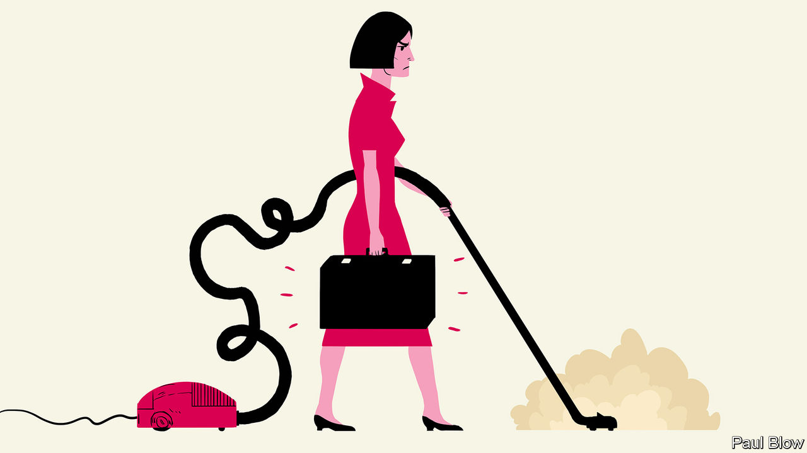

## Bartleby

# Women still face barriers in the workplace

> Many arguments about female progress are a convenient fiction for men

> Mar 5th 2020

WOMEN HAVE made great strides in the employment market over the past 50 years. But many still feel that their progress is being obstructed and, to coincide with International Women’s Day on March 8th, two new books by feminist writers tackle the issues.

In “The Fix” Michelle King, director of inclusion at Netflix, a video-streaming giant, observes that women are constantly told they need to change themselves—be more assertive, work longer hours and so on. Instead, she argues, working practices should change to accommodate the needs of half the adult population. In “The Home Stretch” Sally Howard, a journalist, suggests that a big reason why women are held back is that even those who work full-time are still expected to do the bulk of the housework. To cite the book’s lengthy but apposite subtitle, she makes a strong case “why it’s time to come clean about who does the dishes”.

Male managers may find these books an uncomfortable read, peppered with talk of the patriarchy and gender privilege. Sometimes, the authors go too far. Ms Howard links the patriarchy with capitalism so often that one wonders whether she has ever seen a picture of the Soviet Union’s all-male politburo or considered the harm done to women and baby girls by the Chinese Communist Party’s one-child policy.

But men do not need to forsake the capitalist system to appreciate the plight of female workers. They just need empathy. Are women in the workplace judged by the same standards as their male colleagues? Are they described with adjectives (strident or emotional, for example) that would not be applied to men with the same characteristics?

Despite recent progress, women still face a glass ceiling (see [article](https://www.economist.com//business/2020/03/07/go-north-young-woman)). A couple of stories in Ms King’s book illustrate the point. Sarah was an executive at a multinational who worked late, underwent management training and enthusiastically received and acted on feedback. After many years of rejection, it seemed she was due for promotion to the next tier, which was 100% male. But at the key meeting a male executive said: “I don’t know; she just doesn’t fit. She has those glasses and she wears that clip in her hair.” Not exactly “scientific management”.

In the other tale Ms King, on her first day in a new job, walked into a kitchen full of men. Her boss said “Hey, Michelle, there are dishes in the sink and you are a woman, so, you know, wash them.” His colleagues laughed. When she protested, she was told to learn to take a joke.

Bullying disguised as humour is still bullying. And women are expected to put up with it. They must also tolerate different dress standards. Boris Johnson, Britain’s prime minister, often messes up his hair before public appearances to maintain his “lovable buffoon” image. Dominic Cummings, his adviser, dresses scruffily, which suits his persona as the “eccentric genius”. It is hard to imagine any woman reaching a position of political power while adopting a similar style.

Sometimes the excuse for the lack of female progress in certain professions is that women and men naturally choose to pursue different career paths. Yet those outcomes may simply be the result of formal or informal barriers against female success. At the end of the 19th century, when only 4-5% of American doctors were women, some men no doubt put this down to a lack of aptitude. Many medical schools, perhaps sharing that preconception, did not admit female candidates; Harvard’s began accepting women only after the second world war. In Britain women were not allowed to become practising lawyers until they were admitted to the Law Society in 1922.

In both professions the playing field was eventually levelled. The result? In 2017 more women were admitted to American medical schools than men for the first time. By 2018 half of British solicitors were female.

Another common argument is that it makes sense for married people to specialise, with the man taking on higher-paid employment and the woman doing more of the chores. It is equally dubious. One study, for instance, found that husbands who earn less than their wives do even less housework than those who earn more.

Many of the arguments that women’s lack of progress is down to aptitude or choice look like a convenient fiction for men, who do rather well out of the bargain. Women, who end up doing most of the chores as well as working long hours, get a raw deal. It is not them who need to change—it is the attitudes of men.

## URL

https://www.economist.com/business/2020/03/05/women-still-face-barriers-in-the-workplace
