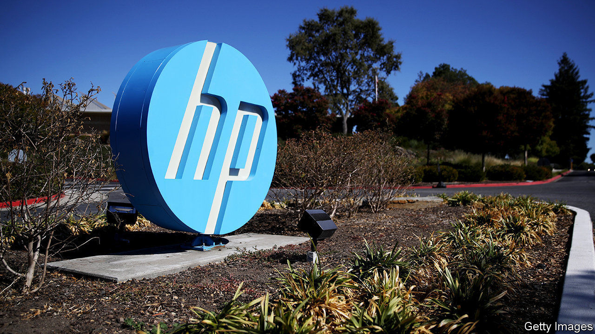

## Tech takeovers

# Xerox launches a takeover bid for HP

> It is an attempt to burnish tech royalty whose glory has faded

> Mar 5th 2020

IF THE BOARD won’t agree, try the shareholders directly. After nearly a year of advances, on March 2nd Xerox made a formal tender offer for HP, a much bigger rival computer-and-printer-maker. It is willing to pay HP’s shareholders $24 a share, valuing the company at $35bn. That is a third higher than its market capitalisation before Xerox made its intentions clear in November—and five times that of Xerox itself.

Both firms are Silicon Valley royalty, left behind by the pace of a technological revolution they did much to shape. Xerox—particularly its fabled Palo Alto Research Centre—helped invent photocopying, laser printing, desktop computers and the “graphical user interfaces” that everyone now takes for granted. A plaque commemorates the garage where Bill Hewlett and David Packard founded HP, with $538 of capital, as “the birthplace of Silicon Valley”.

These days Xerox’s printing business looks to be in long-term decline. The paperless office may be a pipe dream, but IDC, a research firm, forecasts that the number of pages the world prints each year will drop from around 3trn in 2017 to 2.6trn or so in 2023. Xerox’s revenues have fallen every quarter since 2016 bar one, year on year. 

HP, too, has struggled in the smartphone age. Besides its own range of printers, it is the world’s second-largest seller of personal computers (PCs). That market is also now shrinking. An uptick of 0.6% in worldwide PC shipments in 2019, to 261m units, was the first increase in seven years. In the age of mobile devices no one expects a PC revival.

Xerox argues that joining forces would help both firms compete. It promises $2bn of annual cost savings after two years. However, Katy Huberty of Morgan Stanley, a bank, points out that the two companies’ printing-product lines are mostly complementary, with HP specialising in smaller machines than Xerox.

The tech industry has a history of ill-judged mergers (HP’s own acquisition of Compaq, a rival computer-maker, in 2002 being a prime example). Xerox’s plan to swallow a firm five times its size looks ambitious, to put it mildly. Bad blood could complicate things further. HP’s board rejected an earlier offer of $22 a share, made in November, saying it “significantly undervalues” the firm. In February HP said it would return $16bn to its shareholders, in an attempt to block the deal.

Xerox has one thing going for it. Among its big shareholders is Carl Icahn, an activist investor with a string of hostile takeovers to his name (and a stake of around 4% in HP). The markets seem optimistic. Despite the coronavirus-inspired slump, both firms’ share prices remain higher than before Xerox came a-wooing.■