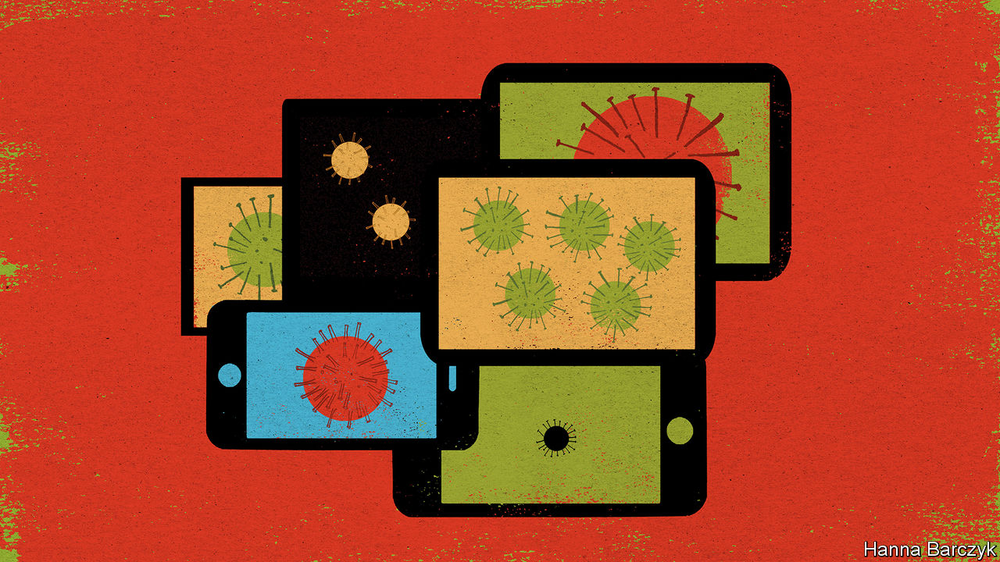

## Chaguan

# China’s propagandists are trapped by their own rhetoric

> The total victory they have promised over the new coronavirus is impossible

> Mar 5th 2020

THE REVIEWS are not yet in, but it is safe to say that “A Battle Against Epidemic: China Combating covid-19 in 2020” has the makings of a bestseller. A project overseen by the Central Propaganda Department of the Communist Party of China, the forthcoming hardback is billed as a tribute to President Xi Jinping’s “outstanding leadership” in the fight against the novel coronavirus. With Mr Xi already dubbed “Commander of the People’s War” against covid-19 by official media, it would be a bold party committee or government office that does not order a copy. Yet those eager to reserve one in advance will need patience, because the volume has suddenly vanished from the online catalogues of the People’s Publishing House. When the book returns in some guise, as it doubtless will, the contents may have changed quite a bit. For propaganda chiefs need to rethink their rhetoric about covid-19, since they cannot hope to live up to it.

Since January hundreds of millions of Chinese have spent weeks in locked-down villages and towns, forbidden to meet friends and family. Some have had to home-school children. Others are living on savings until their workplaces re-open. Scanning social media for news, many normally apolitical citizens have been angered by reports of official cover-ups and incompetence, or by viral smartphone videos of security forces thuggishly enforcing quarantines. The same citizens have then been shocked to see controversial reports deleted before their eyes by censors.

Anxious to rally a frightened public, Chinese leaders declared all-out war on the devil virus some weeks ago. It will end, they promise, with “a complete win”. State and party news outlets have cast doctors and nurses as “white-clad and fearless warriors”. Medics killed by the virus have been hailed as battlefield martyrs.

Though China has nothing resembling a free press, some more independent voices can be heard, whether bloggers or a few big-city, commercially driven news outlets that push the limits of what may be reported. The epidemic has seen notably brave work by Caixin, a business publication whose commercial backers include Tencent, a technology giant, and which is said to have high-ranking fans, among them (it is rumoured) Wang Qishan, China’s vice-president and a former anti-corruption chief. The publication has sent several teams to Wuhan, the city at the centre of the outbreak. They reported that officials hushed up news of tests conducted in December that first discovered the new virus and then suppressed evidence that it could jump from human to human. Editorials in Caixin have argued that transparency is the key to winning public trust, because suppressing the truth fuels panic.

Caixin’s reports have been repeatedly deleted by censors. For all that, and a bit unexpectedly, its calls to level with the public also earn praise from some in the party press. That may be because greater honesty is the only way out of the trap created by early, hubristic promises of total victory. Back on February 20th, when almost all confirmed cases of covid-19 were inside the country’s borders, the China Daily boasted, “Were it not for the unique institutional advantages of the Chinese system, the world might be battling a devastating pandemic.” Now the virus has been detected in more than 70 countries, and—in the past few days—travellers have been found returning to China with infections picked up abroad. This virus is going to be around for a long time, perhaps forever. Someone will have to break that to the Chinese public.

Hu Xijin is editor-in-chief of the Global Times, a bombastic tabloid under the People’s Daily, the party’s official mouthpiece. Mr Hu notes that his own paper’s reports exposed instances of bungling by Wuhan officials. But he concedes that Caixin’s “performance on the investigative front really stood out”. Caixin’s work gives state media cause for “self-reflection”, he adds: the government press “should have played a supervising role” when city, provincial and national health officials made mistakes at the start of the outbreak.

Asked how he thinks Caixin got away with its limit-testing reporting during this crisis, Mr Hu describes a mysterious process by which Chinese media outlets sense the political currents of the day and try to align their work with “what society needs” at that moment, as he puts it. Enter the current at the right time and success can follow, he explains. “If sometimes you miss, the results might be very different.”

A provocateur who relishes explaining to Western reporters how wrong they are, Mr Hu is serene about the challenge of admitting that virus outbreaks may continue long after China eases strict quarantine rules. “If we need to change strategy, we can change any time,” the editor says, venturing that the Chinese are practical, want to go back to work and live in a country with better virus controls than “high-risk” France, Germany, Italy or South Korea. “They want to be rid of the virus. But if it can’t be defeated, we need to accept that too.”

True to nationalistic form, in recent days the Global Times has accused Western nations of failing to learn from China’s resolute policies, as the world prepares for a “protracted war” against the virus. Tut-tutting about the cost of health care in America, the tabloid asked, “If a superpower fails to control covid-19 simply because many people cannot afford treatment, then can that country really be great again?”

China’s top leaders are more subtle about their blame-sharing, but still at pains to note that virus-control is now a collective, global challenge. Meeting scientists on March 2nd Mr Xi talked of “humanity’s battle against diseases” and of the tasks facing all mankind. Such language is not as stirring as books about China single-handedly saving the world. But right now the task is selling something short of total victory to a frightened Chinese public, many of whom distrust official assurances about public health. Blaming the world is a good start. ■