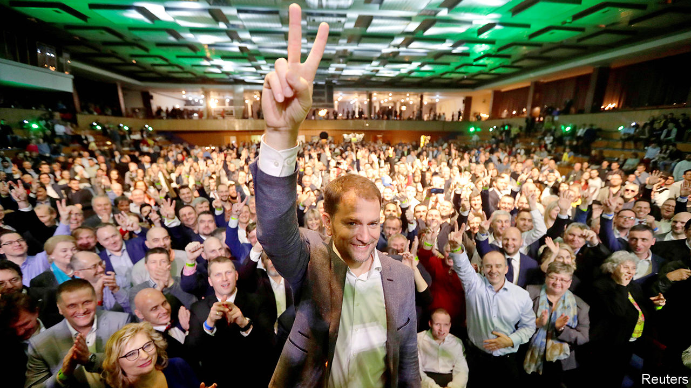

## A different kind of populism

# An anti-corruption campaigner triumphs in Slovakia

> What else Igor Matovic stands for is unclear

> Mar 5th 2020

LAST MONTH Svina (“Swine”), a thinly veiled cinematic portrait of Slovakia’s venal political class, opened to record-breaking crowds. At an election on February 29th Slovakia’s voters proved similarly motivated, turning out in large numbers to kick out Smer, a left-wing party whose 12 almost unbroken years in office had become a byword for corruption and complacency. The winner, with 25% of the vote, was Ordinary People and Independent Personalities (OLaNO), a vaguely centre-right outfit that vows to clean up politics.

OLaNO was established a decade ago as a vehicle for the political career of Igor Matovic, a media baron turned anti-corruption firebrand with a penchant for publicity stunts. A skilled campaigner, Mr Matovic focused on expanding his base across Slovakia under the slogan “Let’s beat the mafia together,” while sidestepping potentially divisive issues like abortion and immigration. “A lot of people wanted to show off their anger, and Matovic was able to portray himself as a respectable figurehead for this feeling,” says Aneta Vilagi, a political scientist at Comenius University in Bratislava.

Mr Matovic’s success had much to do with the murder, in February 2018, of Jan Kuciak, a young journalist probing links between politicians, oligarchs and organised crime. The killing triggered huge protests that led to the resignation of Robert Fico, the Smer prime minister, and the election as president of Zuzana Caputova, a former environmental activist. The trial of an oligarch accused of ordering Kuciak’s murder, which began in January and continues, has exposed an alleged grubby network of co-operation between crooked politicians, judges and law-enforcement officials. All this created fertile ground for OLaNO. One-third of voters said corruption was the most important issue.

Mr Matovic’s 53 MPs, some of whom he is rumoured not to know, are a heterogenous bunch, including social conservatives brought in to appeal to Slovakia’s rural Catholic heartlands. His proposed four-party coalition, which includes right-wing nationalists, also looks unwieldy. All are united in opposing graft; less so on tax or social policy. Yet Eduard Heger, an OLaNO MP tipped to become finance minister, says his party will aim to bring “dramatic change” to public services. “This”, he adds, “will be the best government Slovakia ever had.”

## URL

https://www.economist.com/europe/2020/03/05/an-anti-corruption-campaigner-triumphs-in-slovakia
