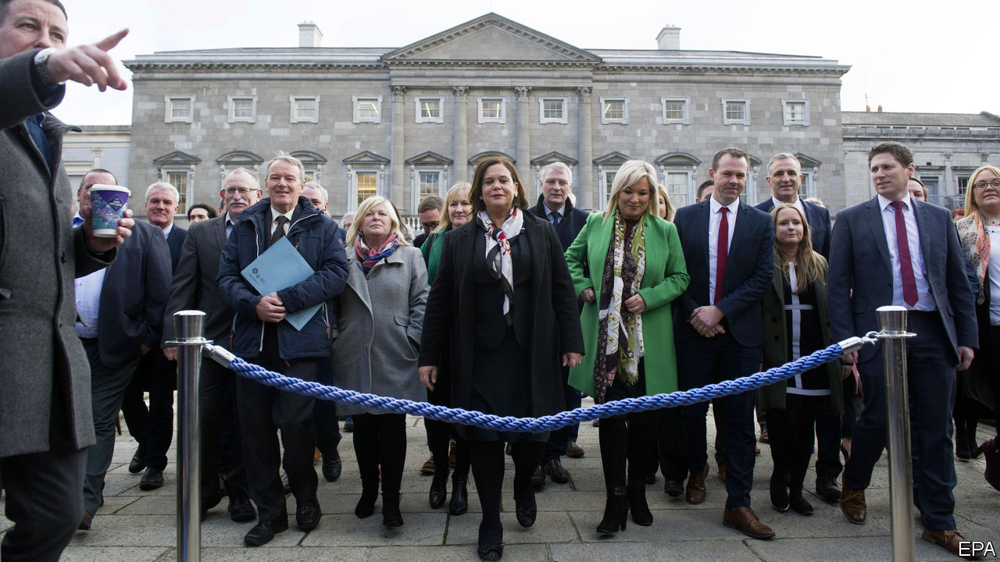

## From balaclavas to ballots

# Is Sinn Fein now a normal political party?

> It is fuzzy how much the Irish Republican Army still influences it

> Mar 5th 2020DUBLIN

NO ONE WAS more surprised than Sinn Fein when it came first in Ireland’s general election last month. Having slumped to 9.5% of the vote in local elections last year, close to the presumed floor of support for what many still see as the political wing of the Irish Republican Army, it rebounded to 24.5% on February 8th, making it, for the first time, Ireland’s most popular party. Since the election its popularity has risen even more, with a recent poll putting it at an astonishing 35%. That may not do it much good though: Ireland’s other two big parties, the centre-right rivals Fianna Fail and Fine Gael, are still both trying to put together a government that would continue to exclude Sinn Fein from power. Despite protestations that it has moved on from the violence of Northern Ireland’s “Troubles” to become a normal party of the centre-left, it is still widely viewed with deep suspicion.

This is not the first time Sinn Fein has been transformed by events. Founded in 1905 with the moderate aim of securing a dual Irish-British monarchy in the manner of Austria-Hungary’s, the tiny movement was radicalised by the Easter Rising of 1916, which the British authorities incorrectly blamed on Sinn Fein rather than the secretive Irish Republican Brotherhood. As sympathy rallied to it after 14 leaders of the “Sinn Fein rebellion” were executed, the party won 73 of Ireland’s 105 seats in the Westminster parliament in the election of 1918. It then used that mandate to declare an independent Irish republic.

So is Sinn Fein, Ireland’s great shape-shifter, now a normal party? It has taken part in power-sharing executives in Northern Ireland since 1999. Its manifesto promises a huge surge in social spending and public housing, if it can negotiate a place in a new ruling coalition. The party’s leader, Mary Lou McDonald, is a middle-class Dubliner with no history of militant service, unlike her predecessor Gerry Adams, a central figure during Northern Ireland’s bloody troubles and widely thought to have been an IRA leader, which he denies.

But Ms McDonald also has a history of endorsing the IRA’s bloody past. Sceptics note that supporters of Dessie Ellis, a former IRA prisoner who won a seat, sang “Come Out Ye Black and Tans”, a pro-IRA ballad, to celebrate his poll victory. Another Sinn Fein candidate ended his victory speech with the IRA slogans “Up the ‘RA” and “Tiocfaidh ar la” (“our day will come”). Little wonder that many fret that the IRA, though officially disbanded, may still be pulling the strings.

Ireland’s police commissioner, Drew Harris, says he still agrees with an assessment in 2015 by the Police Service of Northern Ireland which said the Army Council of the IRA oversees Sinn Fein “with an overarching strategy”, but that its focus is now political. Ms McDonald responded that “the war is over and the IRA is off the stage. The only threat now is so-called dissident elements that actually threaten Sinn Fein because we support the police service.”

Declan Power, an analyst who served in Irish military intelligence, says that a lightly armed IRA still maintains a loose organisation to protect itself from dissident republicans who refuse to recognise the peace process, and to deter recruitment into them. One such group, the “New IRA”, is blamed for killing Lyra McKee, a journalist, in Londonderry last year. “In a way, there’s a degree of responsible thinking in place. You can’t just wind up an entire private army and put it to bed,” he says.

Aidan Regan of University College Dublin says the IRA-Sinn Fein relationship is more nuanced. “Does Mary Lou take her orders from shadowy people in West Belfast [an IRA stronghold]? I don’t think so. But someone who was heavily involved in the Army Council in the IRA, who is still a member of Sinn Fein, of course they are going to have a voice in the party.” ■