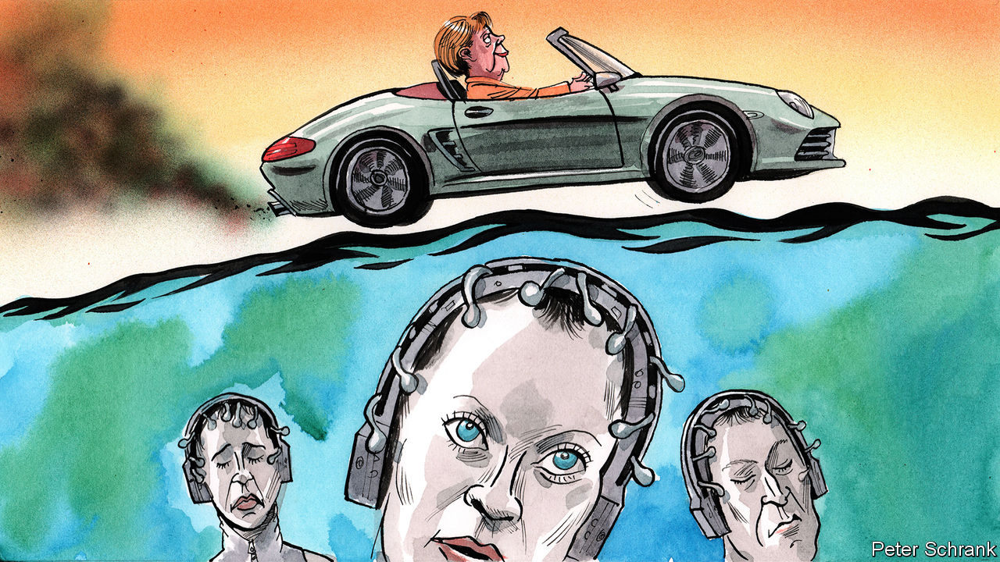

## Charlemagne

# Minority Report: Brussels edition

> Who will kill the European Green Deal?

> Mar 5th 2020

IN “MINORITY REPORT”, a short story by Philip K. Dick, a certain type of mutant is able to foresee crimes before they are committed. Future culprits are named, arrested and found guilty of “precrime” on the word of a team of soothsayers, controlled by a special police unit. Such a system would be welcome in Brussels, where EU wallahs are pondering the fate of its flagship European Green Deal. For now the project seems in rude health. A new climate law, which will oblige EU members to stop carbon emissions on a net basis by 2050, was formally unveiled on March 4th. Fantastical sums of funding have been pledged. A gamut of other legislation is planned. Yet diplomats and officials are starting to fear the worst. Who will kill the European Green Deal?

The first potential culprit is Poland, which has declared itself not to be bound by the 2050 goal. Globally, climate policy proves so rancorous in part because countries that benefited most from turning carbon into cash are now asking others not to take the same easy path. Poor countries can, often justifiably, argue that they are paying a bill run up by rich countries. Such a debate also exists in a version shrunken to European proportions. While western Europe cooks up ways to cut car use, parts of eastern Europe complain that they still need to build motorways in the first place. Cynical diplomats suggest that Polish resolve may weaken if cash is provided to soften the blow. Polish diplomats are doing little to disabuse them. Warsaw’s resistance may not last long.

If a Minority Report-style gang of crime-predicting mutants did exist, then its natural home would be in the European Commission. In Dick’s telling, John Anderton, the officer overseeing precrime, is accused of a yet-to-be-committed murder. Some left-wingers are similarly keen to blame the commission for smothering the Green Deal at birth, by not being ambitious enough in its proposals. On the face of it, the charge is absurd. No other big bloc has orchestrated a pledge to be net neutral in its carbon emissions by 2050. In total, €1trn ($1.1trn) of investment has been earmarked for green projects in the coming decade.

Yet Brussels bean-counters have form for conjuring up suspiciously large, suspiciously round numbers. Reaching the €1trn involves heroic assumptions about the EU’s ability to bring in private investment and the rapid relabelling of money that would have been spent anyway. In terms of hard cash, the EU has only €7.5bn of genuinely new money to play with. This is not much when spread over seven years and between 27 countries.

Though the commission is looking at ways of weakening its strict state-aid rules to encourage governments to dish out more green cash, it has balked at more potent measures. The prospects of loosening fiscal rules, so that member-states can invest heavily in green matters without being slapped over the wrist by the bureaucrats, look dim. Such a policy is anathema to frugal northern countries, such as Germany, which fear governments will simply shovel cash at pet projects by sticking a green label on them. Blaming the commission for being kept on a short leash is unfair.

The most likely offender to be spat out by the mutants in the basement of the commission’s headquarters is Germany. Angela Merkel may have cajoled her sceptical centre-right party into backing the 2050 target. But signing up to distant targets is easy for a leader who knows she will be long gone, points out one diplomat. When it comes to more short-term measures, the complaints have already begun. A German minister has sent a letter to Brussels demanding that the EU go easy on car manufacturers over plans to reduce emissions from next year. German MEPs bleat about plans to reduce emissions to between 50% and 55% of 1990 levels by 2030.

Objections from eastern Europe can be solved. Shifting to a greener economy costs money, since leaders are unwilling to leave a generation of workers on the scrapheap. It is politically hard to spend taxpayers’ money on paying off miners in a politician’s own country, never mind sending the cash next door. Yet it is doable. By contrast, the German handbrake may prove harder to release. Germany has a history of sinking green ambitions. Ms Merkel’s panicked decision to phase out nuclear power after the Fukushima disaster forced the country to burn vast amounts of filthy coal instead. Even the “dieselgate” scandal, when German carmakers engaged in nefarious activities stretching from nobbling emissions results to gassing monkeys in a laboratory while they watched cartoons, did not stop the German government lobbying against tougher enforcement of anti-pollution rules.

Germany does not always get its own way, but it is usually powerful enough to stop others from having theirs. As a rule, what Germany does not want, Europe does not get. Decades of pleading failed to persuade big countries such as France and Italy to enact structural reforms of their economies; they were large enough to shrug off such demands. Germany may prove just as obstinate when it comes to “greening” its successful but carbon-intensive economy. The ironies of this situation stack up quickly. The home of Europe’s biggest green party stands in the way of a comprehensive package of environmental legislation. Reforms being pushed through by Germany’s first commission president in five decades faces the stiffest opposition from her home country.

In “Minority Report” John Anderton wrestles with the question of free will after being told he will murder someone. In the end, he chooses to carry out the murder, but only to ensure the programme remains accurate. Free will in politics is simpler than in science fiction. A Green chancellor, once the realm of fantasy, is now imaginable, with the Green Party second in the polls. As the environment shoots up the agenda, even centre-right parties must grapple with how to balance support for business with strident greenery. Such a change may help save the Green Deal. But if pre-crime existed in Brussels, Germany would already be in jail. ■

Sign up to our fortnightly climate-change newsletter [here](https://www.economist.com//theclimateissue/)

## URL

https://www.economist.com/europe/2020/03/05/minority-report-brussels-edition
