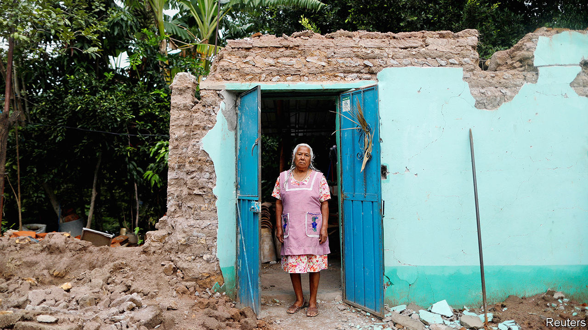

## A pussyfooting cat bond

# A novel pandemic security is no match for a novel virus

> Catastrophe finance is a work in progress

> Mar 7th 2020

IN SEPTEMBER 2017 Mexico’s strongest earthquake in a century killed scores of people, flattened hundreds of buildings and left millions without power. The quake was also bad news for the holders of $150m-worth of “catastrophe bonds”, issued only a month before by the World Bank. Buyers were offered an attractive yield in return for the risk of not getting their money back if disaster struck. Once the quake was judged sufficiently disastrous, the money was instead paid to Mexico’s government to help it rebuild.

If such bonds can help countries cope with earthquakes, why not also disease? A few months before Mexico’s disaster, the World Bank sold $320m-worth of pandemic bonds (and some swaps) on behalf of the poorest 77 developing countries that it serves. The advocates of such bonds point out that they provide an upfront commitment of cash, triggered automatically according to preset rules, which is more reliable than trusting to the kindness of strangers. They also reward investors with higher yields for bearing risks that are little correlated with the rest of their portfolios.

The initial buyers of the bank’s riskier bonds (worth $95m) were told that they faced a 28% chance of losing money to a virus of some kind and a 5.9% chance of losing money to a novel coronavirus in particular. Those odds have now jumped. But the bonds have yet to release money to governments scrambling to prevent a pandemic. Why not?

According to the terms of the bond, a payout cannot be triggered until 12 weeks after an outbreak has been reported to the World Health Organisation (which would be March 23rd). The virus must have killed at least 250 people in total and 20 people in more than one country (a condition the covid-19 virus met on February 27th, when Iran reported over 20 deaths). The outbreak must still be growing when these other criteria are met. And the amount of money a country can get depends on the number of cases it has confirmed (relative to other countries claiming the money).

Critics argue that the conditions are overly stringent, inflexible and dilatory, taking far too long to fulfil. Of course, if the criteria were less strict, investors would have demanded an even higher interest rate on the bond, and if the trigger allowed more scope for discretion, buyers would also have shied away. The charge of tardiness is, however, harder to answer. How can such bonds prevent a pandemic happening if governments must first wait for verification that it has happened?

If countries respond quickly to the danger, lowering the number of cases, they may qualify for less money (or none) as a result. In normal insurance markets, people who take sensible precautions pay lower premiums. But in the case of these bonds, the “premiums” are covered by wealthy donors Japan and Germany and by the World Bank's fund for the poorest countries.

A case can still be made for such instruments. They encourage better monitoring and reporting of infections. And although the existing bonds are too slow, the same is true of more traditional sources of finance, such as the generosity of donor countries. One novelty of the covid-19 disease is how quickly it has captured everyone’s attention. The World Bank, for example, said this week it would provide up to $12bn to help its clients respond to the outbreak, providing the money as quickly as possible. It may take the bank’s pandemic bonds until March 23rd to acknowledge the disaster taking place. But at least the bank itself does not have to wait that long. ■

Correction (March 24th 2020): A previous version of this piece neglected to mention that the pandemic bond is partly financed by the World Bank's International Development Association, which provides aid to the world's poorest countries.

## URL

https://www.economist.com/finance-and-economics/2020/03/07/a-novel-pandemic-security-is-no-match-for-a-novel-virus
