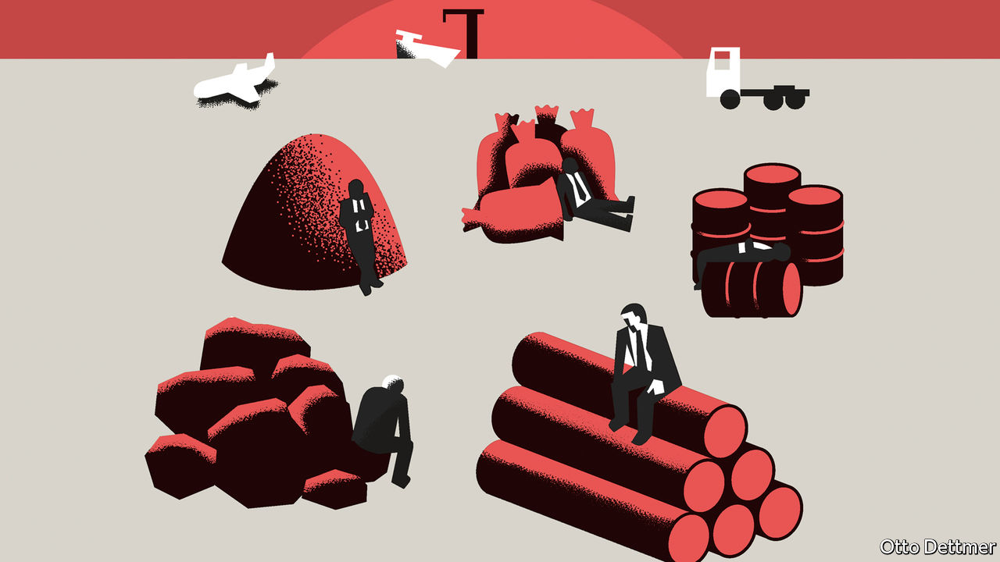

## Free exchange

# Commodity economies face their own reckoning due to covid-19

> As prices fall, pressure for more health-care spending will rise

> Mar 5th 2020

THE REWARD for providing the world economy with the raw materials it needs to grow is perpetual vulnerability. The hyperglobalisation of recent decades, and the associated Chinese growth miracle, yielded large benefits to commodity producers of all sorts. Now, as the shock of the covid-19 pandemic works its way through the world’s new, tangled economic plumbing, commodity-dependent economies find themselves exposed. The dangers faced by this group—UNCTAD, a United Nations trade-and-investment body, classifies 102 economies as commodity-dependent—differ from those of countries wired tightly into manufacturing supply chains. For them, falling commodity prices instantly put a strain on public finances, just as the burden of coping with a public-health crisis is likely to increase.

Managing a commodity-based economy is never easy. When prices rise, governments must worry about excessive spending and financial risk-taking. When they fall, budgets bust and foreign investors take flight, even as the need for domestic spending and easy credit grows. Commodity exporters have faced more bad times than good of late. They have been battered by a slowdown in China’s materials-hungry economy, a shale revolution in America which upended global oil markets in the middle of the 2010s, and growth-sapping trade wars. The tide looked like it was turning late last year, as a trade detente between America and China lent support to an unsteady revival in global manufacturing. Scarcely had producers begun to hope for better times when covid-19 threw a sopping wet blanket on their fortunes.

Markets have fallen dramatically as the pandemic has gained strength. Soyabean prices are off by nearly 6% from January highs, copper by more than 10%, and oil by around 30%. Brent crude fetched $74 per barrel in April of last year and $69 as recently as January, but is now trading at around $52. Prices could fall further if the outlook for the economy deteriorates further, and travel and trade dwindle. Better news out of China, where the number of new cases of covid-19 continues to fall, is encouraging. The Chinese economy accounts for roughly half of global demand for industrial metals and more than 10% of global demand for oil. But a return to economic normality in China could be delayed by the boomerang effect of a spread of the disease elsewhere.

Tumbling prices hit government revenues at a time when higher government spending means public finances are already under strain in countries like Saudi Arabia. The IMF estimates the fiscal breakeven price of oil for many large oil-exporting economies—the price which balances the government’s budget—to be well above current levels: more than $100 a barrel in Algeria and Iran, for example, and over $80 per barrel in Saudi Arabia. Even Russia, with a breakeven price of about $42, may soon feel a squeeze. A recent IMF analysis of the economies of the Persian Gulf notes that while most built up savings as oil prices rose between 1997 and 2007, spending grew faster than revenue over the subsequent seven years. Fiscal reforms implemented between 2014 and 2018, when oil prices entered a prolonged slump, have helped, but most Gulf economies continued to draw down their sovereign-wealth funds and accumulate debt. As The Economist went to press, OPEC producers and allies such as Russia were meeting in Vienna to discuss ways to lift oil prices. Capital Economics, a consultancy, expected them to agree to an emergency output cut of 1m barrels per day for at least three months. Under stress, co-operation could prove short-lived.

Cutbacks in production because of sagging demand for raw materials also affect the strength of the domestic economy: there is less work, and less money to be spent on local goods and services. Growth forecasts are already being revised down for mineral-rich countries like Russia and South Africa. Analysts at Goldman Sachs, a bank, reckon that a 10% drop in commodity prices might shave more than a percentage point from GDP growth in Peru and Chile: both are exporters of industrial commodities such as copper that rely heavily on demand from China.

The rising fiscal pressure on commodity economies could hardly come at a worse time. Managing the viral threat will be expensive. The burden in some countries such as Iran, where almost 3,000 cases of the virus have already been confirmed, could be crushing. In other commodity-producing regions, such as Latin America and sub-Saharan Africa, far fewer cases have been confirmed as yet, and hot and dry climates could limit the virus’ transmissibility. But it is too soon to assume they will be unaffected.

A severe but temporary economic shock seems a perfectly reasonable excuse for a government to borrow more than planned. Commodity-based economies with a history of capable macroeconomic management can run larger deficits without fear of a market backlash; indeed, the yields on bonds issued by Australia have fallen sharply over the past month, reducing the cost of borrowing for a government grappling with a dual public-health and economic threat. Other big commodities producers will need to be more careful. In those with a history of recent financial stress, like Argentina and Venezuela, the covid-19 pandemic could pile misery upon misery. Brazil only recently escaped a cycle of fiscal incontinence, market scepticism and accelerating inflation.

Least predictable of all are the political effects of a potential pandemic. In good times, commodity wealth can blunt the complaints of political malcontents, while straitened circumstances expose all manner of ills. The slump of the past few years has already bred public disaffection across commodity economies, from Russia to Bolivia. The shock from covid-19 will test political systems around the world. Among commodity producers, especially those with little fiscal room for manoeuvre, fractures will be exposed more quickly and, occasionally, more destructively. ■