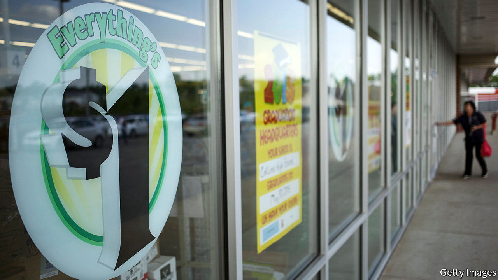
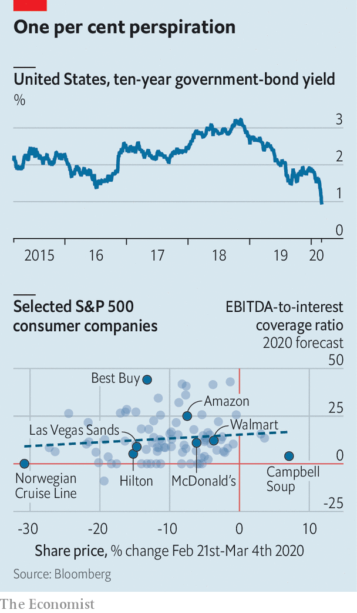

## Parsing the financial turmoil

# What the markets imply about the economic impact of the coronavirus

> Investors should get used to the rollercoaster

> Mar 5th 2020NEW YORK

THE START of the year has been a rollercoaster for stockmarket investors. Out of the gates in January they experienced a gradual ratchet higher, climbing to an all-time peak in America, before a brutal and swift 11.5% plunge in the S&P 500 during the last week of February. So far in March investors have loop-the-looped. After the Federal Reserve convened an emergency meeting on March 3rd to cut interest rates by 0.5 percentage points, stocks spun and gyrated and the yield on the ten-year Treasury bond fell below 1% for the first time ever (see chart).

Uncertainty and fear about the spread of the covid-19 disease are to blame for the havoc (credit for some of the gains on March 4th may belong to Joe Biden, a moderate Democrat, who won the most delegates in primary voting on “Super Tuesday”). The market is wrestling with three fears. First, that the virus will (and may already have) spread widely across America and the rest of the world. Second, that fear of covid-19 and measures to stem its spread, like advising workers to stay home, will have severe consequences for economic activity. And third, that policymakers may be unable to keep short-term disruption from becoming long-term damage.

These fears have culminated in a sharp “risk-off” move in markets. As stocks have tumbled, safe-haven assets like gold, government bonds and certain currencies—such as the yen and the Swiss franc—have rallied sharply. Copper and oil prices, both bellwethers of economic health, have swooned. The VIX, an index of the implied volatility embedded in options prices, has jumped. The price of high-risk corporate bonds fell sharply.

There are two reasons why rapid moves in markets are worth examining. They are important sources of information. By parsing changes in asset prices it is possible to glean insight into how the virus might affect the American economy. And while some markets merely predict doom, others can hasten its arrival—the healthy functioning of credit markets is especially vital.

So what does the market imply about economic expectations? One way of capturing this is to consider what will happen to firms’ finances if people can no longer gather or move around freely. Revenues would take a hit across the board. The damage would be most acute for firms that rely on large groups of people coming to them, such as casino and theme-park owners. It would, however, also hurt those that rely on travel, like hotels and airlines. Corporate events and conferences have been cancelled in many countries—Starbucks, for example, plans to hold its annual shareholder meeting virtually.

Such consumer-facing firms have seen bigger share-price falls than most. But revenues will also suffer at companies with complex supply chains. If factories close in China, firms like Apple are unable to produce their wares. While sales may plummet, costs will not. Firms will still need to pay their staff, landlords and banks, among many other expenses. The markets are suggesting that the hit to profits will be significant. In aggregate the stockmarket gyrations since the middle of February imply that investors, who once thought this year would see robust profit growth of 14.3%, now expect perhaps half that amount.

But the risks may be even greater for some companies, and possibly existential for those with large debts to service. Consumer companies in general have lost 7.1% of their market value since February 24th. But as our chart shows, the prices of listed firms with high interest expenses relative to profits have fallen more than their peers—those with lots of debt have fared worse (except for those purveying essentials, like Campbell Soup). This suggests investors think the risk of a cashflow crunch at some firms is very real. Smaller firms may be more exposed. According to the IMF, small and medium-sized firms with annual interest costs larger than their profits account for more than half of all corporate borrowing in America.

That feeds jitters about bad debts in credit markets. The interest-rate spread over Treasuries demanded by investors to hold high-yield corporate debt had widened to 4.9 percentage points on March 4th, from 3.3 percentage points at the start of the year. Public credit markets even briefly ground to a halt. There was hardly any corporate issuance at all between February 24th and March 2nd in America and Europe. Fear about tight credit markets was one of the reasons the Fed stepped in to cut rates. There is evidence it is helping. After the emergency rate cut on March 3rd a handful of issuers seized the opportunity to issue small quantities of bonds.

Two questions now hang over the markets. First, is their reaction to the epidemic exacerbated by technology? Algorithmic trading has come to dominate stockmarket transactions. Just one in ten equity trades is carried out by a human. Plenty of sensible people worry that these “algos” exacerbate short-term moves. But the evidence in this case suggests that they are not to blame. Algos tend to trade heavily at the open and the close. Market moves since the middle of February have been characterised by extremely high volumes throughout the day.

Second, will the turmoil continue? The VIX gauge offers the closest thing to an answer. Because stocks tend to sedately tick up, but lurch downwards, volatility usually only rises when stocks are falling. But recent news has caused stocks to lurch in both directions. Unusually, volatility therefore remains elevated despite a recovery in share prices. A high VIX also suggests that violent swings will continue. Investors should get used to the rollercoaster ride, because the end is not in sight. ■

## URL

https://www.economist.com/finance-and-economics/2020/03/05/what-the-markets-imply-about-the-economic-impact-of-the-coronavirus
