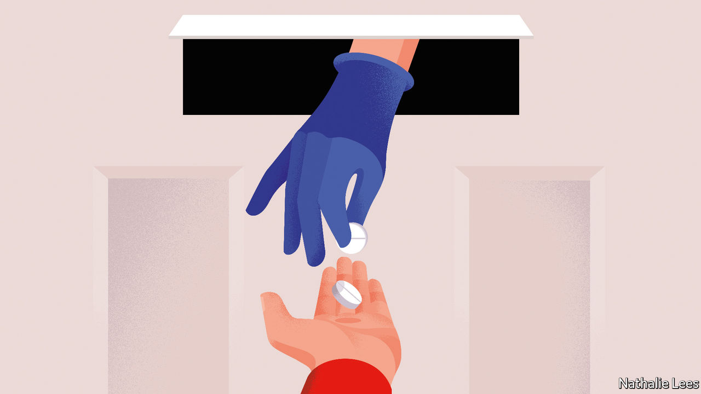
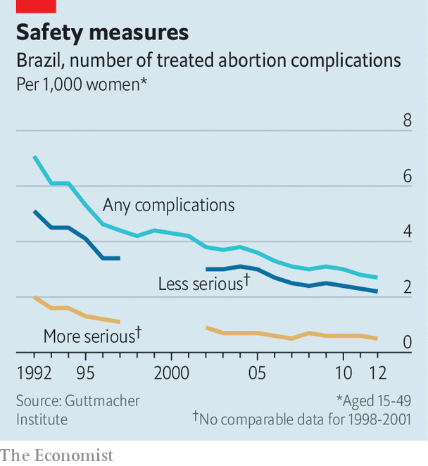

## Pills by post

# Abortions are becoming safer and easier to obtain—even where they are illegal

> Pills are making it easier for women to end unwanted pregnancies

> Mar 5th 2020AUSTIN AND MCALLEN, TEXAS, AND REYNOSA, MEXICO

IN AMERICA ABORTION is a battleground. Pro-lifers urge the Supreme Court to overturn Roe v Wade, its convoluted ruling in 1973 that made abortion legal in all states. Pro-choice campaigners fret that, one day, they will succeed. Presidential elections hinge, in part, on the kind of judges each candidate vows to appoint. And test cases crop up regularly. This week the Supreme Court heard arguments for a law making it harder to run abortion clinics in Louisiana, which could lead to the closure of two of the three in that state.

Yet behind the headlines, abortion is becoming more widely available in most of the world. Between 2000 and 2017 some 27 countries made it easier for women to get abortions. Only Nicaragua made it harder. In the past two years Cyprus, the Republic of Ireland, Northern Ireland and North Macedonia have all loosened restrictions. Since last April, South Korea and Thailand’s constitutional courts have ruled that banning abortion is unconstitutional. Argentina will probably legalise it soon, though Colombia’s top court refused to do so on March 3rd. And in countries where ending a pregnancy is still illegal or tightly restricted, do-it-yourself abortions, which once involved back-alley butchery or wire coat-hangers, are becoming safer.

Reynosa, a city on Mexico’s border with America, is controlled by drug cartels and patrolled by heavily armed state police, their bulletproof vests bristling with spare magazines. The streets are lined with pharmacies which are visited regularly by Americans. Maria (not her real name), a pharmacist, says she sells the “abortion pill” to at least one “gringo” every day.

Misoprostol, the drug in question, is a stomach-ulcer drug which can also be used to cause abortions. It is tightly regulated in America. In Mexico, where abortion is mostly illegal, pharmacies stock it next to cough drops and painkillers. The generic version costs 990 pesos ($50). Some 15 miles away in McAllen in Texas, a state that is dogged in its efforts to stop women getting abortions, the region’s sole surviving abortion clinic charges $700 for treatment that includes the same drug. Some who cannot afford that take their chances with Reynosa’s guns and gangs. Others who dare not cross the Rio Grande buy misoprostol on the black market in America, where they risk getting fakes. Even if the medication is genuine, it is less effective without a second drug, mifepristone, which is much harder to get.

Now there is a third option. Last year Isis, an unemployed 20-year-old from Fort Worth in Texas, got an abortion. She consulted online a doctor in Austria who works for Aid Access, a non-profit that helps women who cannot otherwise get abortions. She paid the group $90. A pharmacy in India sent her seven pills. Isis never had to leave her home. Such abortions are increasingly available—even in countries where ending a pregnancy is illegal.

Bans and restrictions seem to do little to cut the number of abortions. In countries where it is mostly illegal, 37 in 1,000 women have an abortion each year compared with 34 in countries where it is widely available, estimates the Guttmacher Institute, a pro-choice research group. Abortion rates in America have declined steadily since the late 1980s, with no significant difference between states that have introduced new limits and those that have not.

Better access to contraception, by contrast, does make abortions rarer. Every year nearly half of pregnancies worldwide are unintended. That share has been falling for years, mostly thanks to the increased availability of effective contraceptives. In 1969 only 4% of women in the least-developed countries who wanted modern contraception got it; by 2019 that figure was 59%. In much of the rich world it is nearly 90%. Abortion was a prime form of birth control in the Soviet Union. Since communism’s collapse, contraceptive use in eastern Europe has risen sharply. Abortion rates there have halved since 1990. In Mozambique the share of women using contraception doubled between 2011 and 2018. The government is in the middle of making pills and condoms available in all secondary schools. Teenage pregnancies are down.

Delaware is a model of how to improve access to contraception quickly and effectively. From 2014 to 2019 it trained primary health-care workers regularly to ask each woman of childbearing age whether she was happy with her method of birth control or was thinking about having a baby. It also enabled women to get whichever kind of contraception they wanted that same day, explains Mark Edwards of Upstream, the non-profit which ran the programme. Births following unintended pregnancies fell by 25% between 2014 and 2017. The abortion rate dropped more sharply than in any other state in America.

Yet effective birth control is not enough. Half of American women seeking an abortion said they used contraception in the month they got pregnant, reports the Guttmacher Institute. Just ask Gaby Ramirez, a 27-year-old cashier and single mother, whose contraception failed. The morning-after pill also let her down (few realise that it does not work after ovulation). “This”, she says as she nods to the faded-pink waiting area of the Whole Women’s Health clinic in McAllen, its walls enlivened by quotes from women such as Michelle Obama and Isabel Allende, “was a very difficult decision. But I just can’t have another baby.” After three hours of medical tests, state-mandated counselling and form-filling, she was sent home with an appointment to return the next day (Texas law requires two separate visits for abortions). Ms Ramirez opted for a medical abortion (using pills) because she can take them in private.

Brazilian women first discovered misoprostol could be used to terminate pregnancies in the 1980s. Women across Latin America told each other about “the pill that makes your period come back”, first in person and later through hotlines and online.

Since then the shift from surgical abortions to medical ones has been dramatic; in the Nordic countries over 90% of abortions are now drug-induced, in India 80% and in America a third. When taken with mifepristone, misoprostol ends 97% of pregnancies in the first ten weeks without complications. More women are seeking abortions earlier in their pregnancies. That is largely because of cheap at-home pregnancy tests, says Jasbir Ahluwalia, a doctor at the McAllen clinic: “The 98 cents test at Walmart has given women such power.” In most rich countries over two-thirds of terminations are carried out before nine weeks and 90% before 13 weeks.

Statistics on how many women take abortion pills without medical care are understandably patchy. Still less is known about how they fared. But a study in 2016 by Abigail Aiken of the University of Texas at Austin of 1,000 women in Ireland who managed their own abortions with the help of Women on Web, a non-profit which provides online advice and prescribes pills by post, found that 95% ended their pregnancies without any surgical intervention. Just 3% received medical help such as a blood transfusion or antibiotics. The organisation gets around 150,000 requests for help each year, many coming from Brazil, Poland, Thailand and (until abortion was legalised) Northern Ireland. Requests shoot up whenever the website is translated into a new language, says Rebecca Gomperts, the group’s founder.

Interest in self-induced abortion is keen, particularly in conservative places. In one month in 2017, there were 210,000 Google searches in America about it. In 2018 Dr Gomperts set up a separate organisation for Americans after a rise in requests by women in states where it is relatively hard to get abortions. In its first ten months Aid Access held over 11,000 consultations and prescribed abortion pills 2,600 times.

Other websites provide women with information on how to get the medication to induce abortions and how to take it safely. One such site, Plan C, regularly tests pills ordered from online pharmacies and rates providers on the quality of the tablets, price, shipping time and advice. It also answers questions about how to avoid getting in trouble with the law.

The Royal College of Obstetricians and Gynaecologists recently called on the British government to relax rules that require women to take the first pill in a doctor’s office. Were they to do so, abortions could be organised entirely by smartphone and post. Clinics in some parts of the world are already trying this.

The impact on women who live in countries where abortion is illegal is most dramatic. Backstreet abortions used to result in perforated uteruses and life-threatening infections and haemorrhages. Some still do. But globally such complications have become rarer. Since 1990 the number of women dying as a result of botched abortions—most of them illegal—has dropped by 42%, from 108 per 100,000 abortions (1990-94) to 63 (2010-14).

Even on its own, misoprostol is effective in around 85% of cases, and it is far less dangerous than other DIY methods. Countries where misoprostol has become most widely available saw the biggest decline in deaths as a result of unsafe abortions. The fall in unsafe terminations in Brazil, where abortion is illegal, has been dramatic (see chart). In Reynosa, Maria says she regularly sells pills to local women who send their husbands with “lousy excuses about stomach problems”. In Mozambique hospitals have seen many more incomplete abortions in recent years, but a dramatic drop in women coming in with perforated uteruses, says Diana Restrepo of the UN Population Fund. She believes this is due to informal use of misoprostol, which is increasingly easy to buy in pharmacies.

For 90m women in 26 countries abortion is still banned under all circumstances. In El Salvador women have been jailed after having miscarriages. Donald Trump’s administration is trying to extend its global “gag rule”, which bans government aid to foreign non-governmental organisations that “actively promote” abortion, by demanding that all UN aid meets the same criteria. Some American states, along with the Food and Drug Administration, are going after the providers and users of abortion pills.

“Ultimately, what are they going to do? Stop every package? Shut down the internet?” wonders Dr Aiken in a soft Irish-Texan accent. The practice has become too widespread to stop, she says. A recent survey found that nearly a third of patients at three Texan clinics already knew about self-managed abortion with pills. As she learned in Ireland, when governments introduce unreasonable laws and barriers, “you merely drive people to find ever more creative solutions.” Those solutions are, at least, becoming safer.■