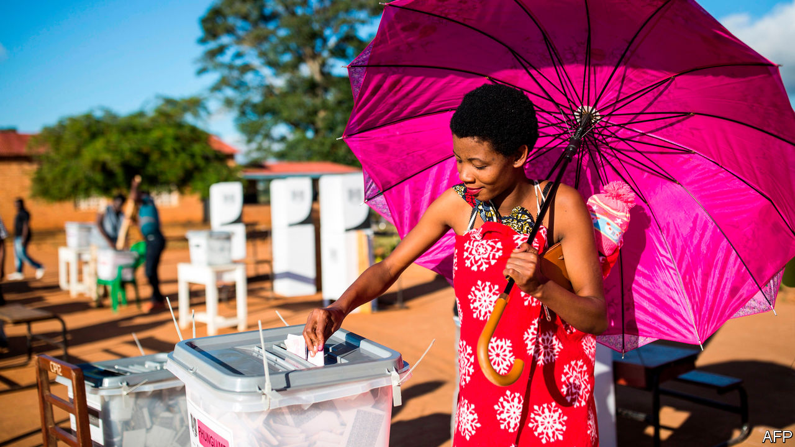

## The battle for liberty in Africa

# How African democrats can fight back

> And how outsiders can help them

> Mar 5th 2020

THREE-QUARTERS of Africans favour multiparty democracy. Whereas in rich countries the fashion is to lament democracy’s shortcomings, Africans want more of it. Their passion is born of experience. Many have endured one-party or military rule, and know that unaccountable rulers abuse. Hence the bravery of the hundreds of thousands of Sudanese who protested against the dictatorship of Omar al-Bashir last year. After three decades of tyranny, plunder and economic mismanagement, they had had enough. What started as a rally against higher bread prices turned into a popular wave that forced the army to ditch the despot and agree to a transition to democracy.

A struggle is raging in sub-Saharan Africa. Most Africans, like people anywhere, want to choose their own rulers. A smaller but powerful group—autocrats and their supporters—is determined to thwart them. Over the past 30 years democracy has gained ground in Africa. During the cold war, peaceful changes of government at the ballot box were almost unheard of, because of Soviet and American support for friendly tyrants. After 1990 nearly every African country held elections. But in the past decade democrats have been pushed back again (see [article](https://www.economist.com//middle-east-and-africa/2020/03/05/young-africans-want-more-democracy)). Political freedom has shrunk in Africa since 2008, according to Freedom House, a watchdog. Crooked ruling parties have found myriad ways to nobble opponents and make elections unfair. The share of Africans who report that they are free to say what they think fell from 79% to 70% in 2008-18. Of the 21 countries that switched off the internet last year, 12 were African. The same number have passed laws making it harder for NGOs to operate.

Several trends favour the autocrats. China offers cash for roads and bridges with no pesky questions about governance. The current White House has no interest in promoting democracy. And new surveillance technologies let autocrats snoop inside dissidents’ phones, making it easier to harass them.

However, Africa’s democratic backsliding should be seen in context. It is smaller in scale than the advances of the 1990s and early 2000s—a case of three steps forward and one step back. And the forces that favour democracy remain strong.

One is urbanisation. The share of sub-Saharan Africans who live in cities has doubled since 1975, to 40%, and continues to rise. City folk are younger, better educated and harder to intimidate than their rural cousins. In the countryside ruling-party thugs can chivvy whole villages to the polls and threaten to take away their food aid if they back the opposition. In cities, by contrast, dissidents can more easily organise. Autocrats try to suppress urban turnout at elections, but this often causes anger to spill onto the streets. African political protests are more than three times as common as they were in 2012, by one estimate, and last much longer. Soldiers can disperse any crowd, but sometimes refuse to shoot. Some even switch sides and join the protesters, as at a crucial point in Sudan’s uprising last year.

Another force is Africans’ desire to build institutions to hold the mighty to account. These include a probing press and vigorous NGOs: think of the tireless reporters who exposed Angola’s kleptocracy, or Catholics who proved Congo’s election was stolen. They include assertive courts: think of the judges who overturned rigged elections in Kenya in 2017 and Malawi in February. They include legislatures, which are not as toothless as is often supposed. Most African presidents are now subject to term limits, which are more than twice as likely to be honoured as broken. And they include reformers within ruling parties. The big struggle in South Africa is between the pro- and anti-corruption factions of the ruling African National Congress; the anti-theft wing narrowly regained the upper hand in 2017.

Some say that an obsession with democracy is misguided, that China proves smart autocracy is better at promoting economic growth. Yet studies show an association between democracy and higher growth in sub-Saharan Africa. Other research suggests that the more democratic a country is, the more likely it is to invest in education and health. Strongmen with spreadsheets can foster development for a time. But democracy does it better. And the moral argument for it is even stronger.

Africa’s battle for democracy will be won or lost by Africans themselves. Still, the rest of the world can and should choose a side. The West has been hopelessly inconsistent, one minute lambasting Zimbabwe for ballot-rigging, the next minute endorsing the same crime in Congo. Better to offer steadier and more united support for democracy. Outsiders should not only reject sham elections but also be more outspoken in the period between votes. Diplomacy is often about timing. Outside help is most useful when a political stand-off could go either way (as when Gambia’s president tried to hang on despite losing an election, but was ejected by the threat of force from neighbouring countries) or when a new, reformist regime is finding its feet (as in Ethiopia today). To know when to intervene, countries need diplomats on the ground, and governments back home that listen to them. President Donald Trump’s gutting of the State Department has not helped.

Support for elections should be more creative. Rather than merely watching what happens on polling day, donors should back local NGOs that can spot intimidation months in advance; digital analysts who can detect disinformation; and parallel voter tabulations against which official results can be checked.

Most important, outsiders should support institution-building. This is slow and thankless. The results are less visible than China’s railways and dams. Yet it is essential. Prosecutors, legislators and journalists all need training; some also need cash to keep the lights on. African whistle-blowers are harder to ignore when outsiders trumpet their findings. It would be wrong for outsiders to fund opposition parties. But championing financial liberalisation can make for more competitive politics, especially in countries where state-run banks deprive opposition parties of credit, thus making it hard to fund campaigns.

Africa matters. By 2060 it will have twice as many people as China. Outsiders should care whether such a giant neighbour is prosperous and peaceful. Democracy cannot guarantee that, but its absence makes poverty and disorder more likely. ■