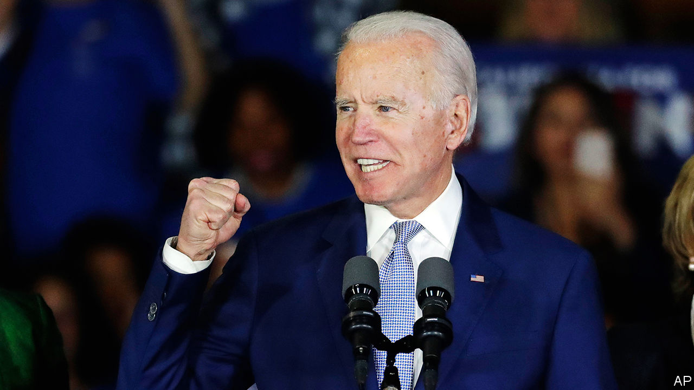

## After Super Tuesday

# Joe Biden redux

> His victories suggest that the Democratic Party has not yet wandered off to the wilderness

> Mar 5th 2020

ELECTIONS HAVE a knack of making pundits look foolish. Ever since the Brexit referendum, electoral upsets around the world have involved underdogs and insurgents pulling off unexpected victories. The Democratic Party seems to be bucking that trend. On March 3rd Super Tuesday produced an upset of a different sort, one that makes Joseph Robinette Biden Jr—a moderate 77-year-old former vice-president making his third bid for the top job—the favourite to win the party’s nomination, and hence to take on President Donald Trump in November.

Democrats seem to have learned the lesson in game theory provided by the Republican Party in 2016. When the primary field is divided between a large number of similar candidates bent on attacking one another, it is possible for a factional candidate who attracts 30% of the electorate to win the nomination even if he terrifies the majority. This set-up landed the Republicans with a nominee who, at the outset of their primaries, much of the party saw as a threat to its very existence. Pete Buttigieg and Amy Klobuchar therefore deserve praise for bowing out before it was too late to prevent Bernie Sanders, America’s lone democratic-socialist senator, from securing the nomination of a party that he joined only to stand in this election. After Tuesday’s vote Mike Bloomberg followed them. The hope is that he will energetically put his formidable electoral machine and even more formidable wallet behind Mr Biden.

That is because Mr Sanders may still win. Both he and Mr Biden have about 600 delegates from the states that have voted so far. They each need 1,400 more to win outright. This race has not been kind to front-runners. Ask Elizabeth Warren who, having briefly dazzled, came third in her home state of Massachusetts. And Mr Biden is not an ideal candidate. He can seem incapable of answering any question in fewer than 1,000 words. His candidacy has long been more reassuring in theory than in practice.

Moreover, at a moment when Washington experience seemingly counts for little with voters, Mr Biden has an awful lot of it. He first arrived as a senator in 1973 and never left. His long record contains several embarrassing moments that voters will be grimly familiar with by November, should he become the nominee. Expect to hear more about plagiarism, about his opposition to busing, his support for the Iraq war, and his votes to deregulate the financial industry. That would give the Trump campaign plenty of material to work with. Ask Obama campaign alumni about Mr Biden as a candidate and they look at their shoes.

Yet Mr Biden also has strengths, which are easy to discount because he is so familiar. He is that rare thing in politics: a decent man. His Washington experience may seem more appealing now America is facing a pandemic. His policy platform is to the left of where Barack Obama ran in 2008 or 2012, and even where Hillary Clinton was in 2016 (see [article](https://www.economist.com//united-states/2020/03/05/joe-biden-has-pulled-off-one-of-the-great-political-comebacks)). But much of it is sensible and, more important, some policies might even pass the Senate. For example, Mr Biden has an ambitious scheme to reduce carbon emissions. It would require $1.7trn over ten years in additional federal spending, but that is less than what Mr Sanders proposes to spend just on replacing petrol and diesel vehicles with electric ones.

This contrast between Mr Biden and Mr Sanders is not just a matter of ideology. It also reflects a different approach to politics. Mr Sanders requires a political revolution to accomplish his ends. Mr Biden, by contrast, refuses to write off the other side as beyond redemption. Many younger Democrats think that the former vice-president’s faith in his power to persuade Republicans to cross the aisle and support him is touching at best, and dangerously naive at worst. Yet the only way to bring about long-lasting change in Washington is for a president to find a coalition in Congress that is broad enough to pass laws. After Super Tuesday, it looks as if only one candidate on the Democratic side may be capable of doing that.■

Dig deeper: