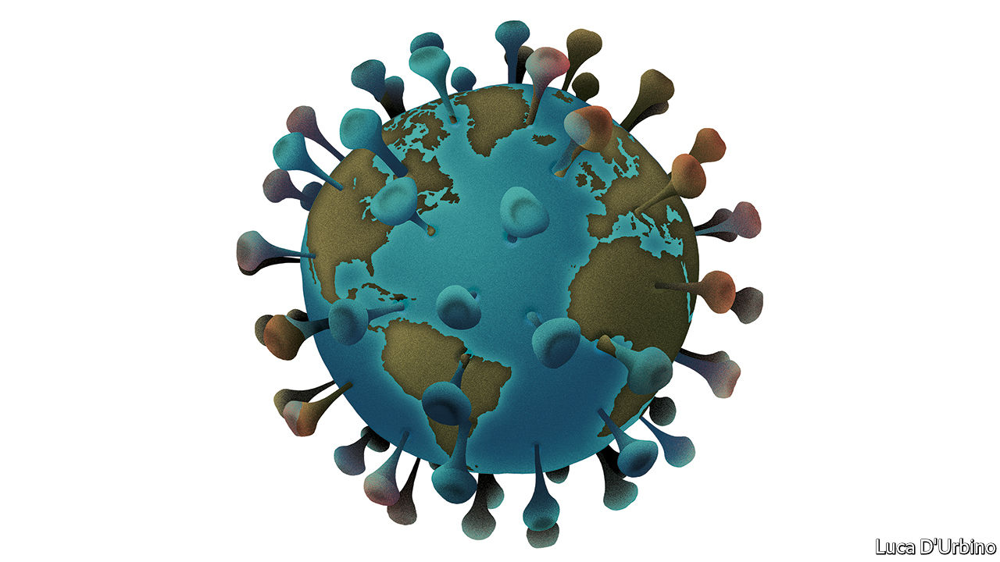

## Covid-19

# The right medicine for the world economy

> Coping with the pandemic involves all of government, not just the health system

> Mar 5th 2020

IT IS NOT a fair fight, but it is a fight that many countries will face all the same. Left to itself, the covid-19 pandemic doubles every five to six days. When you get your next issue of The Economist the outbreak could in theory have infected twice as many people as today. Governments can slow that ferocious pace, but bureaucratic time is not the same as virus time. And at the moment governments across the world are being left flat-footed.

The disease is in 85 countries and territories, up from 50 a week earlier. Over 95,000 cases and 3,200 deaths have been recorded. Yet our analysis, based on patterns of travel to and from China, suggests that many countries which have spotted tens of cases have hundreds more circulating undetected (see [Graphic detail](https://www.economist.com//graphic-detail/2020/03/07/tourism-flows-and-death-rates-suggest-covid-19-is-being-under-reported)). Iran, South Korea and Italy are exporting the virus. America has registered 159 cases in 14 states but as of March 1st it had, indefensibly, tested just 472 people when South Korea was testing 10,000 a day. Now that America is looking, it is sure to find scores of infections—and possibly unearth a runaway epidemic.

Wherever the virus takes hold, containing it and mitigating its effects will involve more than doctors and paramedics. The World Health Organisation has distilled lessons from China for how health-care systems should cope (see [Briefing](https://www.economist.com//briefing/2020/03/05/what-the-world-has-learned-about-facing-covid-19)). The same thinking is needed across the government, especially over how to protect people and companies as supply chains fracture and the worried and the ill shut themselves away.

The first task is to get manpower and money to hospitals. China drafted in 40,000 health workers to Hubei province. Britain may bring medics out of retirement. This week the World Bank made $12bn and the IMF $50bn available for covid-19. The Global Fund, which fights diseases like malaria and TB, said countries can switch grants. In America Congress is allocating $8.3bn of funding. The country has some of the world’s most advanced hospitals, but its fragmented health system has little spare capacity. Much more money will be needed.

Just as important is to slow the spread of the disease by getting patients to come forward for testing when outbreaks are small and possible to contain. They may be deterred in many countries, including much of America, where 28m people are without health coverage and many more have to pay for a large slug of their own treatment. People also need to isolate themselves if they have mild symptoms, as about 80% of them will. Here sick pay matters, because many people cannot afford to miss work. In America a quarter of employees have no access to paid sick leave and only scattered states and cities offer sickness benefits. Often the self-employed, a fifth of Italy’s workforce, do not qualify. One study found that, in epidemics, guaranteed sick pay cuts the spread of flu in America by 40%.

Sick pay also helps soften the blow to demand which, along with a supply shock and a general panic, is hitting economies. These three factors, as China shows, can have a dramatic effect on output. Manufacturing activity there sank in February to its lowest level since managers were first surveyed in 2004. In the quarter to March the economy as a whole could shrink for the first time since the death of Mao Zedong. The OECD expects global growth this year to be its slowest since 2009. Modelling by academics at the Australian National University suggests that GDP in America and Europe would be 2% lower than it would have been in the absence of a pandemic and perhaps as much as 8% lower if the rate of deaths is many times higher than expected. Financial markets are pricing in fear. The S&P 500 has fallen by 8% from its peak on February 19th. Issuance of corporate debt on Wall Street has more or less stopped. The yield on ten-year Treasuries dipped below 1% for the first time ever.

In rich countries, most of the economic effort has been directed towards calming financial markets. On March 3rd America’s Federal Reserve cut rates a fortnight before its monetary-policy meeting, and by an unusually large half-a-percentage point (see [article](https://www.economist.com//finance-and-economics/2020/03/05/what-the-markets-imply-about-the-economic-impact-of-the-coronavirus)). The central banks of Australia, Canada and Indonesia have also acted. The Bank of England and the European Central Bank are both expected to loosen policy, too.

Yet this slowdown is not a textbook downturn. Lower rates will ease borrowing costs and shore up sentiment, but no amount of cheap credit can stop people falling ill. Monetary policy cannot repair broken supply chains or tempt anxious people into venturing out. These obvious limitations help explain why stockmarkets failed to revive after the Fed’s cut.

Better to support the economy directly, by helping affected people and firms pay bills and borrow money if they need it. For individuals, the priority should be paying for health care and providing paid sick leave. The Trump administration is considering paying some hospital bills for those with the virus. Japan’s government will cover the wages of parents who stay at home to care for children or sick relatives; Singapore’s will help cab drivers and bosses whose employees are struck down. More such ideas will be needed.

For companies the big challenge will be liquidity. And although this shock is unlike the financial crisis, when the poison spread from within, that period did show how to cope with a liquidity crunch. Firms that lose revenues will still face tax, wage and interest bills. Easing that burden, for as long as the epidemic lasts, can avoid needless bankruptcies and lay-offs. Temporary relief on tax and wage costs can help. Employers can be encouraged to choose shorter hours for all their staff over lay-offs for some of them. Authorities could fund banks to lend to firms that are suffering, as they did during the financial crisis and as China is doing today. China is also ordering banks to go easy on delinquent borrowers. Western governments cannot do that, but it is in the interest of lenders everywhere to show forbearance towards borrowers facing a cash squeeze, much as banks did to public-sector employees during America’s government shutdown in 2018-19.

There is a tension. Health policy aims to spare hospitals by lowering the epidemic’s peak so that it is less intense, if longer-lasting. Economic policy, by contrast, aims to minimise how long factories are shut and staff absent. Eventually governments will have to strike a balance. Today, however, they are so far behind the epidemic that the priority must be to slow its spread. ■

## URL

https://www.economist.com/leaders/2020/03/05/the-right-medicine-for-the-world-economy
