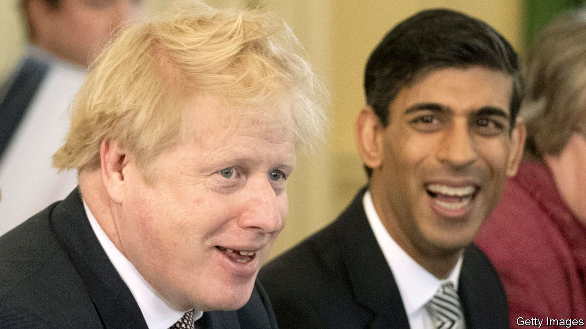
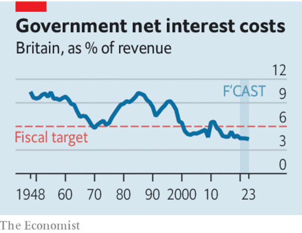

## Fiscal policy

# Why Britain needs a bold budget

> Covid-19 is not the only reason that the government should increase spending

> Mar 5th 2020

THE SMOKE signals rising from Downing Street suggest that the budget due on March 11th will be dull. The covid-19 virus has clouded the outlook; the new chancellor, Rishi Sunak, needs to get his feet under the desk; there will be more fiscal announcements later in the year. It sounds as though the government plans to treat the budget as a holding operation. That would be a mistake. A new government’s first budget is a big moment, and this government has a lot to do. It is time to be bold, not boring.

For over a decade economic policy has been about managing a series of blows. First there was the financial crisis, which landed the government with the cost of rescuing the banks. Then there was Brexit, which has delayed firms’ investment decisions. Now there is covid-19, which is bound to slow the economy further.

These last two factors would argue for an expansionary budget. But there is a further reason: while the government managed immediate perils, long-term problems—notably poor productivity and public services, particularly outside the south-east—have gone unattended.

To deal with these issues, Mr Sunak will have to spend more in two areas. The first is investment. The government looks set to double the R&D budget and boost infrastructure spending, particularly for greener transport. That is all to the good, but other sorts of investment also need a boost. To enhance workers’ skills, Britain should spend more on technical education for school leavers and those already in work. And to raise private investment, which has been weak since 2016 and is growing more slowly than in any other G7 economy, the chancellor should increase capital allowances, which let investment spending be deducted from tax bills, and thus encourage firms to invest.

The second area that deserves more cash is public services. Local authorities, which provide many of them, have about a third less to spend, in real terms, than they did in 2010, and the government’s current plans imply further cuts. That is poor politics and poor economics. A shiny new railway station, paid for out of the capital budget, will be scant consolation to many voters, nor will it boost poorer regions’ prospects if local services, funded out of current spending, continue to deteriorate.

How to pay for all this? In the long run, modestly higher public spending will require higher taxes. And some taxes should rise now, not least to show voters the direction of reform. Raising fuel duty, which has been frozen for almost a decade, will bring in revenue and help wean Britain off fossil fuels. Council tax, the main charge on residential property, needs an overhaul both to raise money and to remove its regional distortions. The property valuations on which it is set date back to 1991, since when real house prices have quadrupled in the capital and doubled in Yorkshire. People sitting on multi-million-pound London piles pay less property tax than those in cheaper homes in other bits of Britain.

Most of the extra spending, however, should be funded by borrowing. That alarms many sensible Britons, who worry that the government is getting too far into debt and will lose credibility by, yet again, breaking the fiscal rules it has set itself. Those fiscal rules have been revised five times over the past decade.

These are valid concerns, but they are outweighed by Britain’s situation. The amount of debt matters less than the cost of servicing it, and, with interest rates historically low, that has fallen steadily from 6.5% of tax revenues in 2010 to 4.6% now. Britain is also insulated against shocks because the government’s bonds, at a 15-year average maturity, are longer-dated than those of any other major economy. Of Britain’s three fiscal rules—to balance the current budget in three years, to keep capital spending below 3% of GDP and to keep an eye on government borrowing costs—the one that really matters, therefore, is a pledge to keep the government’s interest bill below 6% of tax revenues. Time to junk the other rules, stick to that one, and start spending. ■

## URL

https://www.economist.com/leaders/2020/03/05/why-britain-needs-a-bold-budget
