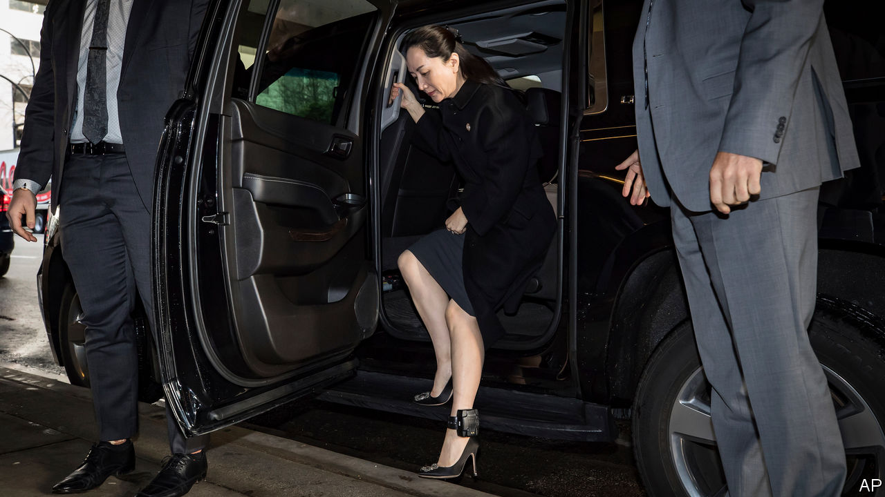
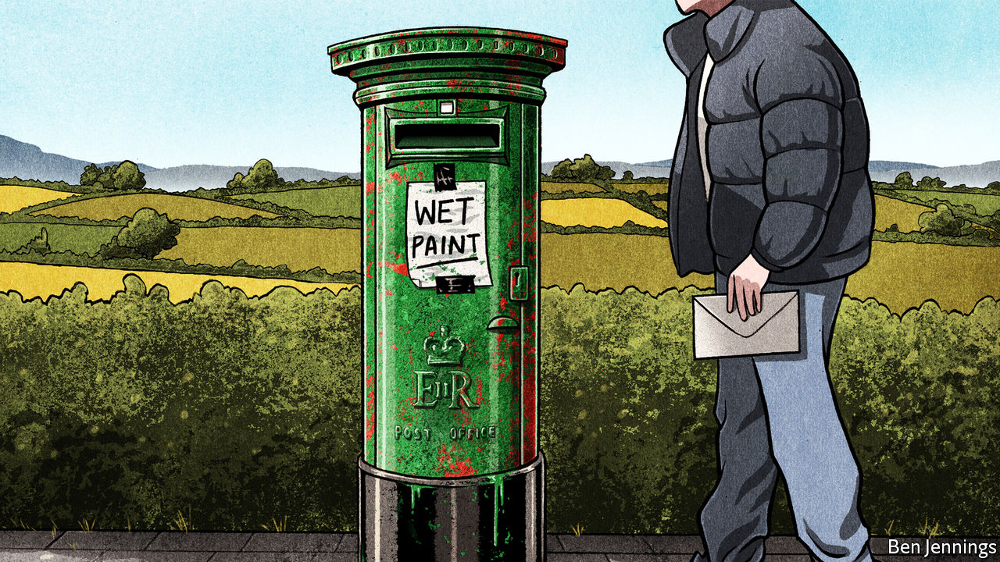
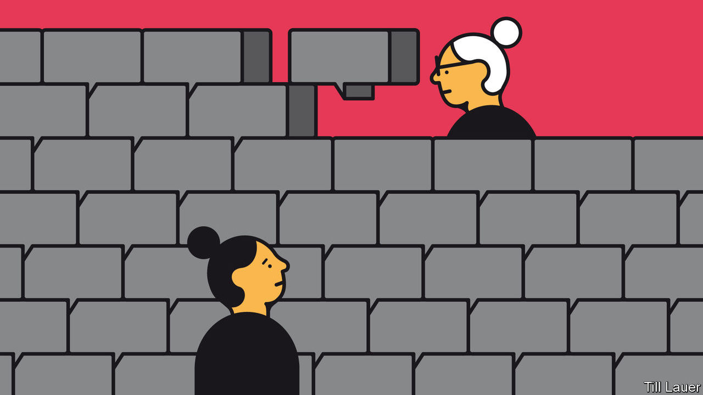

## On telecoms, Ireland, Singapore, America, bananas, Brazil, oil

# Letters to the editor

> A selection of correspondence

> Mar 7th 2020

“[How to handle Huawei](https://www.economist.com//leaders/2019/01/31/how-to-handle-huawei)” (January 25th) called for the adoption of encryption as a way to mitigate the threat of snooping by Chinese tech firms. Although end-to-end encryption can secure communications, it also hinders lawful interception, such as the ability of a country’s police and intelligence agencies to monitor calls. This is a power that even democratic governments are reluctant to lose. Once lawful interception is part of a phone network, it is difficult to secure confidentiality in communications. For example, in 2004 Ericsson’s mobile-phone exchanges in Greece were hacked to reroute calls made by government officials to an array of shadow phones linked to another country, using lawful intercepts.

Furthermore, end-to-end encryption does not secure metadata, such as a phone’s location or the caller’s identity. Both can be valuable to a foreign power. Finally, all arguments regarding voice-call security will become irrelevant, as ever more communications take place over internet platforms, such as Skype, WhatsApp or Viber. We live in a complex world.

DIOMIDIS SPINELLISProfessor of software engineeringAthens University of Economics and Business

You wondered whether a united Ireland would need a new flag (“[Is some revelation at hand?](https://www.economist.com//briefing/2020/02/13/brexit-and-sinn-feins-success-boost-talk-of-irish-unification)”, February 15th). Given that the flag of the republic of Ireland is already a tricolour of the green of the Catholics, the orange of the Protestants and white representing the hope for peace between them, it is not clear what more a new flag could symbolise.

One change that may help would be if a united Ireland rejoined the Commonwealth. Ireland left in 1949 because it could not be a republic and remain a member, though the rules were changed soon after to accommodate India. The queen is not head of state in that country. British-Irish hostility is largely a thing of the past, so this easy concession may make Protestants more comfortable with the prospect of a unified Ireland.

MICHAEL TICKTINRoosevelt, New Jersey

A united Ireland and an independent Scotland would help England, with Wales, find that role in the world which Dean Acheson observed we have been seeking since the loss of empire. Shocked and reduced in size we would (hopefully) accept that we were no longer able to punch above our weight. A smaller country but still with lots of economic heft, we could focus on domestic needs. Being a Holland is rather attractive.

ROGER STAPLETONPoole, Dorset

It now looks more likely that the goal of a united Ireland pursued by Irish republicans for the past century could at last be achieved, not as the result of civil protest, IRA violence or Sinn Fein politicking, but rather as the unintended consequence of a single vote supported by mostly conservative Britons: Brexit. Irish republicans will identify with Napoleon’s advice to never interrupt your enemy when he is making a mistake.

ANDREW LINDGRENSan Francisco

Chinese Singaporeans used to speak varied dialects, but Mandarin was not alien to them ([Banyan](https://www.economist.com//asia/2020/02/22/singapore-has-almost-wiped-out-its-mother-tongues), February 22nd). Already by the 1950s, Mandarin was the dialect taught in Chinese-medium schools in Singapore, and the standard dialect in China. However, over the years, parents increasingly sent their children to English-medium schools in the hope of securing better jobs for them. Had the government done nothing, the decline of Mandarin and all other dialects would have been rapid and drastic. Instead, Singapore adopted a bilingual education policy and required all Chinese students to study Mandarin as a second language.

Dialect-speaking families made a sacrifice, to keep their language and culture alive for future generations. But most families got by, with older members learning enough Mandarin to engage with their grandchildren. Decades later, interest in dialects has revived among young Singaporeans. Quite a few are taking up conversational courses, seeking to connect with their roots.

But it is not realistic to expect Chinese Singaporeans to learn English, Mandarin, plus their own dialect, without weakening their competence in each. Despite Banyan’s optimism, the average human’s capacity for learning languages is finite. This is the experience not just of Singapore, but other multilingual societies such as Mauritius and Hong Kong.

I join Banyan, though, in lamenting the lack of adequate Mandarin equivalents for many colourful dialect expressions, and regret that English is an even poorer substitute for swearing.

FOO CHI HSIAHigh commissioner for SingaporeLondon

In America we are certainly feeling the sting of “less democracy” (“[Too much of a good thing](https://www.economist.com//books-and-arts/2020/02/13/why-an-excess-of-democracy-can-lead-to-poor-decisions)”, February 15th). The electoral college was designed by the Founding Fathers to step in and elect the president if voters got too deranged. It has yet to serve that purpose, but it has upended democracy twice in the past five elections by electing a president who has not attained the most votes.

FRED LAKNERSan Diego

Democratic governments could indeed do with a little less democracy. If only the United States would abolish presidential primaries and return to the old days of closed-door party committees choosing the candidates who are most likely to win. We would then be spared the likes of Donald Trump and Bernie Sanders, who attract support at the extreme ends of their parties at the primaries. Choosing behind closed doors would result in moderate candidates for both parties.

ROGER SAVITTBedford, New York

The school of tropical medicine at Baylor College is not America’s first (“[Anger in a time of autism](https://www.economist.com//united-states/2020/02/22/anger-in-a-time-of-autism)”, February 22nd). The School of Hygiene and Tropical Medicine at Tulane University was founded in New Orleans in 1912, thanks to funding from Samuel Zemurray, known as Sam the Banana Man. Zemurray’s banana empire in Honduras inspired the term “banana republic”, of which New Orleans is considered by some, myself included, to be the northern-most point.

GARY FLEMINGNew Orleans

The world this week ([February 22nd](https://www.economist.com//the-world-this-week/2020/02/22/politics-this-week)) mentioned that the best military minds in Brazil are trained on what they believe to be the biggest threat to their country over the next 20 years: France. Are you sure they are not thinking about football?

PASCAL LECCIASingapore

Norwegians yearning to be green while continuing to owe their wealth to fossil fuels (“[Ecowarriors bankrolled by oil](https://www.economist.com//europe/2020/02/08/why-every-norwegian-ecowarrior-has-200000-petrodollars)”, February 8th) reminded me of the infamous adage among drug-dealers: don’t get high on your own supply.

MICHAEL URBICHZug, Switzerland