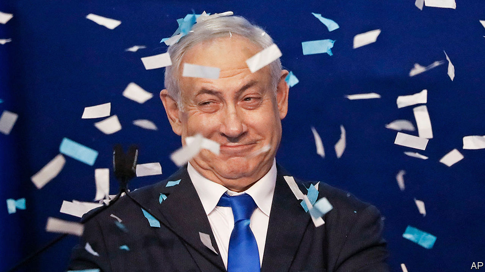
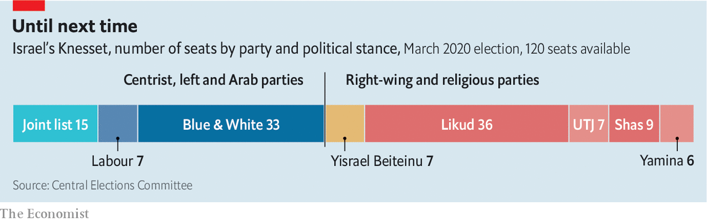

## Limbo time

# Binyamin Netanyahu’s party has come out on top in Israel’s election

> But he will still struggle to form a government

> Mar 5th 2020JERUSALEM

NEVER COUNT out Binyamin Netanyahu. For the past three decades that has been the cardinal rule of Israeli politics. And it was reinforced on March 2nd, when the 70-year-old prime minister pulled off another electoral feat. Mr Netanyahu’s party, Likud, has won the most seats (36) in Israel’s parliamentary election—the third in less than a year. But his coalition of nationalist and religious parties is three seats short of a majority in the 120-member Knesset (parliament).

The previous two ballots, in April and September last year, failed to produce a government. There is no guarantee that this one will either. But Mr Netanyahu has momentum. When Likud was overtaken by Blue and White, its main rival, as the largest party in September, some wrote Mr Netanyahu’s political obituary. More earth was shovelled into his grave when, in November, the attorney-general indicted him for bribery and fraud. Mr Netanyahu, though, hung on, denying any wrongdoing. In December he soundly defeated a challenge to his leadership of Likud. Then he launched a blistering re-election campaign.

Already Israel’s longest-serving prime minister, Mr Netanyahu had plenty to brag about on the stump. He has kept Israel secure, improved ties to Arab states and overseen a growing economy. What is more, President Donald Trump has given him a succession of political gifts: the recognition of Jerusalem as Israel’s capital, the isolation of the Palestinian Authority and, most recently, a peace plan that gives Mr Netanyahu almost everything he wants.

Yet the prime minister’s campaign was defined by its dirtiness. Mr Netanyahu questioned the mental health of Benny Gantz, Blue and White’s leader and a former military chief of staff (appointed by Mr Netanyahu). He even suggested that Mr Gantz had been blackmailed by the Iranians. Mr Netanyahu’s son, Yair, tweeted about alleged infidelity by Mr Gantz. As President Reuven Rivlin, a Likud member, cast his ballot, he lamented that the campaign had declined “to the point of filth”.

But Mr Netanyahu also relied on data to target micro-constituencies, such as immigrants, cab drivers and airline employees. He bombarded each with promises, such as telling cannabis-users that he would decriminalise the recreational use of the drug, and delaying a measure that would make taxi fares more transparent.

Mr Gantz’s strategy was to appeal to “soft-right” voters fed up with Mr Netanyahu’s alleged corruption. But this made the party almost indistinguishable from Likud, and many voters stuck to the original. Blue and White won 33 seats, as in September. Left-wing parties suffered. The coalition of Labour, Gesher and Meretz won just seven seats, down from 11 in September. Some of its former voters supported the Joint List, an alliance of predominately Arab parties, which got 15.

The parties that oppose Mr Netanyahu won a small majority, but are divided. Right-wing members of Blue and White and the nationalist Yisrael Beiteinu party refuse to work with the Joint List. So Mr Netanyahu will probably be given the first chance to form a government. If so, the Supreme Court might intervene. It will undoubtedly be asked to decide whether Mr Rivlin can legally invite someone under criminal indictment to assemble a coalition. Senior members of the opposition are also talking about changing the law in order to ban an indicted politician from forming a government. “Gantz is trying to steal the election,” says Mr Netanyahu.

Even if he is given the green light, Mr Netanyahu has work to do. His coalition won 58 seats, so he needs to peel off three opposition members to get a majority. Alternatively he could cut a deal with Blue and White. During the campaign Mr Gantz ruled out serving under an indicted prime minister. But his poor result might soften his stand. On election night he insisted only that the allegations against Mr Netanyahu be heard in court. The prime minister’s trial is due to begin on March 17th (though some in his coalition still hope to grant him retroactive immunity).

The outcome also raises the question of annexation. Mr Netanyahu has promised to proceed with Mr Trump’s peace plan, which allows Israel to apply sovereignty to large parts of the occupied West Bank, including the Jordan Valley. The prime minister has been working with the Americans on how to move forward. He may feel that action needs to be taken before Mr Trump might have to vacate the White House. And becoming the man who brought more of the promised land under full Israeli control would make for an excellent campaign slogan in case a fourth election is required to break the deadlock. ■

## URL

https://www.economist.com/middle-east-and-africa/2020/03/05/binyamin-netanyahus-party-has-come-out-on-top-in-israels-election
