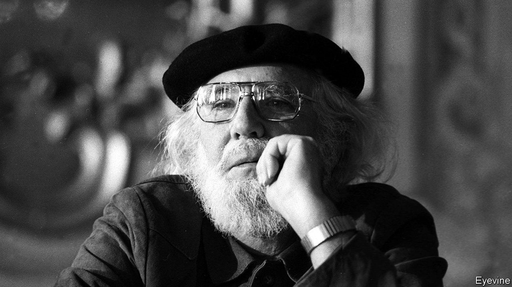

## Building Utopia

# Ernesto Cardenal died on March 1st

> Nicaragua’s revolutionary priest-poet was 95

> Mar 5th 2020

IN MARCH 1983 Ernesto Cardenal, then Nicaragua’s minister of culture, found himself on the broiling tarmac at Managua airport, waiting for the pope. John Paul II had no love for the left-wing Sandinista regime, but the minister—a priest as well as a revolutionary, for all his collarless shirt and black beret—was eager to see him. As the pope approached, he knelt and pulled off his beret for a blessing. What he got was a finger-wagging lecture. “You must sort out your affairs with the church,” the pope told him. Twice.

The photograph of the incident showed him smiling, as if he agreed. But he did not. He felt the pope did not know what true Marxism was. In his experience, Christ had led him to Marx, and the Gospels, with their message of social justice, had led him to communism. The link was obvious, direct. As the crowd that day was yelling out regularly, in case the pope should miss it, “Entre crístianismo y revolución, no hay contradicción.”

Many years before in Solentiname, in a remote southern corner of Lake Nicaragua, he had worked to prove that slogan true. He arrived there in 1967, after Trappist training under Thomas Merton at Gethsemani, to start a contemplative community. Almost at once it became something else. He had grown up as a rich boy, in a mansion at the other end of the vast lake. Here, though, he was among poor fishermen and farmers who had never before been sent a priest. His union with God in meditation would mean nothing unless he involved them as equals. He therefore set about it.

Gradually, a Christian-Marxist Utopia grew up by the edge of the lake. The campesinos were taught to share and live communally. He then encouraged them to paint and they produced, untaught, bright, primitive pictures of the lake, its birds and flowers, that looked like paradise. This, he would tell them, was the perfect world they were aiming for. Creation was evolution; the universe was incomplete, but they would assist its progress. At Solentiname he set up workshops for all to be creators: painters, sculptors, dancers, poets. A library was built, full of Marxist books. Visitors from abroad came to buy pictures and to see his principles in action.

Liberation theology, the “option for the poor”, was then current all over Latin America, but his was sharper-focused. At Solentiname Sunday mass became a free-form discussion, everybody sitting in a circle for Gospel readings which the campesinos would comment on, and he would explain. Why was the good news of Jesus’s birth given first to shepherds? Because the poor and oppressed needed it most. What about the parable of the mustard seed? That was the seed of change they all carried in them. What was the Kingdom of God? That was a place where everything was turned upside down, as when you flipped a tortilla. The Kingdom of God was revolution. It was the overthrow of the right-wing Somoza regime that had ruled Nicaragua for decades—those tyrants who barged through his poems, swanning round in their chocolate-biscuit palace, guarded by goons with machineguns, who would kill a man as casually as they smoked a cigarette.

He had written that way for a long time. Hate alternated with love, especially, in his early “Epigrams”, in lyrics addressed to girls his pleading kisses could no longer reach. Later, both God and rebellion took him over. In the 1950s he supported a coup, yelling for liberty in the street, but fled when it failed. His long poem “Hora 0” (Zero Hour) eulogised Augusto César Sandino, the Sandinistas’ model, as a figure like himself, no soldier, no politician, leading with grim serenity a ragged, shoeless army against the yanquioccupation in the 1920s. Feeling at last that he had to foment armed struggle, in 1977 he sent some would-be martyrs from Solentiname to attack a guard post in the town of San Carlos. In revenge, Anastasio Somoza’s troops destroyed his island Utopia.

Yet all was not lost. In two years the Somocistas themselves had been toppled, and Nicaragua had the rulers he had hoped for. Surprisingly—since he was a man devoted to solitude and simplicity, to Neruda, Whitman and Pound’s “Cantos”—he was one of them. His post as minister of culture, Nicaragua’s first, gave him a chance to do nationally what he had achieved in miniature before.

For nine years he tried, establishing cultural centres and poetry workshops all over the country, restoring Solentiname, launching a literacy drive and selling the Nicaraguan revolution abroad. His white hair and black beret made him its symbol, seemingly mild, until he raised his oracular voice in poems. But there was never enough money in the ministry. Besides, many thought his poetry workshops were not so much classes for the common man as propaganda mills, where the only poetry taught had to be like his: simple, direct, and with the raw howls against dictatorship that typified his “Psalms”. (“Their lying radios roar into the night/Their desks are strewn with criminal intentions...”) That charge was hard to counter. He too was wildly ardent, then.

Eventually the fervour cooled. No one seemed able to adopt either Christianity or Marxism fully in practice; the creeds were equal in that, too. The Sandinistas’ beautiful revolution turned dynastic under Daniel Ortega and his wife, who in 1988 eased him out of the ministry. By 1994 he had left the movement; in 2008 he condemned it as a thieving monarchy. And his priestly life, too, had gone. He had been stripped of his sacramental functions in 1984, soon after his airport scolding, because he refused to leave the government. Only a year ago did he get them back.

That loss he dealt with in his own way, through books and the practice of poetry. He was ever Trappist; in his bare room he needed only a bed, a shelf, a crucifix and a desk. He retreated to Solentiname where God, he said, slept with him in his hammock by the lake. But he wrote less about politics now, and more about the wonders of the cosmos: the stardust that made humans universal, the flowering of galaxies, the poignancy of messages sent to uninhabited planets. His favourite reading was scientific journals. There he tracked the discoveries that showed creation ever greater, evolving slowly, despite many a slip, towards a perfect revolution—as Marx taught and as Christ taught, both alike.■

## URL

https://www.economist.com/obituary/2020/03/05/ernesto-cardenal-died-on-march-1st
