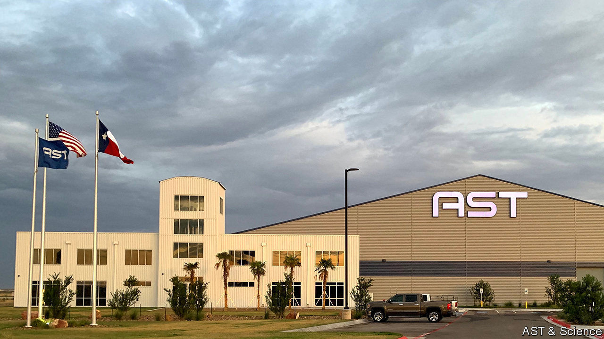

## Call from the heavens

# A new firm says it can link satellites to ordinary smartphones

> If it works, there will be no escaping a mobile signal

> Mar 7th 2020

SMARTPHONES GIVE people access to each other and to the internet when they are on the move—but only where there is network coverage. Satellite constellations, like those being built by SpaceX, OneWeb and Amazon, will provide broadband access anywhere on the planet, but will not talk directly to existing telephone handsets (they will instead require small receiving stations on the ground, to act as gateways). By contrast Abel Avellan, the founder of an American firm called AST & Science, claims to have invented a way to provide the best of both worlds: satellite connectivity that works anywhere on the planet and yet is accessible directly, via existing handsets.

AST & Science emerged from “stealth mode” this week. It dubs its service “SpaceMobile”. Mr Avellan, a veteran of the satellite industry, says he has spent years devising a way to get satellites to talk directly to ordinary phones. The result is an unusually large satellite that is capable of picking up a handset’s feeble signal, and also of broadcasting directly back to that handset. The satellite acts as a relay between the handset and existing antennas on the ground that are connected to cellular networks. In short, the satellite is not an orbiting base-station, but a radio repeater.

Mr Avellan says this approach can work with 2G, 3G, 4G and 5G networks, providing access in remote areas of land that currently have no coverage, and also on planes and at sea. SpaceMobile will, he says, launch a network of “a few hundred” satellites to provide global coverage. That compares with the 12,000 planned by SpaceX.

The company tested its technology in an unusual way. Last April, rather than launching a prototype of one of its large satellites, it kept the prototype on the ground and instead launched a tiny satellite to create what was, in effect, an orbiting handset. Even though the positions of relay and handset were thus reversed, their relative motions were the same as they would have been if the satellite had been in space and the handset on the ground.

Mr Avellan says the tests were successful. And on March 3rd his firm announced that Vodafone, a mobile-telecommunications giant, and Rakuten, a Japanese conglomerate, have joined the project as investors. Other backers include Samsung, a big handset manufacturer, and American Tower, which operates wireless-communications infrastructure around the world.

Such companies would not have backed SpaceMobile if they did not think the technology had a good chance of working. But not everyone is convinced. One industry insider, who has previously been involved with the SpaceX and OneWeb satellite projects, says getting handsets to talk directly to satellites means overcoming a huge number of problems relating to power requirements, propagation delay, allocation of frequency bands, interference and cross-border regulation.

Mr Avellan says he has solved all these problems, and has filed around 30 patents in the process of doing so, though he has yet to reveal full details of how his system works. He says the satellites switch on and off depending on which territory they are over, and use mobile operators’ existing frequency bands when active. Access to the service will be sold wholesale to operating partners, who can then offer SpaceMobile to customers as a global roaming option.

As well as working with existing phones, without the need for terrestrial gateways, Mr Avellan says that because his system needs far fewer satellites than its mega-constellation rivals, and thus fewer launches, it will be cheaper to build. As for pricing, he says access will be cheap enough for it to be used as a gap-filling technology in poor countries, where coverage can be patchy in rural areas. Such extraordinary claims require extraordinary evidence. Now he must prove that his scheme will fly.■

## URL

https://www.economist.com/science-and-technology/2020/03/07/a-new-firm-says-it-can-link-satellites-to-ordinary-smartphones
