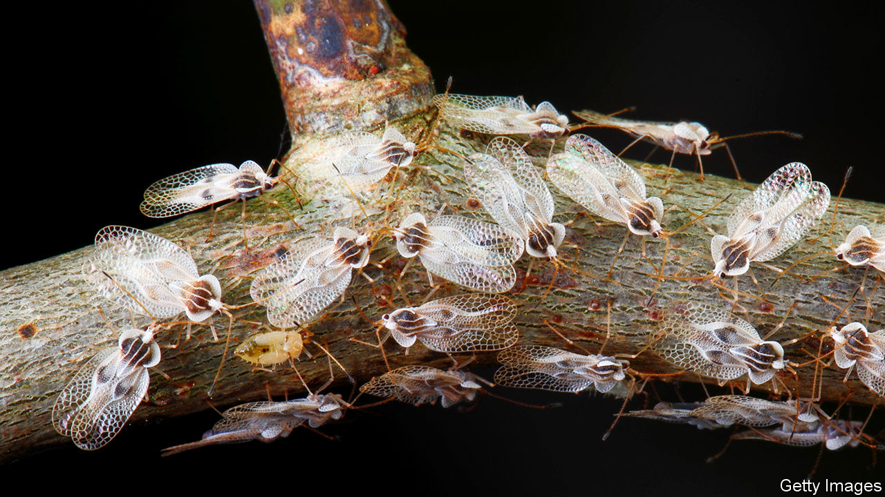

## Wildfires

# Fauna, as much as flora, govern susceptibility to wildfires

> Animals can create or destroy fuel, and also make accidental fire breaks

> Mar 7th 2020

THE WORLD is warming. All else being equal, that warming will promote wildfires. One job which human beings face in the future is therefore to ensure that all else is not equal. And that means understanding how those fires are regulated naturally.

Part of such understanding, Claire Foster of the Australian National University, in Canberra, argues, is a better perception of the role in fires of animals. In a paper in Trends in Ecology and Evolution she examines ways that animals’ activities can suppress or promote the spread of fire.

Some are obvious. That browsing and grazing animals like deer and wallabies keep under control the grasses and brushy plants through which fires spread is well known. The activities of invertebrates in the leaf litter are, by contrast, easily neglected. But two recent studies Dr Foster cites, conducted in Australian eucalyptus forests, have shown that excluding such litter-devouring critters almost halves the rate at which leaf litter decomposes, leaving more fuel on the ground for fires.

The role of large browsers, too, is more subtle than might at first appear. Their activities often destroy the lowest branches of a tree and thus create a gap between those branches that remain out of reach and the kindling of undergrowth and leaf litter scattered on the forest floor. These gaps act as fire breaks by stopping small fires climbing trees and turning into big ones that can jump from the crown of one tree to the next.

Animals are also responsible for creating more conventional, horizontal fire breaks. Species like deer frequently stamp trails bare of vegetation as they travel over and over again along the same routes. Though narrow, these trails are surprisingly effective at preventing fires from spreading. Even more surprising is that some of the most striking examples of firebreak trails are created not by mammals but by ant colonies. Vast numbers of tiny feet repeatedly crossing the same ground more than make up, it seems, for the minuscule weight of the creatures doing the treading.

Regrettably, some animal activities fan the flames. A number of herbivores—insects such as lace bugs (pictured) as well as mammals—stimulate plants to increase the amount of lignin in their leaves. This makes those leaves less edible, and thus more likely to end up on the ground. It also makes them slower to degrade if they do end up there, and therefore more likely to build up as fuel.

Other species actually collect leaves and wood for various purposes. For example, plains viscacha, a type of South American rodent, pile them up to attract mates. These accumulations are bonfires in waiting. Tree-killing insects like pine-bark beetles generate fuel in large quantities, too, since the dead trees they leave behind burn more easily than living ones do. And, ironically, the vertical firebreaks created by branch browsers also clear space for fire-friendly conifers to establish themselves.

Dr Foster and her colleagues suggest that an understanding of the activities of animals in an area would thus help those fighting fires there predict how big a fire is likely to get, how quickly it is likely to spread, how patchy it will be and whether or not it has a good chance of spreading to the canopy. There may even be the potential to shape the behaviour of future fires through measures that increase the populations of fire-suppressing species.■

Sign up to our fortnightly climate-change newsletter [here](https://www.economist.com//theclimateissue/)