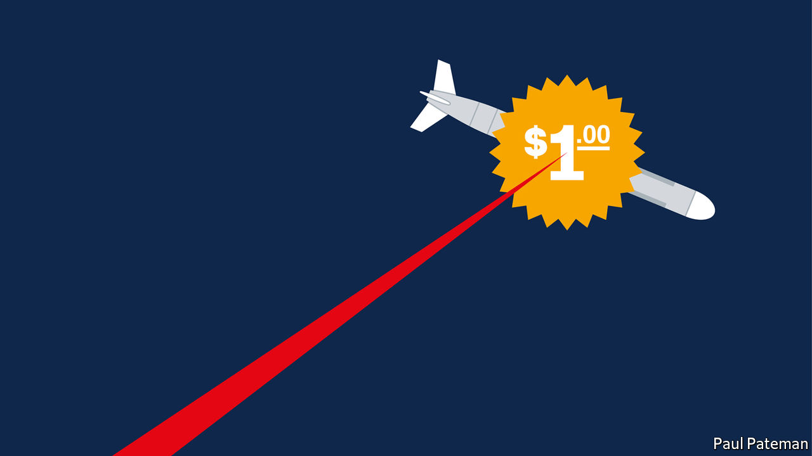

## Military technology

# Laser weapons are almost ready for the battlefield

> Ray guns, in other words, are now real

> Mar 5th 2020

WHEN MARTIANS descend on England in H.G. Wells’s novel “The War of the Worlds”, published in 1898, they incinerate troublesome humans and lay waste to suburban towns with heat-rays that turn all before them into a “a smoky dance of lurid flames”. Such ray guns have been a recurrent feature of science-fiction ever since.

Despite the efforts of military types, though, reality has lagged far behind sci-fi. In 1934, to no avail, Britain’s Air Ministry offered £1,000 to anyone who could use rays of some sort to kill a sheep at a distance of 180 metres. A decade later a Japanese device that generated microwaves managed to snuff out a rabbit that was 30 metres away. But it took ten minutes to do so. Even the invention of lasers, in 1960, failed to usher in the age of the directed-energy weapon, as ray guns are known in the jargon. Ronald Reagan’s effort to weaponise lasers in the “Star Wars” programme of the 1980s was spectacularly unsuccessful.

This time, however, it’s different, according to Kelly Hammett, who joined America’s Air Force Research Laboratory 27 years ago, and now runs its Directed Energy Directorate. “For my entire career,” he says, “we have been working on directed energy. We’re finally at the point at which we’re going to see systems that will make a more substantive difference on the battlefield.”

If true, that will change the cost of war. At the moment, shooting an object out of the sky generally means firing something expensive at it. If the object is an enemy plane or sophisticated ballistic missile, that is probably worthwhile. But Israel, for example, routinely expends $50,000 interceptors on home-made rockets that cost about $1,000. Disparities like this make it easy and affordable to attempt to overwhelm defences with missile salvos or drone swarms. Lasers, by contrast, are cheap to fire and never run out of ammunition.

Lasers come in many varieties, but two, in particular, have been the subject of weaponisation. These are solid-state lasers and chemical lasers. A solid-state laser works by stimulating the emergence of a laser beam from a crystal or a piece of glass by pumping energy into that solid. (The first laser used a ruby as the crystal and a flashlamp as the pump.) The power to do this is provided by an electric current. A chemical laser, meanwhile, draws its energy from reactions between two or more substances and uses that energy to pump yet another substance to emit the beam.

In the first decade of the current century America came close to developing a chemical-laser weapon. This was a hangover from Star Wars, a megawatt device intended to destroy intercontinental ballistic missiles just after they took off. Tests conducted in 2009 were successful. But the system weighed 17 tonnes, and was so large that it required a Boeing 747 to carry it. Also, the pumping reaction involved chlorine, hydrogen peroxide and potassium hydroxide, all of which are corrosive—as was the substance being pumped, iodine. This is not an ideal mixture to have on board a plane. Having burned through $5bn over 16 years, the programme was therefore cancelled in 2011.

Today’s laser weapons have, by contrast, gone down the solid-state route. As Thomas Karr, who heads the Pentagon’s work on directed energy, explains, they use a laser to pump a laser. The main laser’s core—the equivalent of the ruby—is doped with an element such as niobium, to give it suitable properties. Instead of a flashlamp, this laser is stimulated by a laser-emitting diode.

By picking the right combination of ingredients for the main laser, its output can be tuned to an optimum wavelength—about one micron—that results in a narrow, far-reaching beam resistant to absorption by water vapour in the atmosphere. Today’s solid-state lasers are also much more efficient than their predecessors. A third of the electricity driving them is converted into laser light, compared with just a few percent in earlier generations. Dispensing with gases, moreover, means less plumbing and a more compact design.

The breakthrough for solid-state lasers came in 2014, with the testing by America’s navy of one that had a power of 30 kilowatts (kW)—the output of an average home boiler. When fitted to a small vessel called USS Ponce it proved able to fry the components and motors of nearby drones and boats. Ponce’s captain was then given permission to use it for real, if he needed to.

In light of this success a 60kW system, similarly intended for use, will be fitted on USS Preble, a destroyer, later this year. And an even more potent 150kW weapon is undergoing tests on larger ships. Nor are such devices exclusively naval. In February the American army said it planned to field its first “combat relevant” laser, a 50kW weapon that would sit atop Stryker armoured vehicles and defend them against aerial threats, by 2022.

Military lasers have also benefited from progress in materials science. The heat-rays employed by Wells’s Martians relied on “a polished parabolic mirror of unknown composition”. Their real-world successors similarly use mirrors to combine and bounce light within the weapon, before sending it out through a window on its way to its target. Since lasers concentrate huge amounts of power into small areas, these mirrors have to be coated with reflective materials that absorb as little energy as possible. Similarly, the coatings of the windows require high-transmission materials that permit as much energy as possible to pass. Both types of coating have come along greatly in the past 20 years, because of their use in optical gyroscopes, which are fitted widely in aeroplanes and ships, says Mr Karr.

Another advance has been adaptive optics—a set of techniques that use special sensors and deformable mirrors to compensate, in real-time, for distortions caused by Earth’s atmosphere (think of the twinkling of stars). This technology, which enables military lasers to be aimed accurately, was pioneered in secret laboratories in the 1980s and then declassified in the 1990s, to the considerable delight of astronomers, who use it to adjust their telescopes. Last year the American air force’s Starfire Optical Range in New Mexico approached industry to develop a new and powerful sodium laser (one that energises the sodium atoms in a layer of the atmosphere called the mesosphere, to create artificial “guide stars”). This would refine adaptive optics for both astronomical and military purposes.

The next challenge is to soup lasers up still further, so they can take aim at large missiles, as well as the small ones that the Preble and Stryker weapons will be aimed at. The goal, according to Mr Karr, is to achieve 300kW by 2022 and 500kW by 2024. These will be demonstration devices, rather than battlefield-ready. But, a century and a quarter after Wells’s vision, it looks as though the ray gun is at last a reality.■

## URL

https://www.economist.com/science-and-technology/2020/03/05/laser-weapons-are-almost-ready-for-the-battlefield
