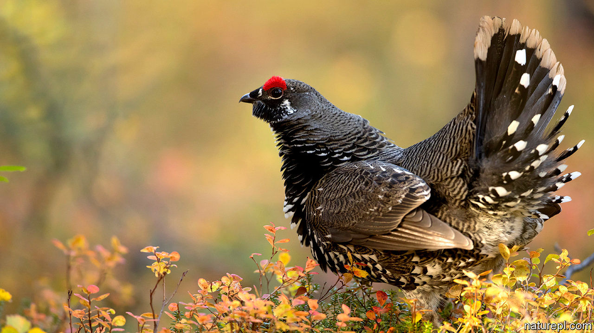

## Evolution

# Which is really the weaker sex?

> It depends on the way sex is determined in the first place

> Mar 7th 2020

WOMEN LIVE longer than men. And, more generally, female mammals live longer than male ones. This might be put down to the fact that males live more dangerous lives than females—competition for the affections of those females being an ingrained part of malehood. Such competition leads either to dangerous fights, or to the growing of showy-offy but physiologically expensive and thus life-limiting accoutrements, or both. All of which would make perfect sense were it not also true that male birds, which cede nothing to their mammalian counterparts in the fighting and showing-off departments, nevertheless manage, on average, to outlive their respective females. Male spruce grouse (pictured), for example, live for 13 years; females for five.

A long-standing hypothesis holds the sex chromosomes to blame. Male mammals are, in the jargon, heterogametic. They have X and Y chromosomes, whereas females have a pair of Xs. In birds, it is the females which are heterogametic. In both groups, the sex-determining chromosome is a stubby thing that is missing many of the genes on its counterpart. It therefore cannot cover for its partner’s genetic deficiencies by providing working copies of genes which are mutated in that partner. (In humans, haemophilia, Duchenne muscular dystrophy and colour-blindness are all caused this way.) As a result, the heterogametic sex is less resilient and dies earlier.

It is a plausible idea. But two sample points (mammals and birds) do not prove it. So Zoe Xirocostas and her colleagues at the University of New South Wales, in Sydney, Australia have looked further. As they describe in Biology Letters, they searched the literature for animals where both the relative longevity of the sexes and the nature of any heterogameticity are known.

Adding reptiles, amphibians, sharks, bony fish, arachnids and insects to the list, they confirmed that the relationship between longevity and heterogameticity does indeed hold up in other groups of animals. But there is a twist. When males are heterogametic the sex difference in lifespan averages 20.9%. Despite extreme examples like the spruce grouse, however, when females are heterogametic the average difference is only 7.1%. These numbers suggest that fighting and showing off are involved in determining longevity differences, too.

Correction (March 11th, 2020): A previous version of this article mistakenly included a picture of a peacock. It has been replaced with a photograph of a male spruce grouse.