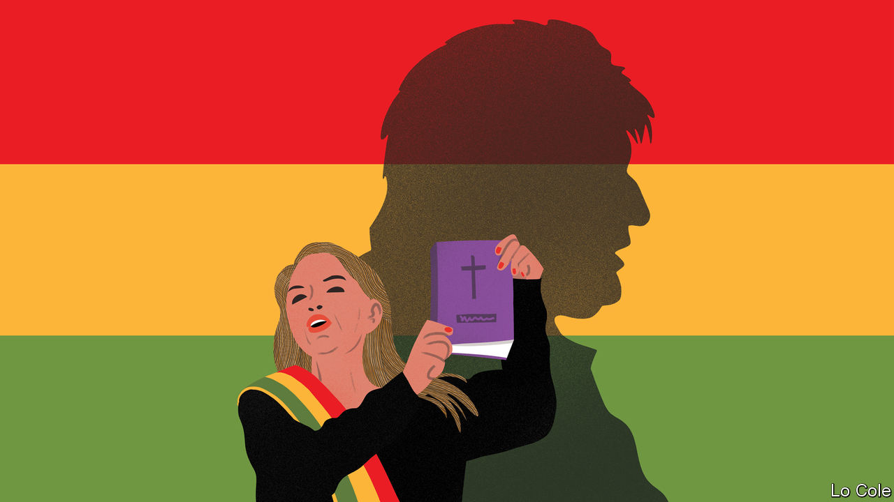

## Bello

# Bolivia after the ouster of Evo Morales, a leftist strongman

> The interim president seeks an electoral mandate. Will that destabilise the country?

> Mar 5th 2020

“THE BOLIVIAN people won’t accept seeing those who have the privilege of directing our collective destiny using their power and the resources of state institutions...to change the rules of democracy and benefit themselves.” So wrote Samuel Doria Medina, a businessman and politician, in a newspaper column on January 26th. He was referring to Jeanine Áñez, a previously obscure opposition senator who in November became Bolivia’s caretaker president. Evo Morales, a leftist strongman, was overthrown that month by protests over electoral fraud. To the dismay of many outsiders, Ms Áñez decided to stand herself in the re-run election, to be held on May 3rd. Her attempt “should be banned”, wrote Mr Doria.

A few days later Mr Doria became Ms Áñez’s running-mate. The priority, he said, was unity to prevent the return of Mr Morales’s Movement to Socialism (MAS) and Ms Áñez was the candidate best placed to achieve that. This shows that pragmatism is trumping principle among Mr Morales’s opponents. But if Ms Áñez triumphs, it may provide additional ammunition to those who claim that Mr Morales was the victim of a coup. And that may presage further instability in Bolivia.

Mr Morales, who was the first elected president of indigenous descent, used natural-gas revenues to build schools, roads and clinics in poor areas. He spoke up for the downtrodden. But he was also guilty of the abuses Mr Doria complains of. He was ruthless in dealing with opposition, and controlled the courts and the electoral authority. Elected three times, in 2016 he narrowly lost a referendum to relax term limits. He stood again in last October’s election anyway.

When this appeared to be heading for a run-off between Mr Morales and Carlos Mesa, a centrist, the president was declared the winner after a sudden interruption in the vote count. That prompted an uprising which ended when the army, as well as the Catholic church and the main union confederation, urged Mr Morales to resign. In all, 36 people died in clashes. The Organisation of American States (OAS), invited by Mr Morales to audit the vote, found widespread and deliberate manipulation, which included the use of hidden servers and falsified tally sheets.

Now Mr Morales, who is in exile in Buenos Aires, has launched a propaganda offensive in which he claims that there was no fraud and that Ms Áñez is ruling as a dictator. In a report last month, commissioned by the Centre for Economic and Policy Research, an think-tank in Washington that supports Venezuela’s dictatorship, two researchers claimed to find no statistical evidence of electoral fraud in Bolivia. That brought a robust response from the OAS, which dismissed the report as “neither honest, nor fact-based nor comprehensive”.

By pressing criminal charges against Mr Morales and some of his collaborators, critics say the interim government is exceeding its mandate. But it also struck an all-party agreement to name a new electoral authority, whose head commands widespread respect. The authority has barred Mr Morales’s attempt to run for the Senate, on the grounds that he is non-resident.

Mr Morales’s position inside Bolivia is weakening. He imposed Luis Arce, his former finance minister, as the MAS candidate, against the wishes of the party. Polls show that Mr Arce would win the first round of the election but with only around 30% of the vote. Unless he gains 40% and a ten-point lead he will face a run-off in June, which the polls suggest that either Mr Mesa or Ms Áñez would win.

Abroad, Ms Áñez is chiefly known for brandishing a large bible at the presidential palace and exclaiming “Glory to God” when she took over. She is a social conservative but in some other ways is less reactionary and more pragmatic than her image. A mestiza from a poor background, she is an experienced parliamentarian. She decided to stand after a poll gave her a 43% approval rating.

Whoever wins faces two big tasks. One is to fix the economy, which Mr Morales left with a big fiscal deficit, an overvalued exchange rate and declining gas revenues. The other is to unite the country. It may help that if Mr Arce loses, the MAS is likely to split between diehards and younger, more moderate leaders. After 14 years of Mr Morales, “we have to go back to recognising that politics involves disagreement, debate and deal-making,” says Roberto Laserna, a social scientist in Cochabamba. These tasks may fall to Ms Áñez.

## URL

https://www.economist.com/the-americas/2020/03/05/bolivia-after-the-ouster-of-evo-morales-a-leftist-strongman
