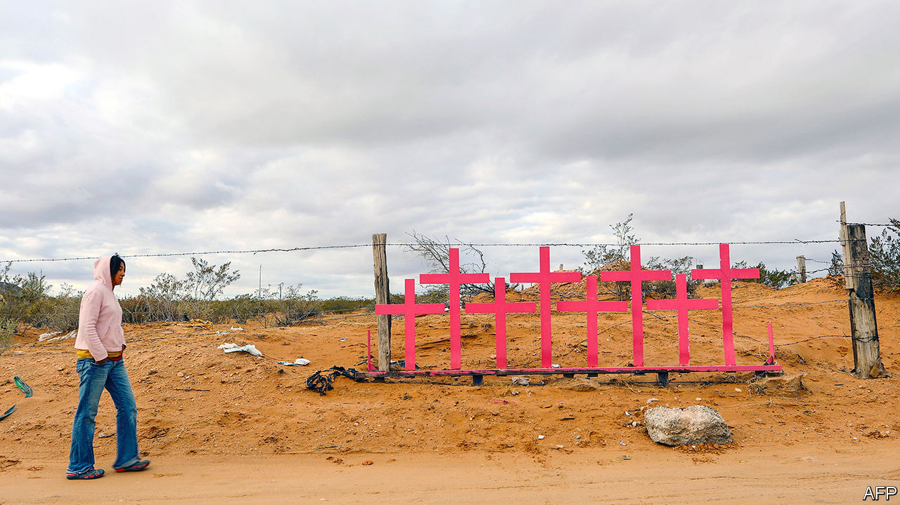

## The violet tide

# Mexico’s new feminist wave

> Outrage at the killing of women starts a mass movement

> Mar 5th 2020MEXICO CITY

FROM THE rooftop of an office block in Mexico City, Sonia Barroeta tells of a lifetime of small abuses. If she wears a skirt, men “won’t leave me in peace”, she says. She has been wearing black trousers for 30 years. She counts six occasions on which she used pepper spray on aggressive men. Now nearing 60, she plans to take part in a demonstration for the first time, a protest to be held on March 8th, International Women’s Day.

On the next day she will join a “national women’s strike”. In her case that will mean staying home from work, along with the other 40 female staff and students of the Asteca Aviation School, which trains (mostly male) pilots and (mainly female) flight attendants. Women suffer not just on the street, but also the office, the home and everywhere in between, says Ms Barroeta. “As a woman, you are worth less from the day you are born.”

Feminist groups called the march and the strike after two brutal murders in February. Ingrid Escamilla, 25, was killed and skinned by her husband. Fátima, a seven-year-old, was abducted, sexually abused and murdered. The Women’s Day march is expected to be the biggest feminist mobilisation in Mexico’s history. This fight against violence is the first big social movement to form during the presidency of Andrés Manuel López Obrador, a left-wing populist who took office in December 2018.

It is part of a Latin American wave. Last year, after police abused women who took part in demonstrations against inequality, price rises and election-rigging in several countries, women held protests against sexism. A Chilean anthem called “A Rapist in Your Path” has been sung from Paraguay to Honduras. (Sample lyric: “The oppressive state is a macho rapist”.)

Although violence is the spur to protest, women are a smaller proportion of murder victims than in countries where they are generally better treated. In Switzerland, in 2018 the best of the 189 countries ranked in the UN Development Programme’s genderinequality index, half of murder victims are female. In 74th-placed Mexico, which has many more murders, the proportion has been steady at 10-15% since the 1990s. That is because a typical murder involves one male gangster shooting another. In 2018, when 36,700 people were killed in Mexico, 3,700 were women.

Feminists argue that murders of women are especially vicious. “They kill us with a distinct cruelty,” says Citlalli Hernández, a senator. Mexico recognises “femicide”, the murder of a woman or girl because she is female, as a separate crime (see [article](https://www.economist.com//the-americas/2020/03/05/why-latin-america-treats-femicides-differently-from-other-murders)). The country classified 980 killings as femicides last year, up from 411 in 2015. Many are the culmination of domestic violence that was reported to police, and are thus preventable. In surveys about whether people feel safe, a gap appeared in 2014: the share of women who feel at risk is ten percentage points higher than that of men.

That has inspired a movement characterised by the youth of its adherents, their militancy and their use of social media to organise. After a teenager accused four policemen of rape last August, women rallied under the hashtag “They don’t take care of us, they rape us”. They smashed the glass doors of the prosecutor’s office in Mexico City, vandalised the Angel of Independence, the city’s best known monument, and clashed with all-women riot squads.

Although murder is the focus of these protests, it is not the only target. “What we want is to change the culture, the social relations, the place we have been put historically,” says Sayuri Herrera, a lawyer.

Most Mexicans want less violence against women. Universities and business groups are backing the Women’s Day march. There is less enthusiasm for other feminist goals, such as access to abortion. The capital legalised abortion in the first trimester in 2007 and the southern state of Oaxaca did so later. Other jurisdictions have not followed.

The protests are aimed more at changing social attitudes than government policy. Their leaders do not expect much help from Mr López Obrador. Though a former agitator himself, he dislikes forces he cannot control. He claims that the feminist movement has been “infiltrated” by conservatives, who exploit its anger to criticise him. In February, while promoting a lottery to pay for medical supplies, he responded to questions from reporters about murdered women by saying, “I do not want femicides to overshadow the raffle.” Some activists defend Mr López Obrador by saying that his administration includes more feminists than did earlier governments.

Being a feminist in Mexico has never been easy. “We were 20 locas [crazy women] in the streets with pro-abortion signs,” says Marta Lamas, a professor at the National Autonomous University, recalling protests she took part in 45 years ago. A spate of horrific murders has captured Mexicans’ attention. That may not bring about the broader changes that feminists seek. ■