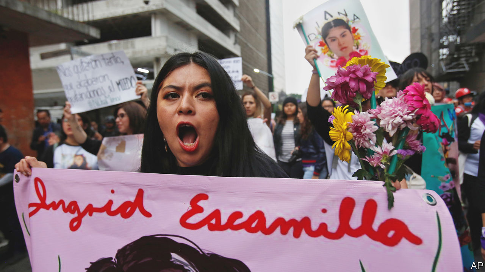

## Special victims

# Why Latin America treats “femicides” differently from other murders

> Does treating some murders of women as a separate crime help bring perpetrators to justice?

> Mar 5th 2020MONTERREY

LIDIA FLORENCIO GUERRERO keeps a candlelit shrine to her daughter, Diana, who in 2017 was raped and murdered in Chimalhuacán, a Mexican town. She has a file documenting how police bungled the investigation. They failed to cordon off the crime scene or wear gloves while handling Diana’s body. Her clothes went missing. Photos of the corpse were sloppily taken, says Diana’s sister, Laura. Ms Guerrero cannot look. She uses the word “femicide” to describe her daughter’s death.

The word is centuries old but has recently taken on a particular meaning: the murder of a female because of her sex. In Latin America femicide has a legal meaning, too. Since 2007 15 countries have recognised it as a distinct category of killing. The proportion of murders of women that are recognised as femicide varies widely. In Mexico, where the criteria include “degrading” injuries or sexual violence inflicted on the victim and a “sentimental relationship” between her and the killer, the share is about a quarter. Countries in other regions, such as France, are debating whether to adopt femicide laws.

The concept of femicide raises public awareness of violence against women, says Martha Cecilia Reyes, head of the women’s institute of Nuevo León, a state in northern Mexico. It is supposed to help bring perpetrators to justice. In many countries jail sentences are stiffer than for murder. The maximum for femicide in Nuevo León is 70 years, 30 years longer than for other murders. Mexican courts do not require prosecutors to show that a femicide defendant intended to kill his victim. That makes it harder for men who beat their wives to death to get away with a manslaughter conviction, says Estefania Medina, a lawyer.

Femicide-specific institutions build expertise. Guatemala has, in effect, a parallel justice system, with specialist judges and prosecutors. Investigators in Mexico’s state-level femicide units are trained to think differently about murder scenes, says Griselda Núñez Espinosa, Nuevo León’s femicide prosecutor. That includes learning to search rubbish for tissues with traces of semen. Femicide cases are more likely than other homicides to end in a jail sentence, since many have an “obvious suspect” in the form of a lover or relative, says Ms Núñez.

But femicide laws have critics. Some lawyers find it absurd that a jealous husband who kills his wife will get decades more jail time than one who kills her male lover. Investigators of femicide cases have no more training and resources than do others, say some lawyers, and so are no more successful at winning convictions.

A survey of prosecutors in Peru found that many deemed it too hard to prove that a murderer had been motivated by misogyny. Some misclassified femicides as ordinary homicides because they thought that would make it easier to win convictions. Mexico’s attorney-general, Alejandro Gertz Manero, recently floated the idea of repealing the law that recognises femicide as a separate crime. It creates extra work for overtaxed investigators, he suggested.

Ms Guerrero did not learn of her daughter’s death for a week because police registered her as a man (deliberately, she believes). They refuse to classify her murder as a femicide. Changing that would not bring justice. But, says Ms Guerrero, it would acknowledge that “Diana was killed simply for being a woman.”■

## URL

https://www.economist.com/the-americas/2020/03/05/why-latin-america-treats-femicides-differently-from-other-murders
