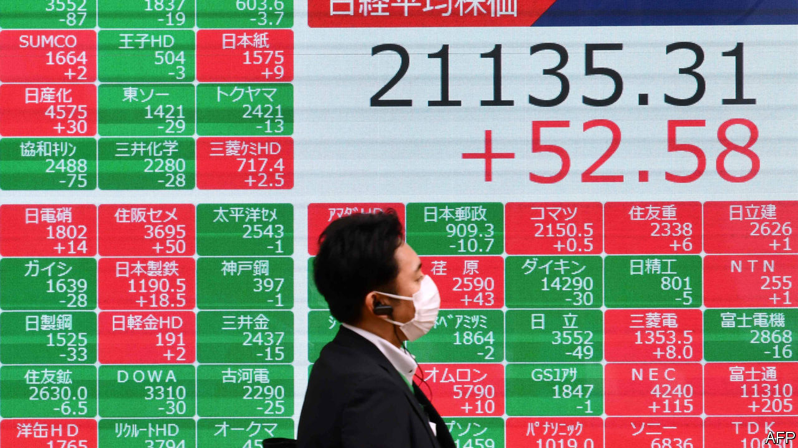
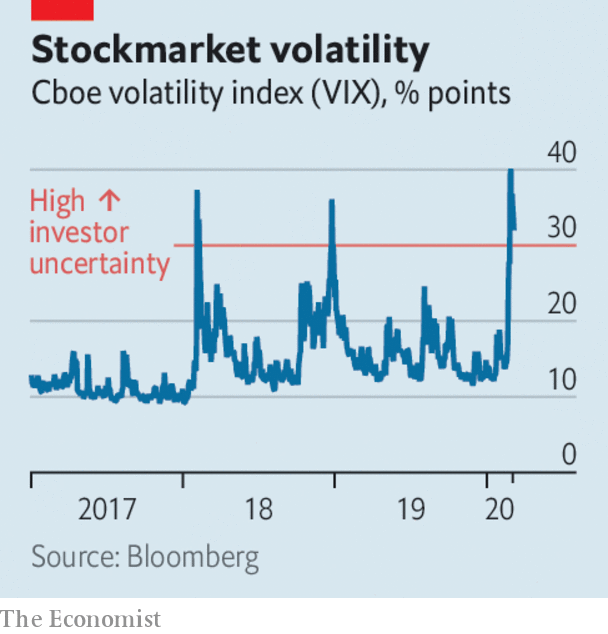

# Business this week

> Mar 5th 2020

Stockmarkets swung wildly following the worst sell-off over a week for more than a decade. The Federal Reserve made an emergency half-a-percentage-point cut to its benchmark interest rate, to a range of 1-1.25%. The Fed last cut rates by half a point in October 2008, the maelstrom of the financial crisis. This time investors fear the potential impact of the spreading coronavirus, covid-19. The yield on ten-year  us Treasury bonds fell below 1% for the first time. The central banks of Australia, Canada and Malaysia also cut rates while the Bank of Japan pumped liquidity into the financial system. The European Central Bank said it was ready to take “appropriate” action; the Bank of England said it would also act. See [article](https://www.economist.com//finance-and-economics/2020/03/05/a-recession-is-unlikely-but-not-impossible).

The International Air Transport Association reported that the covid-19 outbreak caused airline passenger demand in January to grow at the slowest pace since April 2010, when a volcanic ash cloud curtailed global travel. It warned that January was “just the tip of the iceberg”, given that flight restrictions did not begin until January 23rd. Airlines could lose up to $113bn in revenue.

The impact of the coronavirus lockdown on the Chinese economy was laid bare in new data. An index of activity in services plummeted to 26.5 in February from 51.8 in January (a reading below 50 indicates a contraction in activity). In Hong Kong a measure of general business activity plunged to 33.1, the lowest since the survey started in 1998. In some good news, Foxconn, which assembles products for Apple, Samsung and others in China, said it expected to return to normal production capacity by the end of March.

A Dutch diagnostics company at the forefront of developing tests to detect covid-19 agreed to a takeover from an American rival. Thermo Fisher struck a deal worth $11.5bn for Qiagen, which recently sent test kits for evaluation to four Chinese hospitals. Qiagen worked on disease detection during the SARS and swine-flu outbreaks.

South Africa fell into recession again at the end of last year. The economy contracted by 1.4% in the fourth quarter compared with the previous three months, after shrinking by 0.8% in the third quarter. The country has been blighted by rolling power blackouts, which disrupted industry and retail in December. The central bank has warned that growth will stay low if creaking state-owned utilities are not reformed. GDP grew by just 0.2% in the whole of 2019, the slowest pace in a decade.

Revised figures showed that India’s economy grew by 4.7% in the last three months of 2019 compared with the same quarter a year earlier, the weakest showing in seven years. Turkey’s GDP expanded by 5.9% in the fourth quarter; a strong rebound was fuelled by consumer spending. But the economy grew by only 0.9% in the whole year, as Turkey grappled with the fallout from a currency crisis.

A jury took just six hours to find three former executives at Barclays not guilty of fraud in relation to the bank’s bail-out by Qatar’s wealth fund during the 2008 financial crisis. John Varley, the bank’s chief executive at the time, was acquitted last year. The case has raised questions about Britain’s Serious Fraud Office, which spent more than seven years investigating the matter.

Sergio Ermotti, who is stepping down as chief executive of UBS, is to become chairman of Swiss Re, ending speculation that he would be named chairman of the Swiss bank.

Jack Dorsey may have a tougher time running Twitter, after it emerged that Elliott, an activist hedge fund, has accumulated a 4% stake in the social-media platform and wants him to give up one of his two roles as chief executive of Twitter and Square, a mobile-payments provider. Mr Dorsey founded both companies. Elliott reportedly thinks that Twitter’s shares are undervalued because Mr Dorsey is not focusing on the company.

Xerox formalised its $35bn hostile bid for HP by sending a letter to shareholders at the computer-and-printer company explaining why it thinks its offer is a good deal. If HP does not agree to the bid Xerox will try to replace the board. See [article](https://www.economist.com//business/2020/03/05/xerox-launches-a-takeover-bid-for-hp).

Following a lengthy bidding process, Thyssenkrupp decided to sell its elevator business to a private-equity consortium for €17.2bn ($19.2bn), one of the largest-ever buy-out deals in Europe. The consortium is led by Cinven, an activist investor that has been pushing the German engineering group to break up its business. See [article](https://www.economist.com//business/2020/03/05/two-buy-out-firms-pay-eu17bn-for-thyssenkrupps-lifts-business).

A ban on plastic bags came into force across New York state. Officials reckon that New York’s 19.5m residents use 23bn plastic bags a year, which clog landfills and get entangled in trees. The ban took many disgruntled shoppers by surprise. Disgruntled retailers will be able to flout the law until April 1st; after that they face a fine.