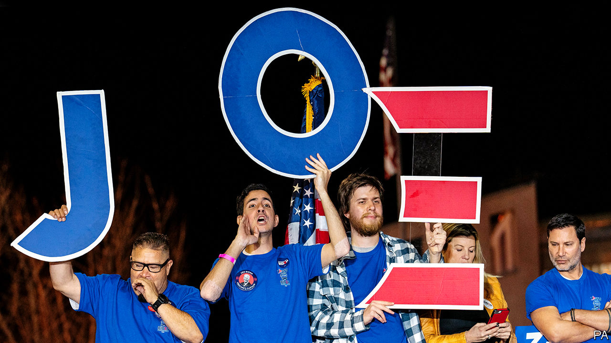
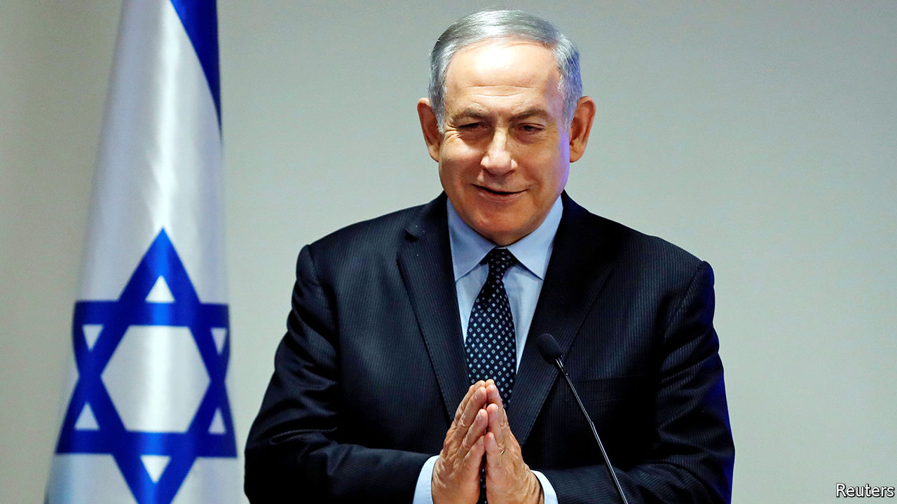

# Politics this week

> Mar 7th 2020

Joe Biden’s campaign bounced back after he won most of the 14 states that voted on Super Tuesday. Barack Obama’s vice-president racked up big victories in southern states, where black voters are a large part of the Democratic electorate. Mr Biden earlier scored a huge win in the South Carolina primary. The race for the party’s presidential nomination is now between him and Bernie Sanders, who won California, the biggest prize on Super Tuesday. Despite a costly media blitz, Mike Bloomberg did poorly and ended his campaign; he endorsed Mr Biden. Elizabeth Warren came in a miserable third in her home state of Massachusetts. See [article](https://www.economist.com//united-states/2020/03/05/joe-biden-has-pulled-off-one-of-the-great-political-comebacks).

In a boost to the power of the presidency, a federal appeals court sided with the White House when it ruled that Congress had no powers to sue a witness to force him to testify at hearings. The case centred on Donald McGahn, a former White House counsel who refused to appear before a committee investigating Russian influence in elections.

The IMF announced a $50bn financing package to help emerging markets cope with the outbreak of covid-19, after warning that the disease posed a “serious threat” to global growth. The World Bank pledged $12bn. Meanwhile, the novel coronavirus continued its advance outside China. Italy closed all schools until mid-March following a spike in fatal cases. The number of infections soared in South Korea, which overtook China in reporting new cases. South Korea is testing extensively for the virus, unlike other countries, where its spread may be underreported. See [article](https://www.economist.com//leaders/2020/03/05/the-right-medicine-for-the-world-economy).

America carried out an air raid against Taliban fighters in Afghanistan who were attacking a security checkpoint. This came just days after both sides signed a peace deal, which Mike Pompeo, America’s secretary of state, had hailed as “a momentous day”. The Taliban has carried out dozens of attacks since signing the deal. America urged it to stick to its commitments. See [article](https://www.economist.com//asia/2020/03/05/a-peace-deal-signed-then-america-and-the-taliban-resume-fighting).

After a week of uncertainty, Malaysia has a new government. The incoming coalition, Perikatan Nasional, is composed of politicians from the United Malays National Organisation, which was booted out at an election in 2018 after 61 years in power, and various allies. The new prime minister is Muhyiddin Yassin, a former UMNO leader who later founded a different party. See [article](https://www.economist.com//asia/2020/03/05/malaysias-new-government-may-be-even-more-unstable-than-old-one).

North Korea fired what are thought to be two short-range ballistic missiles into the Sea of Japan. It was its first weapons test this year.

A parliamentary election was called in Sri Lanka for April 25th. The strongman president, Gotabaya Rajapaksa, hopes his party will win enough seats to overturn recent constitutional amendments that have reduced the power of his office. See [article](https://www.economist.com//asia/2020/03/05/sri-lankas-ruling-party-calls-an-election-hoping-for-a-landslide).

Colombia’s Constitutional Court decided not to legalise abortions during the first 16 weeks of pregnancy. Its ruling leaves in place a decision from 2006, which restricts abortions to cases where the mother has been raped, her life is in danger or the fetus has health problems. Globally, mail-order abortion pills are rendering bans increasingly ineffective. See [article](https://www.economist.com//international/2020/03/05/abortions-are-becoming-safer-and-easier-to-obtain-even-where-they-are-illegal).

Spain agreed to an extradition request from the United States for Hugo Carvajal, a former head of Venezuelan intelligence, whom the Americans suspect of drug-trafficking. Mr Carvajal fled Venezuela and was arrested in Madrid last year. In Venezuela, Nicolás Maduro, the dictator, urged women to have six children “for the good of the country”. Food shortages under the socialist regime have led to widespread malnutrition among children.

Binyamin Netanyahu, the prime minister of Israel, claimed victory in the country’s third parliamentary election in a year. His party, Likud, won 36 seats, compared with 33 for its main rival, Blue and White. But Mr Netanyahu’s alliance of nationalist and religious parties did not win a majority of seats, so he will struggle to form a government. See [article](https://www.economist.com//middle-east-and-africa/2020/03/05/binyamin-netanyahus-party-has-come-out-on-top-in-israels-election).

Iran has stockpiled enough enriched uranium to build an atomic bomb and has blocked inspectors from visiting three nuclear sites, said the International Atomic Energy Agency. It would still take Iran months or years to manufacture a nuclear warhead.

The Democratic Republic of Congo discharged the last patient confirmed to have Ebola, raising hopes that it has contained an outbreak that has killed 2,264 people (two-thirds of those infected).

The constitutional court in Togo rejected claims that a presidential election won by the incumbent, Faure Gnassingbé, had been rigged. The vote and count were marred by irregularities and only a small number of observers were allowed to monitor them.

An attack by Syrian (and perhaps Russian) forces killed at least 36 Turkish troops in Idlib province, the last big pocket of rebel-held territory in Syria. Turkey responded with drone strikes and artillery attacks that dealt the regime of Bashar al-Assad a terrible blow. Turkish troops are in Syria to stop Mr Assad’s offensive on Idlib and prevent a new wave of refugees. See [article](https://www.economist.com//leaders/2020/03/07/why-nato-should-grit-its-teeth-and-help-turkey-in-idlib).

Meanwhile, Turkey declared that it would end a deal under which it stopped migrants from moving to the EU. Thousands of would-be asylum-seekers immediately headed to the border with Greece. Turkish officials said a number of people were killed in incidents involving Greek security forces opening fire on some of the migrants, but Greece has strongly denied this. See [article](https://www.economist.com//europe/2020/03/05/turkey-threatens-to-let-asylum-seekers-flood-into-europe).

The European Commission in Brussels published plans to halve carbon emissions within a decade, and backed it by proposing to “mobilise” €1trn ($1.1trn) in spending. Critics said little of this money was new. Greta Thunberg, a young climate-change activist, denounced the exercise as insufficiently ambitious.

Priti Patel, Britain’s home secretary, came under fire following the resignation of the most senior civil servant in her department. Sir Philip Rutnam left while issuing a claim for constructive dismissal against the Home Office, an unprecedented move. He claims she was involved in a briefing against him because she wanted to replace him. Allegations emerged that Ms Patel bullied officials in other departments. She denies any wrongdoing. See [article](https://www.economist.com//britain/2020/03/05/priti-patels-bust-up-at-the-home-office).

In Slovakia, a new party created by an anti-corruption campaigner was the unexpected winner in a parliamentary election. The ruling party was ousted by a group called the Ordinary People and Independent Personalities party. See [article](https://www.economist.com//europe/2020/03/05/an-anti-corruption-campaigner-triumphs-in-slovakia).