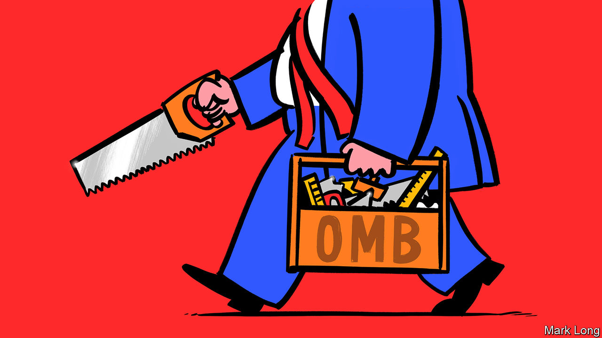

## Assessing the president

# Donald Trump’s toolkit

> How the president has used OMB, an obscure but important federal agency

> Mar 7th 2020WASHINGTON, DC

AMERICA’S GOVERNMENT, as all its citizens learn at school, comprises three branches: executive, legislative and judicial. At the top of the executive branch sits the actual executive—the president. But the branch also includes an array of agencies, both the departments represented in the cabinet, and others—including the National Security Council and the Council of Economic Advisers—that make up the Executive Office of the President (EOP). These agencies advise on and implement presidential policy. Most of the EOP gets repopulated with a change in administration, as it should: new presidents have new policy agendas, which require new personnel.

The exception to that rule is the EOP’s biggest office: the Office of Management and Budget (OMB). Most of its 500-odd employees are career civil servants who take pride in providing nonpartisan advice to presidents of both parties. In 1921 Charles Dawes, the first head of the OMB’s predecessor agency, the Bureau of the Budget, explained that if Congress “passed a law that garbage should be put on the White House steps, it would be our regrettable duty, as a bureau, in an impartial, nonpolitical and nonpartisan way, to advise the executive and Congress as to how the largest amount of garbage could be spread in the most expeditious and economical manner.” Russell Vought, the OMB’s acting director, calls his office “the president’s Swiss army knife”. It has been central to Donald Trump’s efforts to loosen environmental regulations and to cut budgets. It also played a role in the Ukraine scandal.

When Congress refused to appropriate adequate funds for Mr Trump’s border wall, OMB found it. When the government shut down in 2018-19, the OMB found ways for the Internal Revenue Service to send out tax refunds, and for the Department of Agriculture to provide food stamps. The OMB’s job is to understand the mechanics of federal-government operations, and explain to the president and his staff how to get things done. Its titular head is Mick Mulvaney, who is also the president’s chief of staff, but Mr Vought, a former Hill staffer and vice-president of Heritage Action, a conservative policy-advocacy group, has operational control.

The OMB staff often have backgrounds in law or public policy, and tend to like their work: for the past five years, the OMB has ranked in the top quartile of small federal agencies in the Partnership for Public Service’s “Best Places to Work in the Federal Government” survey. (It had dipped early in the Obama administration; Peter Orszag, Mr Obama’s first OMB director, was widely disliked.) One senior official in a previous administration praised the office’s civil servants: “I thought they were just so good, so knowledgeable. They were stubbornish about making clear what they thought, but they also did a lot of, ‘Well, if you want to do that stupid thing, here’s how you do it’.”

As the B in the office’s name suggests, one of OMB’s chief duties is to write the president’s annual budget, in consultation with agencies from across the federal government. Because Congress, not the executive, appropriates funds, the president’s budget is an expression of wishes, not an allocation of funds. To translate the president’s policy priorities into budgetary terms, the OMB’s Resource Management Offices (RMOs), organised by broad oversight areas, weigh competing interests from different parts of government. For the Trump administration, that meant proposing a 27% cut in the funding of the Environmental Protection Agency and a 21% cut in the State Department this year.

Another duty, as the M suggests, is managerial. Once a budget passes—or, as has grown increasingly common, there is a continuing resolution, that merely keeps current funding levels constant—the OMB advises and evaluates agency performance. The OMB also oversees a range of federal functions, including procurement, IT, personnel and financial management.

Within the OMB sits the Office of Information and Regulatory Affairs (OIRA). OIRA reviews agencies’ proposed regulatory changes, ensuring that benefits outweigh costs, and, for new regulations, that agencies have fully considered non-regulatory alternatives to achieve their stated goals.

OIRA has been central to Mr Trump’s deregulatory effort. Just days after his inauguration, the president issued an executive order requiring two regulations to be repealed for every new one introduced. In October his administration estimated that it had actually cut eight and a half regulations for every new one. Some take issue with how Mr Trump’s OIRA conducts cost-benefit analysis of these regulations. Richard Revesz of NYU Law School argues that in its deregulatory zeal, the Trump administration has “made a mockery of cost-benefit analysis [by] weighing broader indirect costs [of regulation], and insisting on ignoring any indirect benefits”. In delaying Obama-era environmental regulations, for instance, he argues that the administration has ignored or downplayed unquantified benefits, such as long-term improvements to air and water quality, while overstating the costs of compliance to industry.

In its keenness to deregulate, OIRA has sometimes got in its own way. According to the Institute for Policy Integrity, a think-tank, the administration has won just five of the 71 court challenges it has faced over deregulation and other agency policy.

Although Mr Vought says morale at the OMB remains healthy, one recently retired veteran demurs. “Career staff were asked […] give us options to do X. They would lay out a range of options,” including ones they thought would be extreme enough to be “a non-starter”, and “usually they chose the non-starter”. The department has also become unusually high-profile for the wrong reasons: it was the OMB’s associate director for national security programmes, Michael Duffey, who told the Pentagon that there was “clear direction from POTUS to continue to hold” military aid to Ukraine.

In January the Government Accountability Office (GAO), a non-partisan auditor, found that this action violated federal law. Mr Vought disputes that: he believes that the OMB had the right to delay funding, and that the GAO’s analysis stems partly from partisan animus (the GAO answers to Congress rather than the president). He also notes that the White House has delayed other tranches of foreign aid, such as to Pakistan and Gaza, over policy concerns.

When not getting rid of regulations and holding up military aid to allies, the OMB has been doing the sort of good-government things it might have done under any administration, streamlining the federal grantmaking process or implementing a law which encourages government to use data better when drafting policy. Another ex-employee says he is “impressed with people’s ability to continue to do their job even when the interest in a fair process isn’t being respected by the leadership of the administration.” Which is about as pejorative as a retired civil servant can be. ■

Dig deeper:

## URL

https://www.economist.com/united-states/2020/03/07/donald-trumps-toolkit
