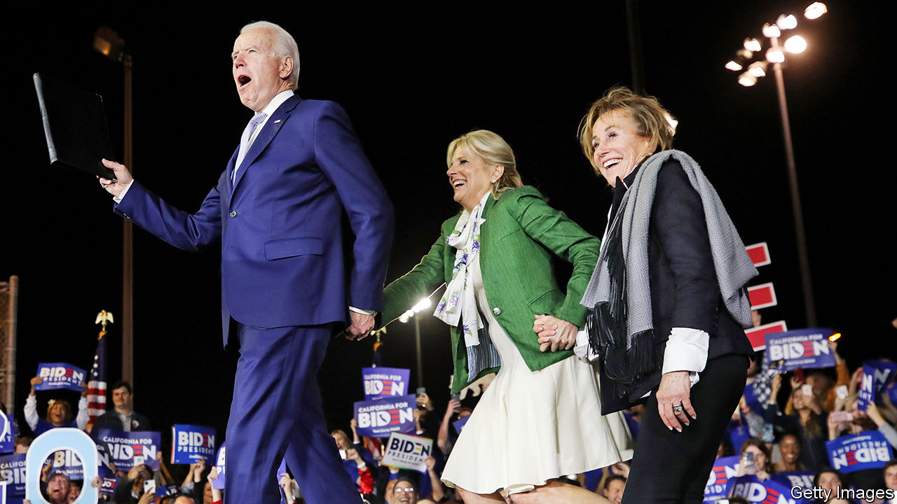
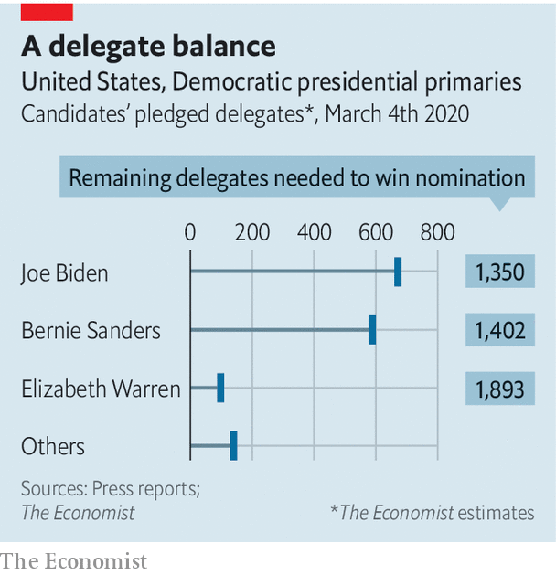
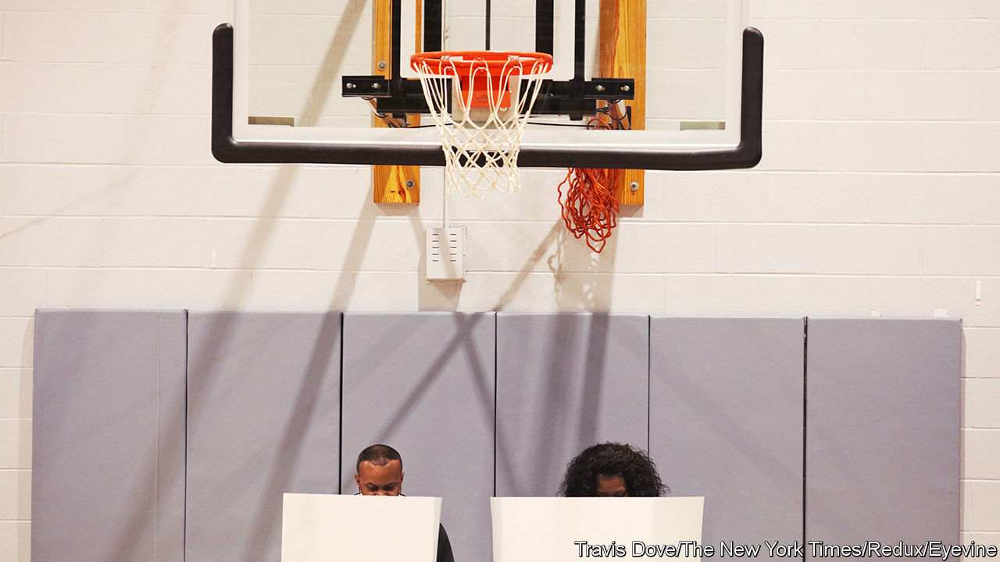

## After Super Tuesday

# Joe Biden has pulled off one of the great political comebacks

> The former vice-president has run a lousy campaign. He will likely be the Democratic nominee anyway

> Mar 5th 2020BOSTON AND HOUSTON

Editor’s note (March 5th 2020): This article has been updated to note that Elizabeth Warren has ended her candidacy.

ONLY A FEW days ago the Democratic primary looked like a re-run of the 2016 Republican contest that launched Donald Trump. The field was crowded and had no clear establishment favourite. The chief contenders for that role—Joe Biden, Mike Bloomberg, Pete Buttigieg and Amy Klobuchar—were ripping into one another while cannibalising the moderate vote. This had created an opportunity for Bernie Sanders, a left-winger with a small but loyal base, to follow the Trump tactics: by turning a series of modest pluralities into an insurmountable delegate lead. Mr Sanders had won or tied the first three states and was predicted to win many more on Super Tuesday, March 3rd. The primary has instead been turned on its head.

A thumping win for Mr Biden in South Carolina on February 29th persuaded Mr Buttigieg and Ms Klobuchar to bow out and endorse him. Three days after bagging his first ever state—during his third presidential campaign—the 77-year-old former vice-president then went on a stunning tear through the Super Tuesday states. He won ten in all, from Maine in the north to mighty Texas in the south. He won states where he had not campaigned or even advertised: including Massachusetts, where he had spent a mere $11,000, assuming it would pick Mr Sanders or another leftist, Elizabeth Warren, the local senator. Mr Sanders won only three states, including his own tiny Vermont. And though as The Economist went to press, he was also leading in California, the biggest prize of all, Mr Biden was running him close enough to be assured of a big chunk of its 415 delegates.

Neither Ms Warren nor Mr Bloomberg, the only other serious candidates remaining, won a state. The contest no longer resembles the Republican primary in 2016 but rather the Democratic one of that year. Mr Biden and Mr Sanders are locked in a two-man race, to bag states and collect delegates, that the left-winger’s smaller faction means he may struggle to win. 

The obvious reason for Mr Biden’s unpredicted success is that a huge number of late deciders broke for him. Exit polls from ten states suggest he won more than 40% of them everywhere apart from Vermont; Mr Sanders won far fewer. But why did this happen? Mr Sanders and his supporters detect an establishment plot. They always do. Though, to be fair to them, the sudden way Mr Buttigieg, Ms Klobuchar and other elected Democrats folded behind Mr Biden, despite justified doubts about his age, speed of thought and ability to enthuse voters, does suggest a degree of co-ordination. Yet that would be only a partial explanation for Mr Biden’s amazing turnaround.

The main reason was black voters: the biggest, most moderate and active part of the Democratic coalition. Hardly present in the early states, they predominate in South Carolina, where they took a deep breath and backed Mr Biden by a huge margin. Exit polls suggest that 56% of black voters followed suit on Super Tuesday. Asked why she had voted for Mr Biden, a black woman emerging from a polling station in Houston, offered a familiar explanation: “He was vice-president with Barack Obama and they did a good job.” Whether in reward for his loyalty to the first black president, or by simple process of elimination, black voters thus swept away the taint of failure that had hitherto clung to Mr Biden.

His endorsement by Mr Buttigieg and Ms Klobuchar, who have seen him up close, also helped—especially in Ms Klobuchar’s state of Minnesota, where he thereby pulled off another surprise victory. And Mr Biden also enjoyed a few breaks, including the woeful recent debate performances of his main rival, Mr Bloomberg, who entered the primary on Super Tuesday and quit it the following day. Mr Sanders entered the multi-state contest rather tarnished, too—his brief spell as the front-runner having drawn unprecedented attention to his history of praising some of the achievements of Fidel Castro’s Cuba. The Democratic establishment had no say in most of that. It was merely one among the several factors that made Mr Biden, a widely discounted former front-runner, seem suddenly more plausible as a third of Democratic voters were about to have their say.

According to our analysis of states that have reported, as well as estimates for California, Mr Biden now has roughly 671 of the 1,991 delegates he would need for the nomination. Mr Sanders has 589. (Ms Warren, with only 89, dropped out of the race on Thursday). That leaves plenty of room for doubt about which septuagenarian will prevail. Yet Mr Biden has demonstrated his advantage. While Mr Sanders mainly won votes from his usual fanbase—made up of white lefties, young voters and Hispanics—the former veep drew support from across the party. For example, he also did well in the sorts of affluent, mostly white suburbs that gave Democrats their House majority in 2018 and where they would need to win again to defeat Mr Trump in November. In Virginia, for example, where he beat Mr Sanders by 30 points, he ran up sizeable margins in both the heavily black Tidewater region and in the diverse, highly educated suburbs of Washington, DC.

Even more tantalising for hopeful Democrats, the former vice-president also notched up some unexpected wins in places that used to back them but have recently shifted towards the Republicans. Maine and Minnesota provided examples of that; there were even reports of Republican voters in Alabama requesting Democratic ballots in order to back Mr Biden. Exit polls showed him doing best with older and more moderate voters. Mr Sanders did far better with younger voters, which looks like a long-term problem for Mr Biden, if not necessarily a crippling one, given how few of them vote.

That the diverse Democratic starting-field has been winnowed down to two white-haired white men is depressing to some Democrats. Yet politically, at least, Mr Biden and Mr Sanders are miles apart. The former vice-president, who is also a veteran of 36 years in the Senate, is a devoted institutionalist. Mr Sanders is calling for a political revolution that would up-end many aspects of American life.

The senator from Vermont wants to ban private health insurance and create a single-payer system free at the point of service. Mr Biden would prefer to preserve the Affordable Care Act, better known as Obamacare, and augment it by creating a public option for health insurance.

Mr Sanders would spend an incredible $16trn on his Green New Deal, including, among other things, a federal jobs-guarantee. Mr Biden also has a bold climate plan, requiring $1.7trn in new federal spending. But its entire size is less than what Mr Sanders would spend replacing petrol- and diesel-powered cars with electric vehicles.

Rather than decriminalise illegal border crossings, as Mr Sanders wants to, Mr Biden would try to create a pathway to citizenship for undocumented immigrants already in America. Both agree on the necessity of undoing much of President Donald Trump’s legacy, particularly his immigration restrictions and deconstruction of health care and environmental provisions. Both would resubscribe to the Paris agreement and the nuclear deal with Iran.

Mr Biden’s critics on the left have dismissed his platform as Hillary Clinton’s warmed up. In fact, he is running to the left of her and Mr Obama. He supports a $15-an-hour minimum wage, and, channelling Mr Sanders a bit, talks of launching a “clean-energy revolution”. He has pledged to “impose carbon-adjustment fees or quotas on carbon-intensive goods from countries that are failing to meet their climate and environmental obligations”, and is more comfortable with renewable-energy standards than with carbon pricing, to help achieve emissions reductions. On foreign policy, he is less of a liberal interventionist abroad than Ms Clinton was—though he is not quite as inclined to isolationism as is Mr Sanders.

How much of either candidate’s platform could be enacted is doubtful, given how hard it will be for the Democrats to take back the Senate in November. Yet Mr Biden’s proposals appear at least to have achieved their political aim of being broadly acceptable. The same could be said of his candidacy in general.

He could yet stumble. Despite a couple of good victory speeches, by his rambling standards, Mr Biden’s weakness as a campaigner is manifest. To observe his look of mounting puzzlement, as his own sentences meander uncontrollably, can be a disconcerting experience. Yet, in the absence of a standout performer to rally their party’s divergent quarters, Democrats appear to have settled on Mr Biden as their likeliest unifier. That largely reflects his personal qualities, including his reputed kindliness, loyalty to Mr Obama and well-known forbearance in the face of personal tragedies—including the death of a wife and two children. This has marked him as a person of quality. “He’s been there,” said a weary-looking voter wearing hospital scrubs in Houston. “I trust him.”

He may not stage huge rallies like Mr Sanders, and may be less thrilling to his supporters, but Mr Biden’s reputation for steadiness and decency in public life may be enough. They are attributes Americans miss. It is also notable that he did especially well on Super Tuesday with voters whose main priority is to get rid of Mr Trump.■

Dig deeper:

## URL

https://www.economist.com/united-states/2020/03/05/joe-biden-has-pulled-off-one-of-the-great-political-comebacks
