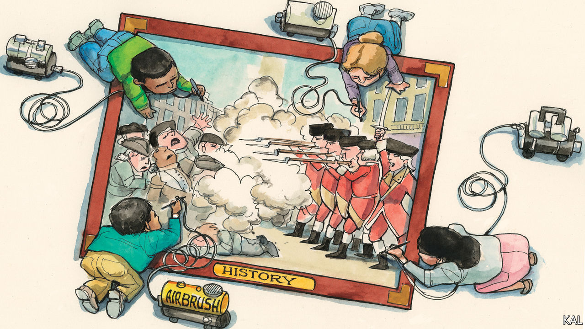

## Lexington

# Talking about a revolution

> The Boston Massacre, which took place 250 years ago this week, is heroically misrepresented

> Mar 7th 2020

ON AN ICY late evening in Boston, on March 5th 1770, an angry mob advanced on a dozen redcoats standing outside the city’s customs building. Ignoring the pleas of the British officer present, Captain Thomas Preston, the Bostonians hurled razor-edged oyster shells and blocks of wood and ice in the darkness, knocking one soldier off his feet. He fired back, prompting several others to do likewise before Preston, despite having been clubbed in the mêlée, ordered them to stop. The soldiers retired, leaving three men dead in the snow and several wounded, two of whom died shortly after.

To ascertain what had gone wrong and who was to blame for the “bloody massacre”, there followed the most forensic series of investigations of the colonial period. It led to and included the trials of Preston and eight of his men for murder, at which scores of eye witnesses were cross-examined by the sharpest legal minds. The defence team for the soldiers included John Adams, a future president, and called 52 witnesses. The testimonies were contradictory. Some claimed Preston had ordered the soldiers to shoot. Most described the British retaliating under severe provocation; given the noise, darkness and confusion it was hard to be sure of anything.

Two of the redcoats were convicted of manslaughter and had the letter M seared into their thumbs. The rest were acquitted. “Facts are stubborn things…whatever may be our wishes, our inclinations, or the dictates of our passions,” said Adams in his defence of the soldiers.” In a later diary entry, displayed in a fine anniversary exhibition at the Massachusetts Historical Society, he determined that “the verdict of the jury was exactly right”.

That is not a view with which many of those who gather to watch Boston’s annual re-enactment of the riot this week would concur. An idea of the massacre as an act of imperialist terror which provoked the crisis, five years later, after which this column is named is one of America’s most popular historical myths. This reflects a disinformation campaign that began directly after the violence and has continued, one way or another, ever since. At a time when the political use of history is proving especially contentious—following the impeachment row and another over the New York Times’s 1619 Project, which aims to reframe the American story around racism—the Boston Massacre is an instructive example.

Bostonians’ antipathy towards the 2,000 British troops sent to the city in 1768 has also been exaggerated. A new book by Serena Zabin documents many family ties between the armed forces and civilian population (it helped that Boston had a surfeit of women). Nonetheless, the garrison offended the libertarian zeal of the Bostonian elite, whose members duly seized on the riot for propaganda value. A cartoon engraved by Paul Revere depicted the redcoats as sneering killers, Preston as their apish cheerleader and the customs office as “Butcher’s Hall”. An annual Massacre oration—the precursor of this week’s re-enactment—was launched a few months after the redcoats’ acquittal. Adams declined to give the third oration on the spurious ground of old age (he was 37). Yet he had in a way facilitated this burgeoning distortion through his own economy with the truth. He had taken pains to absolve regular Bostonians of any blame for the violence, instead attributing it to “a motley rabble of saucy boys, negroes and molattoes, Irish teagues”. Based on sketchy evidence, he blamed one of the victims, a black sailor called Crispus Attucks, in particular.

This had unforeseen consequences. Eighty years later Attucks was embraced by black abolitionists in Boston as the “first martyr of the American revolution”. When it was put to them that the riot was not the revolution and there was scant evidence for Attucks’s lead role, they had only to cite Boston’s orations and Adams’s defence. A Bostonian paramilitary group, precursor to black units in the Union army, was called the Attucks Guards. A grand monument to Attucks was raised in Boston Common in 1888. Dedicating it, the Irish nationalist poet John Boyle O’Reilly tied Attucks to freedom struggles everywhere: “We honour a shrine unfinished, a column uncapped with pride…when Crispus Attucks died.”

Attucks remains popular with black activists. In the civil-rights era, schools were named after him. Recent victims of police brutality and the group they inspired, Black Lives Matter, have been compared to him. White activists also recall the massacre. During its re-enactment in 1975, protesters against Massachusetts’s then policy of busing black children to affluent schools collapsed in the street—to assert that they were also victims of tyranny.

This saga holds several lessons. Libertarian ideals were the intellectual basis for the revolutionary struggle, yet a distorting lens through which to understand almost any isolated episode of it. Their epic force (illustrated in the massacre’s early commemorations: the 1775 oration was delivered by Joseph Warren, months before his death at Bunker Hill, in a toga) proved irresistible from the start, however. This politicising of events has in turn fuelled a rich American tradition of mobilising history to score points.

The Times’s 1619 Project (named after the year Africans were first brought to North America) is not only a corrective to that tradition, but part of it. It has been criticised for being partial and containing inaccuracies. It also downplays the contribution of African-Americans to America’s struggle to live up to the founders’ vision; and the inspiration many of them have found in it. African-Americans were participants in the Boston Massacre and, in one of the first states to restrict and then abolish slavery, beneficiaries of the events it helped set in train. In the figure of Attucks, they also found an unlikely inspiration in massacre propaganda.

Sticklers for historical accuracy have much to complain of here. Yet the incontestable fact of the massacre offers consolation. In 18th-century Boston, justice and the rule of law prevailed over politics and the mob. Perhaps even more than ideas of freedom, they are America’s foundation. May Adams’s successors remember it.■