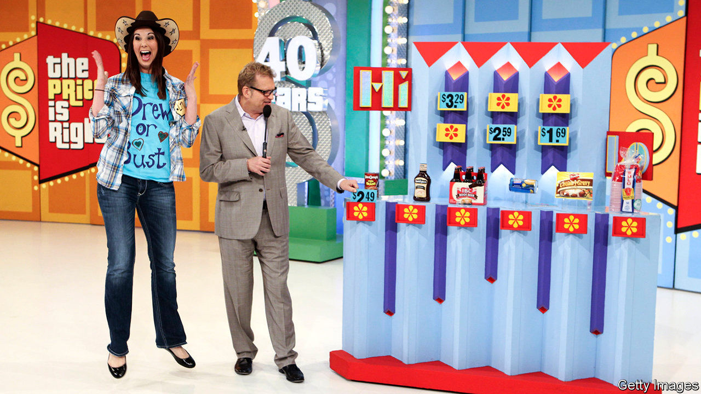
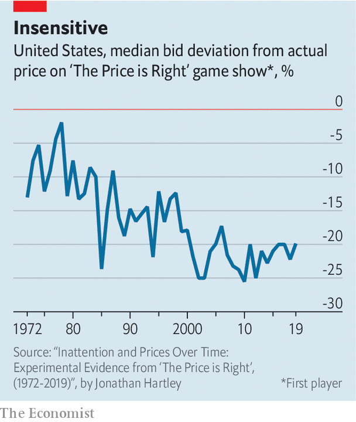

## The price is wrong

# What one game show reveals about the American economy

> Why have contestants on “The Price is Right” become so much worse at guessing?

> Mar 5th 2020SAN FRANCISCO

SINCE 1972 Americans have sat through more than 9,000 episodes of “The Price is Right”, a game show with an economic twist. After being summoned from the audience by the famous catchphrase—“come on down”—contestants must guess the exact price of prizes, ranging from guitars to garden furniture. If they bid too high, they are disqualified. In a recent paper Jonathan Hartley of Harvard’s Kennedy School points out an interesting trend. Contestants have got a lot worse at guessing prices (see chart).

Technology may play a role. Reaching for a smartphone is easier than recalling a fact from memory. Who remembers phone numbers anymore? People may just fall out of the habit of recalling prices. Still, the rise of the smartphone is a recent phenomenon—it cannot explain why contestants became worse guessers during the 1970s, 1980s and 1990s.

Economic changes may be a better explanation. A paper published in 2001 suggested that higher GDP growth raised “price-recall error”. Like the proverbial politician who thinks a gallon of milk costs $15, as people get richer they worry less about budgeting. (Contestants guessed a bit better after 2010, when GDP growth was weak and budgets tight.) A related trend is that Americans devote a shrinking share of their household spending to goods—which tend to appear on “The Price is Right”—and a rising share to services, such as dining and child care, which do not. Contestants might be pretty good at guessing the price of a spin class or a babysitter.

Perhaps the most intriguing explanation, however, relates to globalisation. In the early 1970s consumers had a relatively limited selection of products to choose from. Around the time that “The Price is Right” first aired, Sears catalogues were hundreds of pages long. But a search on Amazon brings up nearly 1,000 results just for the word “toaster”. Firms offer a huge range of differentiated products at wildly different prices, allowing consumers to satisfy their peculiar wants. The upshot is that guessing prices is trickier. What is the price of a shovel, for which there were more than 10,000 results on Amazon?

The rise of online shopping adds further confusion. Online retailers use algorithms to respond instantly to fluctuations in supply and demand. Alberto Cavallo of Harvard Business School finds that some large retailers now change their prices, both upwards and downwards, twice as frequently as they did a decade ago. All of which suggests that contestants’ guesses may yet get worse.

## URL

https://www.economist.com/united-states/2020/03/05/what-one-game-show-reveals-about-the-american-economy
