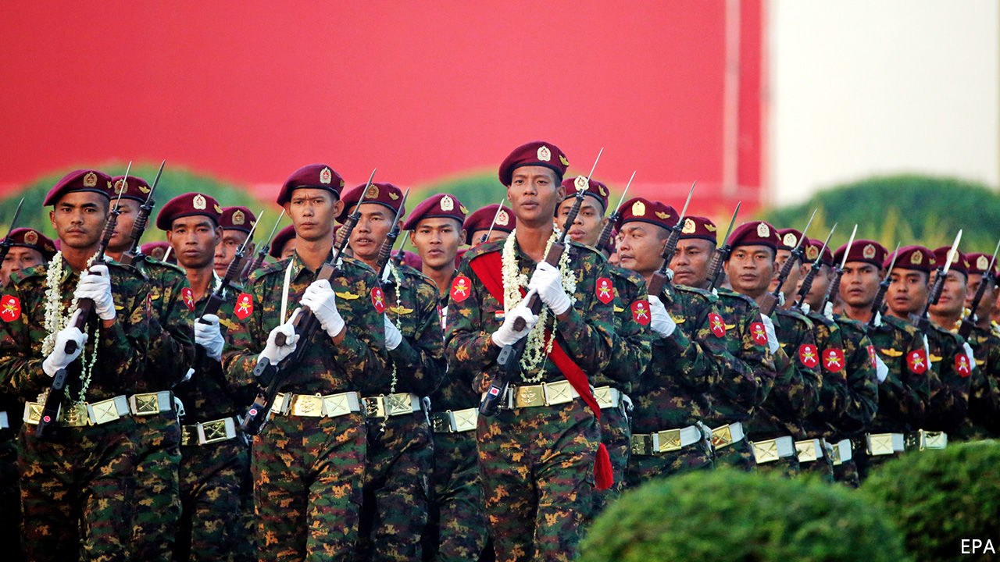

## Making war and law

# Myanmar’s army blocks constitutional reforms

> The civilian government had been seeking to limit the generals’ political power

> Mar 12th 2020YANGON

AS THE SHOUTING slalomed around the chamber, Myanmar’s parliamentarians stiffened in shock. They had only just begun debating a number of proposed amendments to the constitution, and tempers were already fraying. One MP, Major-General Tin Swe Win, bellowed repeatedly at the speaker of the house. The ruling National League for Democracy (NLD) was hoping to reduce the army’s big role in government, by gradually trimming the number of seats in the national and regional parliaments filled by military appointees like the major-general, among other things. He was not in favour.

Tension continued to crackle in the chamber for another two weeks, but on March 10th and 11th, General Tin Swe Win got his way. Although the NLD’s amendments won support from a majority of MPs, they did not reach the necessary threshold of more than three-quarters, thanks to opposition from the quarter of seats reserved for serving military officers. The soldiers rejected all substantive changes, including a proposal to strip the army of its majority on a committee empowered to declare a state of emergency and thus hand power to the army chief. An amendment to make it easier to change the constitution in future by reducing the required threshold from three-quarters to two-thirds of MPs was also knocked back.

The army even rejected symbolic concessions to the NLD and its leader, Aung San Suu Kyi. It blocked the party’s bid to change the constitution’s description of Myanmar from a “disciplined democracy” to a “democracy” plain and simple, as well as its effort to remove the clauses of the constitution that have prevented Miss Suu Kyi from becoming president. (She runs the civilian part of the government anyway, with the title “state counsellor”, having installed a loyal ally as president.)

The intransigence of the army, or Tatmadaw, as Burmese call it, is no surprise. The constitution, which the generals drew up towards the end of the 50-odd years they ran the country, deliberately avoids giving civilian politicians unfettered control not only of the army itself, but also of government more broadly. Instead, it was carefully crafted to maintain the generals’ “iron grip on the security sector”, says Thant Myint U, the author of “The Hidden History of Burma”. In addition to appointing members of parliament and the emergency-declaring committee, the army commander can name his own notional boss, the minister of defence, as well as the ministers of the interior and border control. That gives him control over the police, intelligence services and border guards, as well as the armed forces.

The Tatmadaw sees itself as the guardian of the nation, and has never distinguished between its military and political roles, writes Andrew Selth of Griffith University in Australia. The long period of military rule in effect fused the army with the rest of the state, says Marco Bünte of Friedrich-Alexander University in Germany. Although the NLD took charge of the civilian bit of the government in 2016, after a 25-year stand-off with the Tatmadaw, former military officers and officials first appointed under military rule continue to serve in every branch of government, including the judiciary. Members of political parties, in contrast, have been allowed to work as civil servants only since this week, as a result of one of the few constitutional amendments that parliament did approve.

The courts and bureaucrats side instinctively with the Tatmadaw. Two journalists from Reuters, a news agency, who exposed a massacre in which an army unit killed ten villagers, spent more time behind bars for revealing “official secrets” than did the soldiers who slaughtered innocent civilians. What is more, the massacre is the only incident for which soldiers have been punished during a months-long, army-led pogrom in 2017 that sent more than 750,000 Rohingyas, a Muslim minority, fleeing to neighbouring Bangladesh. This week the police said the army was seeking a criminal prosecution of Reuters and an MP quoted in a Reuters report, for claiming that shelling by the army had killed two Rohingya civilians. Neither the police nor the army seem to have investigated the shelling itself.

As if its weapons and its constitutional powers do not give the Tatmadaw enough power, it also has huge economic clout. It owns two big conglomerates, Myanmar Economic Holdings Limited (MEHL) and Myanmar Economic Corporation (MEC), which benefited from lucrative monopolies under military rule. An American diplomatic cable from 2009 stated that MEHL and MEC are “key components of the elaborate system of patronage the [army] uses to maintain power”. In recent years they have lost some of their monopolies and have had to start paying taxes. But MEHL and its subsidiaries, Myawaddy Bank and Myawaddy Trading, remain among the country’s biggest businesses.

The civilian government has reduced expenditure on the Tatmadaw, from 4.3% of GDP in 2015, just before the NLD took office, to 3.3% in 2017. But according to the UN, “The Tatmadaw’s ability to draw upon alternative sources of revenue, outside the military budget, enables it to operate without effective oversight.”

Miss Suu Kyi has seldom dared to confront the Tatmadaw directly. Indeed, she has leapt very publicly to its defence over its treatment of the Rohingyas, arguing before the International Court of Justice last year that its abuses were neither systematic nor widespread. Behind the scenes, however, she has on occasion subtly foiled the generals. They do not appear to have anticipated her invention of the job of state counsellor. She has also appointed her own national security adviser, instead of relying on the men in uniform. And although the army dominates the committee that can declare a state of emergency, it is the president who convenes it. Neither of the two NLD loyalists who have held the job since 2016 has seen fit to do so. Most notably, at the end of 2018, in what looked like an anodyne restructuring of the bureaucracy, her government moved the powerful General Administration Department, which controls all bureaucrats in state and local government, from the army-run Ministry of the Interior to a department under civilian control. This put “the backbone of public administration” in the NLD’s hands for the first time, writes Matthew Arnold of the Asia Foundation, an NGO. 

In theory, Miss Suu Kyi and the NLD will not always need to resort to bureaucratic subterfuge to get their way. The Tatmadaw claims that it will relinquish its role in politics once democracy has “matured”. But with their churlish refusal to countenance even modest constitutional reforms, it is the generals, not the civilian politicians, who are behaving immaturely. ■

## URL

https://www.economist.com/asia/2020/03/12/myanmars-army-blocks-constitutional-reforms
