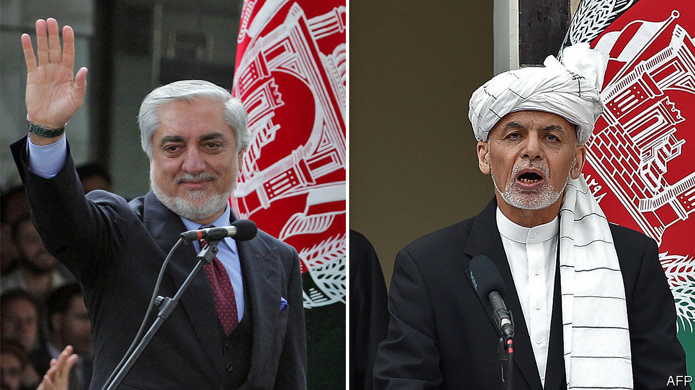

## Twin peaks

# Two different people are sworn in as president of Afghanistan

> The electoral farce is distracting from peace talks with the Taliban

> Mar 12th 2020

AFGHANISTAN WAITED five months for a president and then two came along at once. An election was held in September, but the results were not announced until last month. Although the electoral commission said the incumbent, Ashraf Ghani, had won, his main electoral rival, Abdullah Abdullah, dismissed its tally as fraudulent and declared himself the winner. On March 9th both men had themselves sworn in, in competing inauguration ceremonies held just metres apart in the capital, Kabul.

Afghans watched split-screen news coverage of the events and wearily shook their heads. Satirists seized on the farce. The two could each rule for eight hours a day, with a third shift going to the leader of the Taliban insurgency, suggested Afghan Onion, a parody site. Residents in one Kabul neighbourhood reportedly held their own spoof swearing-in. Yet for all the gallows humour, there was unease. The squabble conjures memories of the 1990s, when warlords who are still on the political stage fought for power. A salvo of rockets that landed close to Mr Ghani’s ceremony, without causing casualties, did not stem the foreboding.

The election and subsequent dispute have a familiar ring. In the previous vote, in 2014, Mr Ghani also defeated Dr Abdullah, only to have him cry fraud. That time, America ended the stand-off by persuading Mr Ghani to create an important-sounding job, chief executive, for Dr Abdullah. But both ruled out a repeat of this awkward power-sharing government before the latest vote and, so far, American diplomats have been unable to change their minds.

Donald Trump’s pointman for Afghanistan, Zalmay Khalilzad, spent the day before the inaugurations shuttling between the opposing camps. Western countries signalled support for Mr Ghani by sending delegations to his swearing-in, but they still would like him to find a way to include Dr Abdullah. Yet it is rumoured that Dr Abdullah has rejected an offer to name two-fifths of cabinet posts and take a leading role in peace talks with the Taliban, which are supposed to start imminently.

Mike Pompeo, America’s secretary of state, said he hoped for an inclusive government “which unifies the country and prioritises peace”. “It is serious, but not terminally so—having multiple poles of power is hardly new here,” says a diplomat in Kabul. “Afghans will work it out. They’ll have to. It is their problem to fix.”

The horse-trading distracts from a harder and more important task for the Afghan political elite: bargaining with the Taliban. Talks between the militants and Afghan leaders had been due to start on March 10th. But the Taliban insisted that the Afghan government should release 5,000 prisoners first—something Mr Ghani has refused to do. On March 11th, however, he announced he would release 1,500 Taliban detainees in the coming weeks. Each fighter would have to give a written guarantee he would not return to the battlefield. If talks progress, Mr Ghani promised, a further 500 Taliban prisoners would be freed each fortnight, up to a total of 5,000.

The Taliban immediately rejected the offer. Perhaps they were hoping for a better one from Dr Abdullah.■