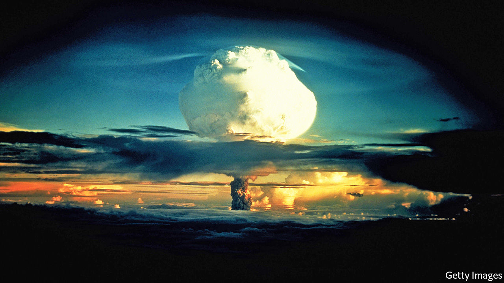

## Fragments and ruins

# A journey through the lasting traces of human civilisation

> In “Footprints”, David Farrier asks what will remain of the Anthropocene

> Mar 12th 2020

Footprints: In Search of Future Fossils. By David Farrier.Farrar, Straus and Giroux; 320 pages; $28. Fourth Estate; £16.99.

THE BLASTS flung debris into the sky and rucked the sea-floor like a rug. The flash from the largest—which, at 15 megatons, was 1,000 times stronger than the detonation that flattened Hiroshima—was visible in Okinawa, 2,600 miles away. Radiation from its fallout was detected in cattle in Tennessee. The atomic-bomb tests on the Marshall Islands from 1946-58 were an awesome display of American might, and of mankind’s power to reshape the world.

Their effects lingered long after the mushroom clouds dispersed. Rates of cancer soared among islanders downwind of the fallout. There were stillbirths and “jellyfish babies” (children born without bones, and skin so translucent their hearts could be seen flickering within). Yet, as David Farrier reports in his thoughtful book, the full impact of this “carnival of atomic energy” cannot yet be known. The half-life of the plutonium-239 released in nuclear reactions is 24,100 years—several times the length of recorded history. In fact, Mr Farrier writes, those blasts will constitute one of humanity’s most enduring signatures, legible “at both poles and on every continent, in lake sediments and ice cores, in tree rings and living tissues”.

In “Footprints” he asks what material traces, or “future fossils”, will remain of what is sometimes known as the Anthropocene, the epoch in which people have held sway over the environment. His explorations take him from Shanghai, a megacity of 24m people, to the tomb-like hush of a laboratory in Tasmania that analyses Antarctic ice. He ranges from the deep past to the far distant future to tell the story of humankind’s lasting imprint.

Despite its sobering theme, Mr Farrier’s prose glitters. His journey takes in marvels. He meets a poet who aspires to encode verse into the DNA of Deinococcus radiodurans, a hardy bacterium that is nearly unkillable; inscribing its genome is an attempt “not to preserve information but to write an eternal poem”. Mr Farrier listens to the moaning made by the Ross Ice Shelf as it melts, the eerie keening “of its own dissolution”. Perhaps most movingly, he holds a 200,000-year-old Palaeolithic tool, which seems blunt and clumsy until he flips it over and realises that its craftsman was probably left-handed, as he is. Wonder rather than anger is his default response in contemplating humanity’s legacy.

Though a literature teacher by profession, he draws equally from science, philosophy and the arts, paleoclimatologists as well as poets. This approach owes something to the work of the 17th-century polymath Sir Thomas Browne as well as modern writers such as Gavin Francis and Rebecca Solnit. Occasionally readers may feel lost amid the vertiginous data; for instance, “50m kilometres of roads” is hard to picture, the sheer scale wrenching the reference towards meaninglessness.

By contrast, when Mr Farrier indulges his bookishness the result is exhilarating. His central idea, that language and storytelling might be the most enduring of human traces, is beautifully expressed. The fables of surrealists such as Jorge Luis Borges and J.G. Ballard frame understanding of the Anthropocene, he believes. Insights of poets such as Alice Oswald bring the “bright unbearable reality” into focus.

“Footprints” is a meditation, not a finger-wagging harangue. As Mr Farrier notes, even if pollution and consumption ceased tomorrow, their effects would take millennia to unwind. Human life is etched into the fossil record for aeons to come. “The challenge is to learn…to examine our present,” he writes, “by the eerie light cast by the onrushing future.” His subtle, elegant book rises to that challenge. ■

## URL

https://www.economist.com/books-and-arts/2020/03/12/a-journey-through-the-lasting-traces-of-human-civilisation
