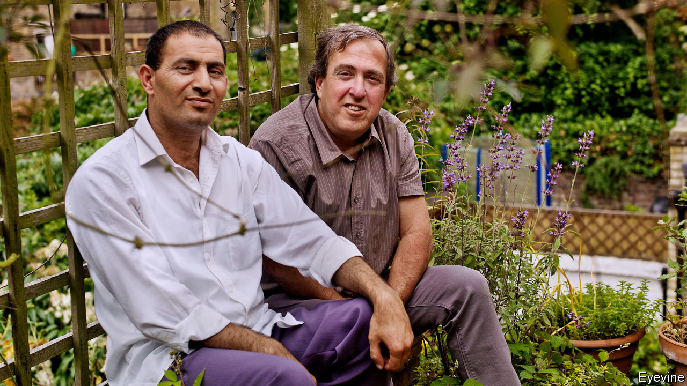

## Brothers in arms

# “Apeirogon” depicts a moving Israeli-Palestinian friendship

> Colum McCann’s new novel captures their heartbreak in vivid tesserae of prose

> Mar 12th 2020

Apeirogon. By Colum McCann. Random House; 480 pages; $28. Bloomsbury; £18.99.

COLUM MCCANN’S new novel refers at one point to the “Jerusalem Syndrome”: the messianic delusions that “proximity to the holy places” can induce in pilgrims to the city. Foreign writers and artists often display their own version of this mania. It consists in ordering the divided peoples of the Holy Land to recognise how much they have in common (in history, heritage, culture, even genetics) and instructing them to live in peace.

Irish-born but long resident in New York, Mr McCann knows every pitfall that awaits the moralising traveller keen to swell the region’s “corny” and “trite” rhetoric “of justice, of kinship, of reconciliation”. From its mysterious title onwards, the oblique storytelling of “Apeirogon”, his seventh novel, shuns the conventions of the high-minded outsider’s reportage. Yet, for all his sophisticated artistry, the authority of this work of fiction rests ultimately on its truth.

Mr McCann did not invent the entwined destinies of Bassam Aramin and Rami Elhanan. Rather, their real, conjoined lives inspired this “hybrid novel”, which weaves documentary and imagination into its toughly lyrical fabric. Both bereaved fathers, the pair of friends decided that “the only revenge is making peace”. Brought up in Hebron, Mr Aramin was a Fatah militant who served seven years in jail but soon set out “to pit himself against the ignorance of violence, including his own”. In 2007 an Israeli soldier killed his ten-year-old daughter Abir with a rubber bullet as she bought sweets in the West Bank town of Anata.

Mr Elhanan is an Israeli whose father, a Holocaust survivor, immigrated from Hungary, but whose mother’s family had lived in Jerusalem for six generations. Hamas terrorists killed his 13-year-old daughter Smadar in 1997 in a suicide-bomb attack on the city’s Ben Yehuda Street. But he progressed from viewing Palestinians as threats from “the dark side of the moon” to acknowledging “the equality of pain”. First in Combatants for Peace (Mr Elhanan fought in three of Israel’s wars), then in the Parents Circle that brings together bereaved families from both sides, the duo have sought through their activism to replace the clear lines of enmity with “the tangle of knowing each other”.

Journalists and film-makers have told their story before. Mr McCann, too, co-operated closely with the friends. “Apeirogon”, though, wraps the facts of their journeys, and their griefs, into an elliptical and fragmentary narrative. It situates their quest for hope within the art and landscape of Israel-Palestine and the “smashed jigsaw” of rival histories. “Geography here is everything,” Mr McCann writes. His mosaic of 1,001 colourful, enigmatic paragraphs range across the scenery of a military occupation that stifles the West Bank like “the rim of a tightening lung” and, for Palestinians, “deprives you of tomorrow”.

The reader glimpses the men’s zigzag route through loss into peacemaking via vivid, jagged tesserae of prose. Meanwhile, images of flight, flux and movement—involving migratory birds, watercourses, artworks, even weaponised drones—offer a hawk’s, or dove’s, eye view of the seething cauldron that the novelised Mr Elhanan calls a “condensed everywhere”.

An “apeirogon”, the geometric term that becomes Mr McCann’s key metaphor, is a shape “with a countably infinite number of sides”. The patchwork pattern of this novel matches the polyhedral complexity of the pasts it evokes. With “one story becoming another”, “Apeirogon” insists on “the sheer simultaneity of all things”. The results are frequently beautiful, sometimes baffling. The imagery often dazzles, but plainer passages that inhabit the men’s minds as they wrestle against rage and bitterness towards an “ethic of reciprocity” have the greatest emotional power. At the core of this fractal fiction is a simple, radiant myth: “The hero makes a friend of his enemy.” ■

## URL

https://www.economist.com/books-and-arts/2020/03/12/apeirogon-depicts-a-moving-israeli-palestinian-friendship
