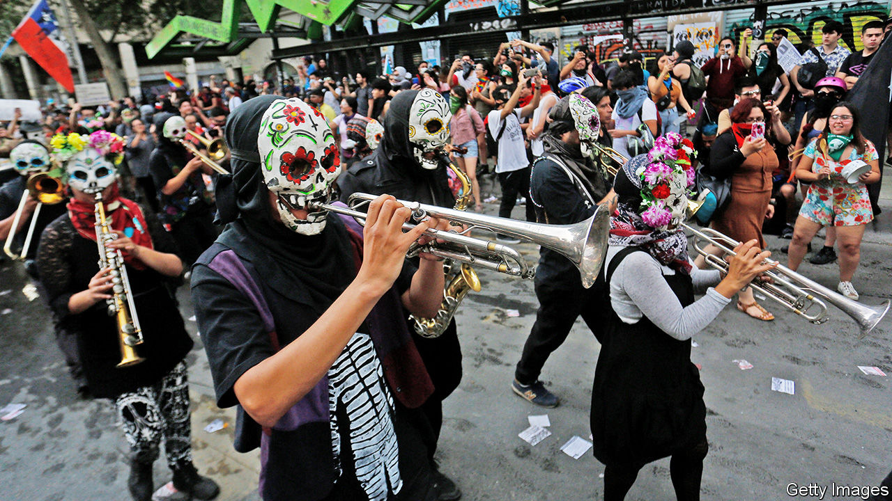

## The beat goes on

# Demonstrators in Chile are looking to the past for their soundtrack

> Once-silenced voices are resounding in Santiago—and new protest songs are being added to the canon

> Mar 12th 2020SANTIAGO

AS HIS PRESIDENTIAL campaign reached its climax in 1970, Salvador Allende appeared at the Teatro Caupolicán in Santiago beneath a banner that read: “There is no revolution without music.” He was flanked by some of the revered performers who in the preceding years had thrust Chile’s music onto the world stage. Among them was Víctor Jara, a singer who would be tortured and murdered soon after the coup that ended Allende’s socialist administration in 1973. The ensuing dictatorship of General Augusto Pinochet lasted 17 years; but Jara’s music, and that of other artists who were censored, exiled or killed, lived on.

As Chile is convulsed by protests against inequality and poor public services, politics and music, old and new, have again become entwined. On October 25th last year, when more than 1m people took to the streets of Santiago, guitarists mustered on the steps of the national library to play Jara’s ode to peace and freedom, “El derecho de vivir en paz” (“The right to live in peace”). In Plaza Italia crowds sang “El baile de los que sobran” (“The dance of those left over”), a protest anthem of 1986 by the band Los Prisioneros. The song “reflects the primal discontent of a society whose rights are not represented,” reckons Miguel Tapia, the group’s drummer. Unfortunately, he says, “its message still resonates.” Elsewhere musicians serenaded the throng from street corners and balconies.

In response to the looting and arson that erupted alongside the protests, President Sebastián Piñera had earlier imposed a curfew and deployed the armed forces to restore order. But a familiar soundtrack rang out even when the streets emptied. At 8pm each evening, when the curfew took effect, demonstrators played “El derecho de vivir en paz” in synchrony from their apartments. A pianist’s rendition of “Gracias a la vida” (“Thanks to life”), by the legendary songwriter Violeta Parra, drifted through the trees on one of Santiago’s wide, lamplit avenues. And during the days, crowds sang the refrain of “El pueblo unido jamás será vencido” (“The people united will never be defeated”) by Quilapayún, a venerable folk group.

As the armed forces took over the country in 1973, this was the song broadcast on the radio after Allende bade an emotional farewell to the nation. It “immediately became a symbol of the fight against the Pinochet dictatorship, and it has accompanied many other struggles from the moment it was conceived,” says Eduardo Carrasco, one of Quilapayún’s founding members, who is now 79. He recalls that it was borrowed by opponents of Portugal’s authoritarian regime and of General Franco in Spain; more recently it was adopted by activists during the Arab spring and by the gilets jaunes in France. The aloof elite that has alienated many 21st-century Chileans is a far cry from the monstrous rulers of the 1970s and 1980s; still, thinks Mr Carrasco, “this song is as relevant now as it ever was.”

Another, more rudimentary kind of ensemble has provided a backbeat to the events. The collective bashing of saucepans on balconies, a rowdy percussion known as cacerolazo, is popular across South America, from Buenos Aires to Caracas. In Chile it emerged during the Allende years: in 1971, during Fidel Castro’s visit to the country, there was a “march of the empty pots” in protest at food shortages. The ritual was a practical way to express dissent during the dictatorship, when public criticisms were repressed.

Since democracy returned in 1990, cacerolazos have spilled out from the safety of homes and back onto the streets, says Javier Osorio, a historian of contemporary music at Alberto Hurtado University in Santiago. “The sound of the cacerolazo has no borders,” he says; “it’s an all-encompassing form of protest.” Amid the current unrest, some Chileans have thrashed their saucepans furiously while others have kept to a rhythm. Pans have been strapped to the handlebars of bicycles to be banged with a spoon while the rider is on the move.

Old musical traditions have been revived; once-silenced voices echo between the concrete apartment blocks in the centre of Santiago. At the same time, modern artists have added new protest songs to the canon, drawing on the past but incorporating the mood and themes of today.

A new single by Ana Tijoux, a Franco-Chilean rapper, is called “Cacerolazo”. The rhythm of the cacerolazo also resounds in a song by Mon Laferte, who scrawled “In Chile they torture, rape and kill” on her bare chest for the Latin Grammy awards in November. (More than 5,000 complaints of alleged abuse by the police and armed forces have been lodged; by the end of January prosecutors were investigating 31 deaths.) Nano Stern’s “Regalé mis ojos”—“I gave my eyes”—refers to the hundreds of eye injuries inflicted after rubber bullets and shotgun pellets were fired towards protesters’ faces (tactics that have now been revised).

In tribute to those injuries, “El violador eres tu” (“The rapist is you”), a feminist anthem created by a group of women in Valparaiso, is typically performed wearing blindfolds. Linking police violence with abuses of women more generally, the song has struck a chord around the world. “La Caravana” by Kuervos del Sur, a rock band from the central city of Curicó, alludes to the steady flow of marchers along the Alameda, Santiago’s main drag. The marches, and the tumult, abated in the summer heat, but despite some government concessions (see [article](https://www.economist.com//the-americas/2020/03/12/can-chile-reinvent-itself)), they are now redoubling in the run-up to a referendum on constitutional reform on April 26th.

Allende harnessed the power of music as he became Latin America’s first elected socialist leader; it fortified Pinochet’s long-suffering opponents. Now, in very different circumstances, it has again become the heartbeat of Chilean politics. “Music is what creates a sense of belonging at times like these,” comments Mr Osorio. “Everyone who plays these songs, who hears them, who picks up a spoon and taps out that same rhythm on a saucepan—these people are all feeling the same thing.” ■

## URL

https://www.economist.com/books-and-arts/2020/03/12/demonstrators-in-chile-are-looking-to-the-past-for-their-soundtrack
