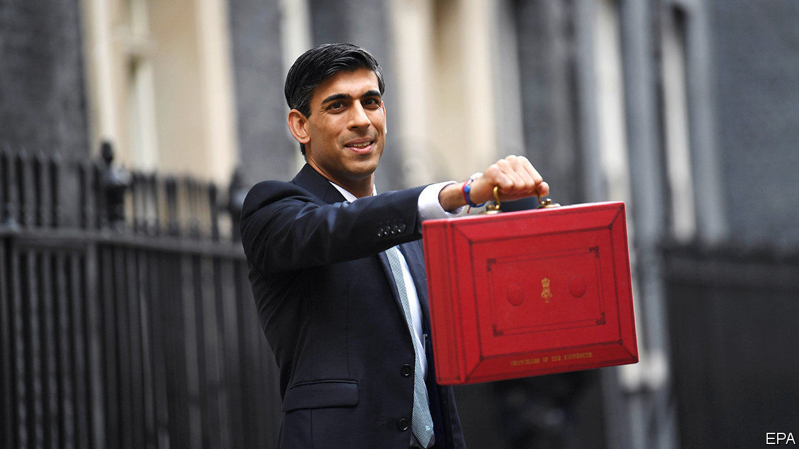
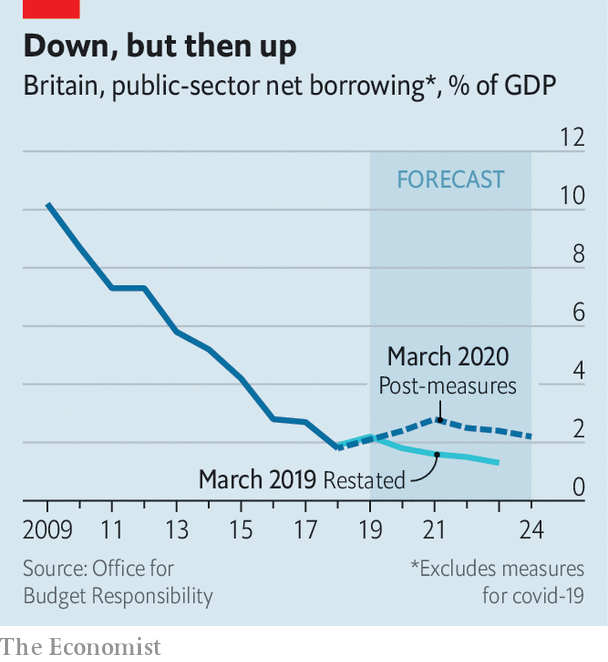

## Economic medicine

# Anti-covid-19 measures mask a shift in Britain’s budget strategy

> A shock-and-awe response to the virus

> Mar 12th 2020

ON MARCH 11TH policymakers took decisive action to inoculate the economy from the effects of covid-19. The Bank of England eased monetary policy. And Rishi Sunak, the chancellor, unveiled the largest sustained fiscal loosening since the early 1990s. He announced a £30bn ($39bn), or 1.3% of GDP, giveaway for the coming year, made up of £12bn of immediate virus-related spending and £18bn of other measures. Fiscal prudence would appear to have been an early casualty of this government—and of the virus.

In his budget speech Mr Sunak noted that one in five workers may be simultaneously absent in the coming weeks, creating a concurrent shock to both supply and demand. He argued that, because the hit to supply was likely to be transitory, the best response was a “temporary, targeted and timely” boost to support demand in the short run and try to stop hard-hit firms going out of business. The mutation of covid-19 from a Chinese crisis into a global one came too recently for it to be reflected in the forecasts of the Office of Budget Responsibility, the fiscal watchdog. So policymakers are, to a greater extent than usual, flying blind.

The bank reduced base rates by 50 basis points back to the post-crisis low of 0.25%, a bigger cut than investors had expected. It also introduced a new facility to give banks access to cheap liquidity to sustain lending for small- and medium-sized businesses and it cut capital requirements. City economists were quick to note that, although interest rates cannot be reduced much further, the bank could still choose to restart its programme of quantitative easing should the outlook darken.

The real action came on the fiscal side. Mr Sunak outlined a three-pronged strategy to cushion the blow from the virus on the public services, on households and on businesses. For the first he essentially wrote a short-term blank cheque, pledging to give the NHS whatever financial resources it required. Some £5bn has been set aside as an emergency-response fund. Support for households will take the form of early entitlement to sick pay for those required to isolate themselves and easier access to welfare payments for the self-employed and those working in the gig economy.

The support for businesses, especially smaller ones, was the most substantial element. The main goal was to ease potential cashflow problems. Firms with fewer than 250 employees will have any statutory sick pay picked up by the government. The “time to pay” scheme, which lets firms restructure tax payments, will be extended. Business rates, a property tax, will be cut to zero for the coming year for most small firms in industries such as retailing, hospitality and leisure. Some 700,000 especially tiny firms eligible for small-business-rate relief will receive a one-off payment of £3,000 to help them manage.

The reaction from the main business lobbies was positive. The British Chambers of Commerce welcomed the chancellor’s efforts to help firms manage their cashflow. Ian Stewart, chief economist of Deloitte, a professional-services firm, hailed the Treasury’s and the bank’s actions as “a forceful and convincing response to the crisis”. According to one corporate restructuring specialist, easier credit conditions and a delayed schedule of tax payments should help to prevent “thousands of insolvencies over the next few months. There are firms that would have gone to the wall that now won’t.”

Whether these measures will prove sufficient will depend as much on epidemiology as on economics. The ultimate impact of the virus is still impossible to quantify. But the emergency measures masked a wider shift in the government’s fiscal strategy. Even excluding any covid-19 related economic slowdown, as well as the £12bn response package announced so far, the government is set to borrow significantly more in the next five years than it had previously planned (see chart). The deficits planned in 2019 for the years from 2021 to 2024 have all been revised up by more than 1% of GDP.

For the past decade British fiscal policy has aimed at reducing the ratio of public debt to GDP over the medium term. This target has been quietly dumped in favour of stabilising the debt ratios. Such a long-term shift in policy may ultimately matter more than any emergency medicine.■

Dig deeper:

## URL

https://www.economist.com/britain/2020/03/12/anti-covid-19-measures-mask-a-shift-in-britains-budget-strategy
